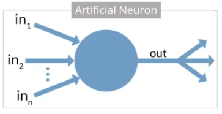
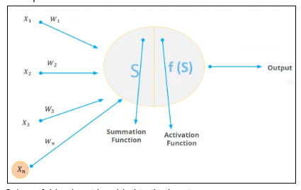
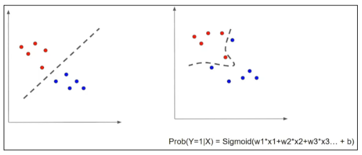
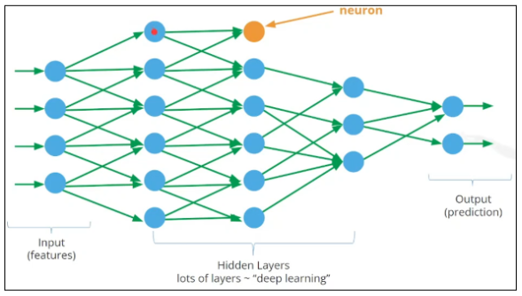
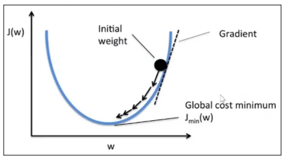
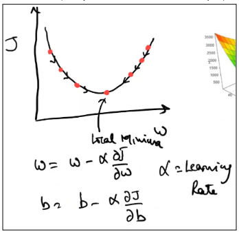
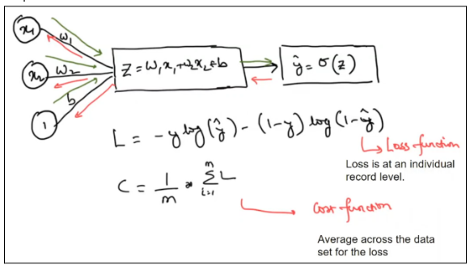

1. Artificial neuron  
   
   1. Each input is taken separately, a weight is added to each separately, and sums them up.   
   2. A trader function is applied to the weighted sum of the inputs.   
   3. Transfer function produces a non-linear output.   
      ![][image2.PNG]  
      1. A.k.a. Activation function   
      2. Step, Sign, Sigmoid, tanH, Relu   
2. Perceptrons   
   
   1. A bias input is added to the inputs.   
   2. Bias always has value of 1 but has a different wright.   
   3. While weight determines the slope of the equation, bias shifts the output towards left or the right.   
3. Why a non-linear activation function   
     
   1. NN solves a complex problem having a complex / non-linear decision boundary (see above)  
      1. Audio or video data has non-linear decision boundaries.   
   2. To control the output of a neuron i.e. to avoid it going too high or too low.   
   3. Sigmoid activation function is also similar to the logistic regression function.   
   4. Neural networks are also called non-linear function estimators.   
4. Neural network architecture  
    
   1. The weight of the input is determined as part of the learning process. The weight is the value of the strength of the relationship between the two neurons.   
   2. The weights are initialized to a random value in the beginning or 0 or 1\.   
   3. The number of neurons in the input layer are \= total number of features \+ bias input. (Q: how the weight at each layer boundary is decided?)  
   4. Once the features pass through the input and hidden layers, we ultimately calculate the loss at the output layer.  
      1. Mean squared error, mean absolute error, binary classification, cross entropy / log loss function.   
   5. After the data is passed through input layer to the output layer (through hidden layers), it calculates the loss function   
      1. It is a.k.a. Cost function  
   6. The calculation of loss function determines how accurate the NN prediction is.   
   7. Forward propagation  
      1. Data is passed through layers  
      2. Each neuron performs the compute (weight \* input \+ bias)  
      3. Apply the sigmoid activation function and pass the output to next neuron  
   8. Loss function  
      1. How close the actual value is to the predicted value (accuracy of the model)..   
      2. Once the loss is known, we try to adjust the weights to minimize loss.   
   9. Back propagation   
      1. Adjustment of each of the weights at every layer to minimise the loss.   
      2. The weights are adjusted using gradient descent algorithm.   
   10. Gradient descent algorithm

|  |  |
| :---- | :---- |

       1. Learning rate  
          1. Used to control the change in weight and bias to reduce error  
          2. Used to analyze the change in error given the change in weight and bias.  
          3. Learning rate of 0.01 is considered safe.   
       2. Slowly adjust the weights so that we reach at the bottom of the curve  
       3. At the bottom, the prediction is most accurate (i.e., error is minimum)  
       4. Cost function or error function   
       5. The slope is calculated gradually (in small steps) to reach the optimal point.   
       6. Everytime we bring it down, we perform a forward and backward propagation.   
       7. The number of attempts to bring it to optimal point is by trial-error method   
   11. Simplified version of a neural network   
       
       1. Neuron performs a weighted sum of the input features \+ bias   
       2. Output performs the y^ (predicted value) i.e. sigmoid function to the weighted sum.  
       3. Note that y^ is the predicted value and y is the actual value.  
       4.   
5. TBD  
6. TBD  
7. Variants of gradient descent (1:16:10)  
8.   
9. NN in tensor flow  
   1. Use this LF, LR  
10. Cost function (CF)  
    1. CF may have multiple ups/down  
       1. Local minima  
       2. Global minima   
    2. How is the global minima achieved?  
       1. Genetic algo to come to the global minima.   
       2. TF instead of random distribution of weights, it uses xavier's distribution (a.k.a. glorot's distribution)   
       3. Humanly visualizing minima is possible only till 3rd dimension.   
    3. Who decides the behavior of the cost function?   
    4. Initialization of the weight itself is a ML (tricky) problem.   
11. Neural Network (3:08:50)  
    1. \# of weights are equal to the \# of input features.   
    2. Thereafter the number of weights are also equal to the number of neurons across different layers  
       1. they are initialized randomly or using xavier's distribution  
12. Momentum (3:12:40)  
    1. vanilla   
    2. nesterov   
    3. Help to find the global minima  
13. Concepts (3:14:30)  
    1. Learning rate  
    2. Gradients  
    3. Back propagation  
       1. Is back propagation only between the two adjacent layers?   
       2. Or is back propagation between any layers?   
    4. Loss function  
    5. Gradient descent algo  
    6. Bias   
    7. Epocs  
    8. Weight initialization   
14. Feature engg in NN (3:15:20)  
    1. NN does the FW by itself. Each neuron does w\*in+b  
    2. PCA   
       1. First PCA was the linear combination of input features  
       2. PC2 was orthogonal to PC1  
    3. NN figures out which weights are important. automatically zero out the unimportant features.  
       1. How does NN decides which input (neuron) or weight is more important?   
    4. DL problem is a minimization problem   
15. Activation function (3:20:15)  
    1. used for non-linear representations  
       1. Sigmoid  
          1. squashed between 0 and 1\.   
       2. Tanh  
          1. squashed between \-1 and 1\.   
       3. ReLU  
          1. the most popular one a.k.a. rectified linear unit  
          2. f(x) \= 0 for x \< 0  
          3. f(x) \= x for x \>= 0  
16. Regularization (3:22:45)  
    1. How to handle the overfitting and underfitting  
    2. Underfitting \- increasing the layers or neurons   
    3. Overfitting  
       1. Training set accuracy is very high (98%)  
       2. Test set accuracy is relatively low (70%)  
       3. The gap is too big   
       4. Happens in large or complex design of NN  
    4. The non-linear estimator function should be generalized  
    5. It should be able to use on any data   
    6. Analogy   
       1. Mugging up the topic without understanding will make you fail the exam if the kind of questions change.   
       2. Understanding the concepts well will help you do better  
    7. The gap between training and test accuracy means that:  
       1. Model is remembering the data, it is not deducing the data relationship  
       2. Challenge in the NN  
    8. Model remembers the training data and infers the relationship between independent and dependent data   
17. How to handle regularization? (3:26:40)  
    1. Early stopping   
       1. AAdd figure. \*\*  
       2. Stop at the point where the gap of training and test data loss start diverging.   
       3. Model performing poorly on test set vs the training set. So stop training after this point.   
    2. \- L1/L2 regularization   
       1. Ridge (L2) regression and lasso (L1) machine learning   
       2. Apply regularization step with sum of squares of the weight and add it as penalty to the cost function  
       3. The weights are also considered in the cost function during the minimization process.   
    3. Dropout regularization   
       1. Randomly drop certain neurons along with their connections during the training phase.   
       2. Tell tensorflow to drop about 15-20% of neurons during the training phase.  
       3. This also treated as one of the hyperparameters during the model building  
       4. It is implemented as an additional layer in the tensor flow.  
18. Pytorch vs Tensorflow  
    1. Tensorflow developed by google   
    2. Pytorch developed by facebook   
    3. Lazy execution in pytorch  
    4. Programming in tensorflow and pytorch is different  
    5. Tensorflow is more practical in building NN  
       1. Good for data scientist working on real problems  
    6. Pytorch is more for programmers   
       1. Good for researchers writing papers  
19.   
