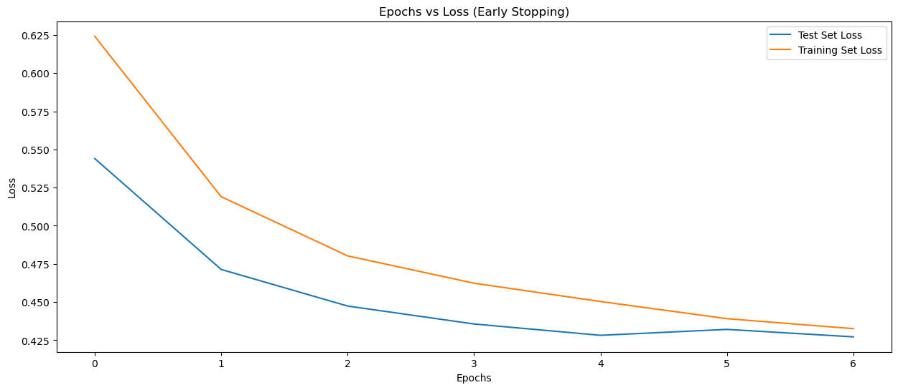
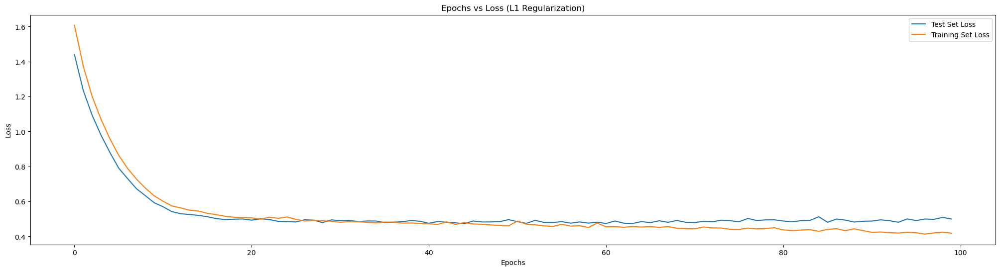
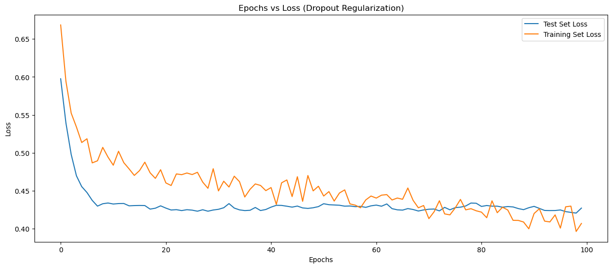

```python
import pandas as pd
import numpy as np
```


```python
df_diab = pd.read_csv('../datasets/diabetes.csv')
```


```python
df_diab.head()
```


<div>
<style scoped>
    .dataframe tbody tr th:only-of-type {
        vertical-align: middle;
    }

    .dataframe tbody tr th {
        vertical-align: top;
    }

    .dataframe thead th {
        text-align: right;
    }
</style>
<table border="1" class="dataframe">
  <thead>
    <tr style="text-align: right;">
      <th></th>
      <th>Pregnancies</th>
      <th>Glucose</th>
      <th>BloodPressure</th>
      <th>SkinThickness</th>
      <th>Insulin</th>
      <th>BMI</th>
      <th>DiabetesPedigreeFunction</th>
      <th>Age</th>
      <th>Outcome</th>
    </tr>
  </thead>
  <tbody>
    <tr>
      <th>0</th>
      <td>6</td>
      <td>148</td>
      <td>72</td>
      <td>35</td>
      <td>0</td>
      <td>33.6</td>
      <td>0.627</td>
      <td>50</td>
      <td>1</td>
    </tr>
    <tr>
      <th>1</th>
      <td>1</td>
      <td>85</td>
      <td>66</td>
      <td>29</td>
      <td>0</td>
      <td>26.6</td>
      <td>0.351</td>
      <td>31</td>
      <td>0</td>
    </tr>
    <tr>
      <th>2</th>
      <td>8</td>
      <td>183</td>
      <td>64</td>
      <td>0</td>
      <td>0</td>
      <td>23.3</td>
      <td>0.672</td>
      <td>32</td>
      <td>1</td>
    </tr>
    <tr>
      <th>3</th>
      <td>1</td>
      <td>89</td>
      <td>66</td>
      <td>23</td>
      <td>94</td>
      <td>28.1</td>
      <td>0.167</td>
      <td>21</td>
      <td>0</td>
    </tr>
    <tr>
      <th>4</th>
      <td>0</td>
      <td>137</td>
      <td>40</td>
      <td>35</td>
      <td>168</td>
      <td>43.1</td>
      <td>2.288</td>
      <td>33</td>
      <td>1</td>
    </tr>
  </tbody>
</table>
</div>


```python
df_diab.shape
```


    (768, 9)


```python
df_diab.Outcome.unique()
```


    array([1, 0], dtype=int64)


```python
# Check if any zero or missing values. 
df_diab.isna().sum()
```


    Pregnancies                 0
    Glucose                     0
    BloodPressure               0
    SkinThickness               0
    Insulin                     0
    BMI                         0
    DiabetesPedigreeFunction    0
    Age                         0
    Outcome                     0
    dtype: int64


```python
# Baking the data set to extract dependent and independent variables. 
X = df_diab.drop(['Outcome'],axis=1)
y = df_diab['Outcome']
```


```python
# A seed is a number that initializes the selection of numbers by a random number generator; 
# given the same seed number, a random number generator will generate the same series of 
# random numbers each time a simulation is run.
np.random.seed(12345)
```


```python
from sklearn.model_selection import train_test_split
```


```python
# Split into training and testing, to perform stratified sammpling
# Stratified sampling: dividing the whole data set into homogeneous groups called strata (stratum).

# train_size is 80% // 80% of the data is used to train the model. Large data is required for the training.
# random_state is 12345 // 
# stratify = y // to get a balanced data for the training. Can only be done on the dependent data (not on independent data).
# the stratify sampling will ensure that the percentage of the split data is also same as the original data. 
# Random sampling may create certain imbalances in the training and test data and may lead to inaccuracies. 
X_train, X_test, y_train,y_test = train_test_split(X,
                                                   y,
                                                   stratify = y,
                                                   test_size=0.2,
                                                   random_state=12345)
```


```python
X_train.shape
```


    (614, 8)


```python
X_test.shape
```


    (154, 8)


```python
# Scale of certain data columns are different than each other. To unify the scale, standard scaling is performed.
# Other scaler types are: Min-Max scaler, Robust scaler. 
from sklearn.preprocessing import StandardScaler
```


```python
# X-scaled = (X - mean)/sd -> z value

# Neural network are sensitive to scale so scaling is mandtory. 
# Some ML algorithms also needs scaling 

# (x-mu)/sigma
# Calculate Z values for each column divided by standard deviation. 

# Training dataset is used for training the model. So 'mu' and 'sigma' is inferred from the training set only.
# Test dataset is used for validating the model. We keep the test set prstine. Don't learn or infer anything.

# Do fit_transform only on X_train and transform on X_test.
# We take the mean and standard deviation from X_train and apply it to X_test.

scaler = StandardScaler()
X_train_scaled = scaler.fit_transform(X_train)
X_test_scaled = scaler.transform(X_test)
```


```python
import tensorflow as tf
```


```python
print(tf.__version__)
```

    2.18.0
    


```python
# In TF, models are build using 'Seqiential' APIs and 'Functional' APIs. 
# In 'sequential' APIs, we are building one layer (input, hidden-1, hidden-2, etc.) after the other. 
from tensorflow.keras.models import Sequential
```


```python
# Every layer can be modeled as a 'Dense' layer. 
# The 'Dense' layer a.k.a. fully connected layer i.e. every neuron is connected to previous layer and following layer.
# The 'Input' Layer 
from tensorflow.keras.layers import Dense, Input
```


```python
# Instantiate a blank model. No layers are added as yet. 
model = Sequential()
```


```python
# We are having 8 input features. 
X_train_scaled.shape[1]
```


    8


```python
# Add the all input features to the input layer. 
# Layer has a 'shape' argument, where we initialie it with a 2-D array. 
model.add(Input(shape = (X_train_scaled.shape[1],))) # Input Layer
```


```python
# First Hidden Layer - with 128 neurons, and activation function 'Relu'
# The number of first hidden layers can be anything. They will keep reducing more layers are added.
model.add(Dense(units=128,
                activation='relu'
         ))
```


```python
# Add two more hidden layer to make it a Deep neural network (DNN)
# Second Hidden Layer - 64 neurons, Relu activation
model.add(Dense(units=64, activation='relu'))

# Third Hidden Layer 32, relu activation
model.add(Dense(units=32, activation='relu'))
```


```python
# Output layer - Sigmoid. 
# WE have addd only one neuron and using 'sigmoid' activation function 
# in the output layer as it is a binary classification.
model.add(Dense(units=1, activation='sigmoid'))
```


```python
model.summary()
```


<pre style="white-space:pre;overflow-x:auto;line-height:normal;font-family:Menlo,'DejaVu Sans Mono',consolas,'Courier New',monospace"><span style="font-weight: bold">Model: "sequential"</span>
</pre>


<pre style="white-space:pre;overflow-x:auto;line-height:normal;font-family:Menlo,'DejaVu Sans Mono',consolas,'Courier New',monospace">┏━━━━━━━━━━━━━━━━━━━━━━━━━━━━━━━━━┳━━━━━━━━━━━━━━━━━━━━━━━━┳━━━━━━━━━━━━━━━┓
┃<span style="font-weight: bold"> Layer (type)                    </span>┃<span style="font-weight: bold"> Output Shape           </span>┃<span style="font-weight: bold">       Param # </span>┃
┡━━━━━━━━━━━━━━━━━━━━━━━━━━━━━━━━━╇━━━━━━━━━━━━━━━━━━━━━━━━╇━━━━━━━━━━━━━━━┩
│ dense (<span style="color: #0087ff; text-decoration-color: #0087ff">Dense</span>)                   │ (<span style="color: #00d7ff; text-decoration-color: #00d7ff">None</span>, <span style="color: #00af00; text-decoration-color: #00af00">128</span>)            │         <span style="color: #00af00; text-decoration-color: #00af00">1,152</span> │
├─────────────────────────────────┼────────────────────────┼───────────────┤
│ dense_1 (<span style="color: #0087ff; text-decoration-color: #0087ff">Dense</span>)                 │ (<span style="color: #00d7ff; text-decoration-color: #00d7ff">None</span>, <span style="color: #00af00; text-decoration-color: #00af00">64</span>)             │         <span style="color: #00af00; text-decoration-color: #00af00">8,256</span> │
├─────────────────────────────────┼────────────────────────┼───────────────┤
│ dense_2 (<span style="color: #0087ff; text-decoration-color: #0087ff">Dense</span>)                 │ (<span style="color: #00d7ff; text-decoration-color: #00d7ff">None</span>, <span style="color: #00af00; text-decoration-color: #00af00">32</span>)             │         <span style="color: #00af00; text-decoration-color: #00af00">2,080</span> │
├─────────────────────────────────┼────────────────────────┼───────────────┤
│ dense_3 (<span style="color: #0087ff; text-decoration-color: #0087ff">Dense</span>)                 │ (<span style="color: #00d7ff; text-decoration-color: #00d7ff">None</span>, <span style="color: #00af00; text-decoration-color: #00af00">1</span>)              │            <span style="color: #00af00; text-decoration-color: #00af00">33</span> │
└─────────────────────────────────┴────────────────────────┴───────────────┘
</pre>


<pre style="white-space:pre;overflow-x:auto;line-height:normal;font-family:Menlo,'DejaVu Sans Mono',consolas,'Courier New',monospace"><span style="font-weight: bold"> Total params: </span><span style="color: #00af00; text-decoration-color: #00af00">11,521</span> (45.00 KB)
</pre>


<pre style="white-space:pre;overflow-x:auto;line-height:normal;font-family:Menlo,'DejaVu Sans Mono',consolas,'Courier New',monospace"><span style="font-weight: bold"> Trainable params: </span><span style="color: #00af00; text-decoration-color: #00af00">11,521</span> (45.00 KB)
</pre>


<pre style="white-space:pre;overflow-x:auto;line-height:normal;font-family:Menlo,'DejaVu Sans Mono',consolas,'Courier New',monospace"><span style="font-weight: bold"> Non-trainable params: </span><span style="color: #00af00; text-decoration-color: #00af00">0</span> (0.00 B)
</pre>


```python
#(8+1)*128 = 1152
#(128+1)*64 = 8256
#(64+1)*32 = 3080
#(1+1)*1 = 2
```


```python
# Note that in the first hidden (dense) layer, there are 128 neurons i.e. 128 * 8+1 input neurons.
# Therfore 128 * 9 = 1152 parameters (or links)

# Note that in the second hidden (dense) layer, there are 64 neurons i.e. 64 * 128+1 input neurons.
# Therfore 64 * 129 = 8256 parameters (or links)

# Note that in the third hidden (dense) layer, there are 32 neurons i.e. 32 * 64+1 input neurons.
# Therfore 32 * 65 = 2080 parameters (or links)

# Note that in the final output (dense) layer, there is 1 neurons i.e. 1 * 1+1 input neurons.
# Therfore 1 * 2 = 2 parameters (or links)

# Trainable parameters: the one which are able to optimize using the gradient descent algorithm.
1152+8256+2080+33+2
```


    11523


```python
# Compile the configured model. 
# "adam" optimizer is used, which is the advanced version of gradeint descent. 
# Use the binary cross entropy log loss function.
# Metric to be monitored for is 'accuracy'.
model.compile(optimizer='adam', # Variant of Gradient Descent
              loss= 'binary_crossentropy', # Log Loss or Binary Cross Entropy
              metrics=['accuracy']) # Monitor Accuracy
```


```python
# The function 'fit' trains the model where the model learns patterns from the provided data.
# X and Y: the input data and the corresponding target labels.
# validation_data: used to monitor model's performance during training, helping to detect overfitting.
# epochs: the number of times the model will iterate over the entire training dataset. 
#  - Nunber of epochs is not fixed. Sometimes accuracy is achieved with a smaller value as well.
# Performs:
# - Feeding data to the model.
# - Calculating the error (loss).
# - Adjusting the model's parameters to reduce the error.
# - Repeating this process for a specified number of times.
result = model.fit(X_train_scaled, 
                   y_train,
                   validation_data = (X_test_scaled, y_test),
                   epochs=100)

# Interpreting output:
# Epoch 88/100
# 20/20 ━━━━━━━━━━━━━━━━━━━━ 0s 6ms/step - accuracy: 0.8610 - loss: 0.4383 - val_accuracy: 0.7597 - val_loss: 0.5397
# - accuracy: on the training data set. 
# - loss: loss on the training data set. 
# - val_accuracy: on the validation data set. 
# - val_loss: loss on the validation data set. 

# The large difference beween the training accuracy and the validation accuracy is the indicator of overfitting. 
# Accuracy depends on number of layers. 
# With CNN, we can not train for a larger number of epochs (e.g. 50+). We need a higher compute (GPU/TPU) machine.
# Auto encoders are trained using 500+ epochs e.g. complex data (e.g. music). 
```

    Epoch 1/100
    20/20 ━━━━━━━━━━━━━━━━━━━━ 3s 18ms/step - accuracy: 0.5787 - loss: 0.6585 - val_accuracy: 0.7532 - val_loss: 0.5277
    Epoch 2/100
    20/20 ━━━━━━━━━━━━━━━━━━━━ 0s 9ms/step - accuracy: 0.7555 - loss: 0.5189 - val_accuracy: 0.7792 - val_loss: 0.4574
    Epoch 3/100
    20/20 ━━━━━━━━━━━━━━━━━━━━ 0s 6ms/step - accuracy: 0.7773 - loss: 0.4642 - val_accuracy: 0.7857 - val_loss: 0.4389
    Epoch 4/100
    20/20 ━━━━━━━━━━━━━━━━━━━━ 0s 6ms/step - accuracy: 0.7851 - loss: 0.4560 - val_accuracy: 0.7857 - val_loss: 0.4388
    Epoch 5/100
    20/20 ━━━━━━━━━━━━━━━━━━━━ 0s 6ms/step - accuracy: 0.8027 - loss: 0.4242 - val_accuracy: 0.7727 - val_loss: 0.4340
    Epoch 6/100
    20/20 ━━━━━━━━━━━━━━━━━━━━ 0s 7ms/step - accuracy: 0.7902 - loss: 0.4429 - val_accuracy: 0.7792 - val_loss: 0.4284
    Epoch 7/100
    20/20 ━━━━━━━━━━━━━━━━━━━━ 0s 6ms/step - accuracy: 0.7905 - loss: 0.4227 - val_accuracy: 0.7792 - val_loss: 0.4292
    Epoch 8/100
    20/20 ━━━━━━━━━━━━━━━━━━━━ 0s 6ms/step - accuracy: 0.7958 - loss: 0.4230 - val_accuracy: 0.7727 - val_loss: 0.4319
    Epoch 9/100
    20/20 ━━━━━━━━━━━━━━━━━━━━ 0s 6ms/step - accuracy: 0.7913 - loss: 0.4192 - val_accuracy: 0.7987 - val_loss: 0.4335
    Epoch 10/100
    20/20 ━━━━━━━━━━━━━━━━━━━━ 0s 6ms/step - accuracy: 0.8215 - loss: 0.3974 - val_accuracy: 0.7727 - val_loss: 0.4315
    Epoch 11/100
    20/20 ━━━━━━━━━━━━━━━━━━━━ 0s 7ms/step - accuracy: 0.7965 - loss: 0.4331 - val_accuracy: 0.7922 - val_loss: 0.4310
    Epoch 12/100
    20/20 ━━━━━━━━━━━━━━━━━━━━ 0s 6ms/step - accuracy: 0.8042 - loss: 0.4184 - val_accuracy: 0.7727 - val_loss: 0.4371
    Epoch 13/100
    20/20 ━━━━━━━━━━━━━━━━━━━━ 0s 6ms/step - accuracy: 0.8005 - loss: 0.4366 - val_accuracy: 0.7922 - val_loss: 0.4367
    Epoch 14/100
    20/20 ━━━━━━━━━━━━━━━━━━━━ 0s 6ms/step - accuracy: 0.7942 - loss: 0.3987 - val_accuracy: 0.7727 - val_loss: 0.4330
    Epoch 15/100
    20/20 ━━━━━━━━━━━━━━━━━━━━ 0s 6ms/step - accuracy: 0.8079 - loss: 0.4279 - val_accuracy: 0.7727 - val_loss: 0.4400
    Epoch 16/100
    20/20 ━━━━━━━━━━━━━━━━━━━━ 0s 8ms/step - accuracy: 0.8155 - loss: 0.3879 - val_accuracy: 0.7727 - val_loss: 0.4365
    Epoch 17/100
    20/20 ━━━━━━━━━━━━━━━━━━━━ 0s 8ms/step - accuracy: 0.8349 - loss: 0.3710 - val_accuracy: 0.7662 - val_loss: 0.4307
    Epoch 18/100
    20/20 ━━━━━━━━━━━━━━━━━━━━ 0s 5ms/step - accuracy: 0.8308 - loss: 0.3730 - val_accuracy: 0.7857 - val_loss: 0.4388
    Epoch 19/100
    20/20 ━━━━━━━━━━━━━━━━━━━━ 0s 6ms/step - accuracy: 0.8331 - loss: 0.3626 - val_accuracy: 0.7792 - val_loss: 0.4377
    Epoch 20/100
    20/20 ━━━━━━━━━━━━━━━━━━━━ 0s 7ms/step - accuracy: 0.8307 - loss: 0.3626 - val_accuracy: 0.7857 - val_loss: 0.4316
    Epoch 21/100
    20/20 ━━━━━━━━━━━━━━━━━━━━ 0s 6ms/step - accuracy: 0.8588 - loss: 0.3224 - val_accuracy: 0.7662 - val_loss: 0.4398
    Epoch 22/100
    20/20 ━━━━━━━━━━━━━━━━━━━━ 0s 6ms/step - accuracy: 0.8493 - loss: 0.3621 - val_accuracy: 0.7727 - val_loss: 0.4363
    Epoch 23/100
    20/20 ━━━━━━━━━━━━━━━━━━━━ 0s 6ms/step - accuracy: 0.8529 - loss: 0.3426 - val_accuracy: 0.7857 - val_loss: 0.4331
    Epoch 24/100
    20/20 ━━━━━━━━━━━━━━━━━━━━ 0s 6ms/step - accuracy: 0.8784 - loss: 0.3145 - val_accuracy: 0.7662 - val_loss: 0.4410
    Epoch 25/100
    20/20 ━━━━━━━━━━━━━━━━━━━━ 0s 8ms/step - accuracy: 0.8481 - loss: 0.3437 - val_accuracy: 0.7662 - val_loss: 0.4420
    Epoch 26/100
    20/20 ━━━━━━━━━━━━━━━━━━━━ 0s 7ms/step - accuracy: 0.8492 - loss: 0.3283 - val_accuracy: 0.7662 - val_loss: 0.4395
    Epoch 27/100
    20/20 ━━━━━━━━━━━━━━━━━━━━ 0s 6ms/step - accuracy: 0.8805 - loss: 0.3078 - val_accuracy: 0.7532 - val_loss: 0.4382
    Epoch 28/100
    20/20 ━━━━━━━━━━━━━━━━━━━━ 0s 6ms/step - accuracy: 0.8655 - loss: 0.3096 - val_accuracy: 0.7532 - val_loss: 0.4632
    Epoch 29/100
    20/20 ━━━━━━━━━━━━━━━━━━━━ 0s 11ms/step - accuracy: 0.8890 - loss: 0.2996 - val_accuracy: 0.7727 - val_loss: 0.4378
    Epoch 30/100
    20/20 ━━━━━━━━━━━━━━━━━━━━ 0s 6ms/step - accuracy: 0.8700 - loss: 0.3239 - val_accuracy: 0.7532 - val_loss: 0.4559
    Epoch 31/100
    20/20 ━━━━━━━━━━━━━━━━━━━━ 0s 6ms/step - accuracy: 0.8806 - loss: 0.3113 - val_accuracy: 0.7727 - val_loss: 0.4361
    Epoch 32/100
    20/20 ━━━━━━━━━━━━━━━━━━━━ 0s 6ms/step - accuracy: 0.8780 - loss: 0.2962 - val_accuracy: 0.7532 - val_loss: 0.4643
    Epoch 33/100
    20/20 ━━━━━━━━━━━━━━━━━━━━ 0s 6ms/step - accuracy: 0.8863 - loss: 0.2639 - val_accuracy: 0.7727 - val_loss: 0.4583
    Epoch 34/100
    20/20 ━━━━━━━━━━━━━━━━━━━━ 0s 6ms/step - accuracy: 0.8898 - loss: 0.2802 - val_accuracy: 0.7662 - val_loss: 0.4502
    Epoch 35/100
    20/20 ━━━━━━━━━━━━━━━━━━━━ 0s 6ms/step - accuracy: 0.9124 - loss: 0.2563 - val_accuracy: 0.7273 - val_loss: 0.4955
    Epoch 36/100
    20/20 ━━━━━━━━━━━━━━━━━━━━ 0s 6ms/step - accuracy: 0.8859 - loss: 0.3001 - val_accuracy: 0.7792 - val_loss: 0.4579
    Epoch 37/100
    20/20 ━━━━━━━━━━━━━━━━━━━━ 0s 6ms/step - accuracy: 0.8891 - loss: 0.2845 - val_accuracy: 0.7532 - val_loss: 0.4815
    Epoch 38/100
    20/20 ━━━━━━━━━━━━━━━━━━━━ 0s 6ms/step - accuracy: 0.9032 - loss: 0.2590 - val_accuracy: 0.7338 - val_loss: 0.5265
    Epoch 39/100
    20/20 ━━━━━━━━━━━━━━━━━━━━ 0s 16ms/step - accuracy: 0.9059 - loss: 0.2721 - val_accuracy: 0.7792 - val_loss: 0.4733
    Epoch 40/100
    20/20 ━━━━━━━━━━━━━━━━━━━━ 0s 7ms/step - accuracy: 0.9015 - loss: 0.2323 - val_accuracy: 0.7403 - val_loss: 0.5153
    Epoch 41/100
    20/20 ━━━━━━━━━━━━━━━━━━━━ 0s 8ms/step - accuracy: 0.8885 - loss: 0.2498 - val_accuracy: 0.7403 - val_loss: 0.5130
    Epoch 42/100
    20/20 ━━━━━━━━━━━━━━━━━━━━ 0s 12ms/step - accuracy: 0.9051 - loss: 0.2458 - val_accuracy: 0.7662 - val_loss: 0.5059
    Epoch 43/100
    20/20 ━━━━━━━━━━━━━━━━━━━━ 0s 6ms/step - accuracy: 0.9163 - loss: 0.2350 - val_accuracy: 0.7468 - val_loss: 0.4993
    Epoch 44/100
    20/20 ━━━━━━━━━━━━━━━━━━━━ 0s 6ms/step - accuracy: 0.9272 - loss: 0.2145 - val_accuracy: 0.7468 - val_loss: 0.5786
    Epoch 45/100
    20/20 ━━━━━━━━━━━━━━━━━━━━ 0s 6ms/step - accuracy: 0.9184 - loss: 0.2119 - val_accuracy: 0.7403 - val_loss: 0.5179
    Epoch 46/100
    20/20 ━━━━━━━━━━━━━━━━━━━━ 0s 6ms/step - accuracy: 0.9286 - loss: 0.2241 - val_accuracy: 0.7468 - val_loss: 0.5478
    Epoch 47/100
    20/20 ━━━━━━━━━━━━━━━━━━━━ 0s 6ms/step - accuracy: 0.9321 - loss: 0.1875 - val_accuracy: 0.7403 - val_loss: 0.5736
    Epoch 48/100
    20/20 ━━━━━━━━━━━━━━━━━━━━ 0s 6ms/step - accuracy: 0.9312 - loss: 0.2017 - val_accuracy: 0.7468 - val_loss: 0.6211
    Epoch 49/100
    20/20 ━━━━━━━━━━━━━━━━━━━━ 0s 6ms/step - accuracy: 0.8939 - loss: 0.2297 - val_accuracy: 0.7468 - val_loss: 0.5541
    Epoch 50/100
    20/20 ━━━━━━━━━━━━━━━━━━━━ 0s 7ms/step - accuracy: 0.9389 - loss: 0.1859 - val_accuracy: 0.7468 - val_loss: 0.5652
    Epoch 51/100
    20/20 ━━━━━━━━━━━━━━━━━━━━ 0s 9ms/step - accuracy: 0.9494 - loss: 0.1725 - val_accuracy: 0.7143 - val_loss: 0.5975
    Epoch 52/100
    20/20 ━━━━━━━━━━━━━━━━━━━━ 0s 13ms/step - accuracy: 0.9484 - loss: 0.1660 - val_accuracy: 0.7338 - val_loss: 0.5907
    Epoch 53/100
    20/20 ━━━━━━━━━━━━━━━━━━━━ 0s 8ms/step - accuracy: 0.9615 - loss: 0.1562 - val_accuracy: 0.7143 - val_loss: 0.6032
    Epoch 54/100
    20/20 ━━━━━━━━━━━━━━━━━━━━ 0s 8ms/step - accuracy: 0.9603 - loss: 0.1524 - val_accuracy: 0.7273 - val_loss: 0.6275
    Epoch 55/100
    20/20 ━━━━━━━━━━━━━━━━━━━━ 0s 7ms/step - accuracy: 0.9451 - loss: 0.1610 - val_accuracy: 0.7338 - val_loss: 0.6382
    Epoch 56/100
    20/20 ━━━━━━━━━━━━━━━━━━━━ 0s 8ms/step - accuracy: 0.9592 - loss: 0.1482 - val_accuracy: 0.7338 - val_loss: 0.6670
    Epoch 57/100
    20/20 ━━━━━━━━━━━━━━━━━━━━ 0s 8ms/step - accuracy: 0.9741 - loss: 0.1345 - val_accuracy: 0.7273 - val_loss: 0.6690
    Epoch 58/100
    20/20 ━━━━━━━━━━━━━━━━━━━━ 0s 9ms/step - accuracy: 0.9621 - loss: 0.1413 - val_accuracy: 0.7143 - val_loss: 0.6688
    Epoch 59/100
    20/20 ━━━━━━━━━━━━━━━━━━━━ 0s 10ms/step - accuracy: 0.9613 - loss: 0.1293 - val_accuracy: 0.7403 - val_loss: 0.7310
    Epoch 60/100
    20/20 ━━━━━━━━━━━━━━━━━━━━ 0s 7ms/step - accuracy: 0.9561 - loss: 0.1426 - val_accuracy: 0.7338 - val_loss: 0.6766
    Epoch 61/100
    20/20 ━━━━━━━━━━━━━━━━━━━━ 0s 10ms/step - accuracy: 0.9504 - loss: 0.1344 - val_accuracy: 0.7403 - val_loss: 0.7270
    Epoch 62/100
    20/20 ━━━━━━━━━━━━━━━━━━━━ 0s 9ms/step - accuracy: 0.9509 - loss: 0.1310 - val_accuracy: 0.7273 - val_loss: 0.6866
    Epoch 63/100
    20/20 ━━━━━━━━━━━━━━━━━━━━ 0s 7ms/step - accuracy: 0.9635 - loss: 0.1304 - val_accuracy: 0.7208 - val_loss: 0.7192
    Epoch 64/100
    20/20 ━━━━━━━━━━━━━━━━━━━━ 0s 8ms/step - accuracy: 0.9696 - loss: 0.1060 - val_accuracy: 0.7078 - val_loss: 0.7807
    Epoch 65/100
    20/20 ━━━━━━━━━━━━━━━━━━━━ 0s 10ms/step - accuracy: 0.9774 - loss: 0.1125 - val_accuracy: 0.7013 - val_loss: 0.8004
    Epoch 66/100
    20/20 ━━━━━━━━━━━━━━━━━━━━ 0s 8ms/step - accuracy: 0.9652 - loss: 0.1185 - val_accuracy: 0.7468 - val_loss: 0.7471
    Epoch 67/100
    20/20 ━━━━━━━━━━━━━━━━━━━━ 0s 7ms/step - accuracy: 0.9690 - loss: 0.0963 - val_accuracy: 0.7013 - val_loss: 0.8704
    Epoch 68/100
    20/20 ━━━━━━━━━━━━━━━━━━━━ 0s 7ms/step - accuracy: 0.9563 - loss: 0.1288 - val_accuracy: 0.7208 - val_loss: 0.8530
    Epoch 69/100
    20/20 ━━━━━━━━━━━━━━━━━━━━ 0s 7ms/step - accuracy: 0.9730 - loss: 0.1026 - val_accuracy: 0.7273 - val_loss: 0.7797
    Epoch 70/100
    20/20 ━━━━━━━━━━━━━━━━━━━━ 0s 7ms/step - accuracy: 0.9726 - loss: 0.1056 - val_accuracy: 0.7078 - val_loss: 0.8665
    Epoch 71/100
    20/20 ━━━━━━━━━━━━━━━━━━━━ 0s 6ms/step - accuracy: 0.9574 - loss: 0.1333 - val_accuracy: 0.7468 - val_loss: 0.8603
    Epoch 72/100
    20/20 ━━━━━━━━━━━━━━━━━━━━ 0s 6ms/step - accuracy: 0.9807 - loss: 0.0843 - val_accuracy: 0.7273 - val_loss: 0.8740
    Epoch 73/100
    20/20 ━━━━━━━━━━━━━━━━━━━━ 0s 6ms/step - accuracy: 0.9740 - loss: 0.0879 - val_accuracy: 0.7273 - val_loss: 0.8712
    Epoch 74/100
    20/20 ━━━━━━━━━━━━━━━━━━━━ 0s 6ms/step - accuracy: 0.9906 - loss: 0.0650 - val_accuracy: 0.7273 - val_loss: 0.8581
    Epoch 75/100
    20/20 ━━━━━━━━━━━━━━━━━━━━ 0s 6ms/step - accuracy: 0.9881 - loss: 0.0765 - val_accuracy: 0.7532 - val_loss: 0.8748
    Epoch 76/100
    20/20 ━━━━━━━━━━━━━━━━━━━━ 0s 6ms/step - accuracy: 0.9873 - loss: 0.0651 - val_accuracy: 0.7338 - val_loss: 0.8907
    Epoch 77/100
    20/20 ━━━━━━━━━━━━━━━━━━━━ 0s 6ms/step - accuracy: 0.9813 - loss: 0.0684 - val_accuracy: 0.6948 - val_loss: 0.9673
    Epoch 78/100
    20/20 ━━━━━━━━━━━━━━━━━━━━ 0s 6ms/step - accuracy: 0.9813 - loss: 0.0724 - val_accuracy: 0.7078 - val_loss: 0.9304
    Epoch 79/100
    20/20 ━━━━━━━━━━━━━━━━━━━━ 0s 6ms/step - accuracy: 0.9911 - loss: 0.0734 - val_accuracy: 0.7338 - val_loss: 0.9500
    Epoch 80/100
    20/20 ━━━━━━━━━━━━━━━━━━━━ 0s 6ms/step - accuracy: 0.9871 - loss: 0.0619 - val_accuracy: 0.7273 - val_loss: 0.9489
    Epoch 81/100
    20/20 ━━━━━━━━━━━━━━━━━━━━ 0s 7ms/step - accuracy: 0.9859 - loss: 0.0585 - val_accuracy: 0.7273 - val_loss: 0.9747
    Epoch 82/100
    20/20 ━━━━━━━━━━━━━━━━━━━━ 0s 6ms/step - accuracy: 0.9976 - loss: 0.0463 - val_accuracy: 0.7143 - val_loss: 0.9715
    Epoch 83/100
    20/20 ━━━━━━━━━━━━━━━━━━━━ 0s 6ms/step - accuracy: 0.9945 - loss: 0.0433 - val_accuracy: 0.7273 - val_loss: 0.9806
    Epoch 84/100
    20/20 ━━━━━━━━━━━━━━━━━━━━ 0s 7ms/step - accuracy: 0.9864 - loss: 0.0533 - val_accuracy: 0.7208 - val_loss: 1.0466
    Epoch 85/100
    20/20 ━━━━━━━━━━━━━━━━━━━━ 0s 7ms/step - accuracy: 0.9645 - loss: 0.1047 - val_accuracy: 0.7208 - val_loss: 1.1537
    Epoch 86/100
    20/20 ━━━━━━━━━━━━━━━━━━━━ 0s 6ms/step - accuracy: 0.9772 - loss: 0.0799 - val_accuracy: 0.6948 - val_loss: 1.0485
    Epoch 87/100
    20/20 ━━━━━━━━━━━━━━━━━━━━ 0s 6ms/step - accuracy: 0.9848 - loss: 0.0720 - val_accuracy: 0.6688 - val_loss: 1.1956
    Epoch 88/100
    20/20 ━━━━━━━━━━━━━━━━━━━━ 0s 10ms/step - accuracy: 0.9736 - loss: 0.0728 - val_accuracy: 0.7013 - val_loss: 1.0026
    Epoch 89/100
    20/20 ━━━━━━━━━━━━━━━━━━━━ 0s 6ms/step - accuracy: 0.9877 - loss: 0.0718 - val_accuracy: 0.7208 - val_loss: 1.0708
    Epoch 90/100
    20/20 ━━━━━━━━━━━━━━━━━━━━ 0s 18ms/step - accuracy: 0.9823 - loss: 0.0762 - val_accuracy: 0.6818 - val_loss: 1.0724
    Epoch 91/100
    20/20 ━━━━━━━━━━━━━━━━━━━━ 0s 6ms/step - accuracy: 0.9746 - loss: 0.0758 - val_accuracy: 0.7143 - val_loss: 1.0498
    Epoch 92/100
    20/20 ━━━━━━━━━━━━━━━━━━━━ 0s 16ms/step - accuracy: 0.9901 - loss: 0.0484 - val_accuracy: 0.7338 - val_loss: 1.0921
    Epoch 93/100
    20/20 ━━━━━━━━━━━━━━━━━━━━ 0s 15ms/step - accuracy: 0.9903 - loss: 0.0504 - val_accuracy: 0.7273 - val_loss: 1.0334
    Epoch 94/100
    20/20 ━━━━━━━━━━━━━━━━━━━━ 0s 7ms/step - accuracy: 0.9813 - loss: 0.0636 - val_accuracy: 0.7208 - val_loss: 1.2489
    Epoch 95/100
    20/20 ━━━━━━━━━━━━━━━━━━━━ 0s 6ms/step - accuracy: 0.9852 - loss: 0.0540 - val_accuracy: 0.7013 - val_loss: 1.0787
    Epoch 96/100
    20/20 ━━━━━━━━━━━━━━━━━━━━ 0s 7ms/step - accuracy: 0.9861 - loss: 0.0626 - val_accuracy: 0.7208 - val_loss: 1.1201
    Epoch 97/100
    20/20 ━━━━━━━━━━━━━━━━━━━━ 0s 6ms/step - accuracy: 0.9588 - loss: 0.0979 - val_accuracy: 0.6948 - val_loss: 1.1486
    Epoch 98/100
    20/20 ━━━━━━━━━━━━━━━━━━━━ 0s 7ms/step - accuracy: 0.9862 - loss: 0.0539 - val_accuracy: 0.7338 - val_loss: 1.1408
    Epoch 99/100
    20/20 ━━━━━━━━━━━━━━━━━━━━ 0s 6ms/step - accuracy: 0.9650 - loss: 0.1121 - val_accuracy: 0.7403 - val_loss: 1.1236
    Epoch 100/100
    20/20 ━━━━━━━━━━━━━━━━━━━━ 0s 8ms/step - accuracy: 0.9702 - loss: 0.1257 - val_accuracy: 0.7143 - val_loss: 1.2106
    


```python
y_train_pred = model.predict(X_train_scaled)
y_test_pred = model.predict(X_test_scaled)
```

    20/20 ━━━━━━━━━━━━━━━━━━━━ 0s 5ms/step
    5/5 ━━━━━━━━━━━━━━━━━━━━ 0s 8ms/step 
    


```python
y_train_pred[0] >=0.5
```


    array([ True])


```python
# Import the confusion matrix and ccuracy score to determine the loss (correlating it to the model)
from sklearn.metrics import confusion_matrix, accuracy_score
```


```python
confusion_matrix(y_pred=y_train_pred >= 0.5, 
                 y_true = y_train)
```


    array([[397,   3],
           [  2, 212]], dtype=int64)


```python
# Verify the accuracy on the training data set. 
accuracy_score(y_pred=y_train_pred >= 0.5, 
               y_true = y_train)
```


    0.99185667752443


```python
confusion_matrix(y_pred=y_test_pred >= 0.5, 
                 y_true = y_test)
```


    array([[76, 24],
           [20, 34]], dtype=int64)


```python
# Verify the accuracy on the test data set. 
accuracy_score(y_pred=y_test_pred >= 0.5, 
               y_true = y_test)
```


    0.7142857142857143


```python
# The record of the training process, specifically the metrics that were tracked during each epoch. 
# These are the same numbers which are displayed during the training of the model at each epoch.
history = pd.DataFrame(result.history)
```


```python
history.head()
```


<div>
<style scoped>
    .dataframe tbody tr th:only-of-type {
        vertical-align: middle;
    }

    .dataframe tbody tr th {
        vertical-align: top;
    }

    .dataframe thead th {
        text-align: right;
    }
</style>
<table border="1" class="dataframe">
  <thead>
    <tr style="text-align: right;">
      <th></th>
      <th>accuracy</th>
      <th>loss</th>
      <th>val_accuracy</th>
      <th>val_loss</th>
    </tr>
  </thead>
  <tbody>
    <tr>
      <th>0</th>
      <td>0.672638</td>
      <td>0.617253</td>
      <td>0.753247</td>
      <td>0.527719</td>
    </tr>
    <tr>
      <th>1</th>
      <td>0.754072</td>
      <td>0.510039</td>
      <td>0.779221</td>
      <td>0.457389</td>
    </tr>
    <tr>
      <th>2</th>
      <td>0.776873</td>
      <td>0.469774</td>
      <td>0.785714</td>
      <td>0.438939</td>
    </tr>
    <tr>
      <th>3</th>
      <td>0.786645</td>
      <td>0.454751</td>
      <td>0.785714</td>
      <td>0.438811</td>
    </tr>
    <tr>
      <th>4</th>
      <td>0.788274</td>
      <td>0.443680</td>
      <td>0.772727</td>
      <td>0.434036</td>
    </tr>
  </tbody>
</table>
</div>


```python
import matplotlib.pyplot as plt
```


```python
# Plot the graph of the history to visualize the difference between the training loss and the testing loss. 
plt.figure(figsize = (25,6))
plt.plot(history.val_loss, label='Test Set Loss')
plt.plot(history.loss, label='Training Set Loss')
plt.title('Epochs vs Loss')
plt.xlabel('Epochs')
plt.ylabel('Loss')
plt.legend()
plt.show()
```


    

    


```python
# Plot the graph of the history to visualize the difference between the training accuracy and the testing accuracy. 
plt.figure(figsize = (15,6))
plt.plot(history.val_accuracy, label='Test Set Accuracy')
plt.plot(history.accuracy, label='Training Set Accuracy')
plt.title('Epochs vs Accuracy')
plt.xlabel('Epochs')
plt.ylabel('Accuracy')
plt.legend()
plt.show()
```


    

    


```python
# Display the model weights layer by layer. 
model.get_weights()
```


    [array([[-0.26959774,  0.10946758,  0.2249993 , ..., -0.13737191,
             -0.23306139,  0.06360957],
            [ 0.20160116,  0.20237659,  0.25787732, ..., -0.37392697,
              0.18326157, -0.14942007],
            [-0.09486642, -0.13795713, -0.15986449, ...,  0.02432849,
             -0.25631186,  0.37877968],
            ...,
            [ 0.14612304,  0.16217372,  0.05625659, ..., -0.11084835,
             -0.06725694, -0.14837605],
            [-0.20047328,  0.23017947,  0.01638706, ...,  0.11020467,
              0.218328  ,  0.25103238],
            [-0.02310985, -0.01546471, -0.21083649, ..., -0.19872485,
              0.11873502,  0.1385103 ]], dtype=float32),
     array([ 0.03544249, -0.02486247, -0.01495735, -0.07769862,  0.05048937,
            -0.08253377, -0.03378524, -0.06102377, -0.05119123, -0.00539534,
            -0.00051568,  0.01673323, -0.00921883,  0.02797197, -0.03706643,
             0.06534898,  0.05942265, -0.07828026, -0.02021494,  0.02840703,
            -0.0466579 , -0.14291233,  0.07050908,  0.01934274,  0.02579477,
             0.11832427,  0.08180829, -0.07111677,  0.12737866, -0.01907069,
            -0.0712991 ,  0.01029952, -0.12339693,  0.08054161, -0.00992364,
             0.04577631, -0.14581192,  0.08227892,  0.0482271 ,  0.07661645,
             0.04243454,  0.06651791,  0.03438681,  0.00911308,  0.0140885 ,
             0.03875374, -0.0735599 ,  0.03549984,  0.01709722, -0.04735514,
             0.12977463, -0.05000822,  0.04521329,  0.05409795, -0.01828099,
             0.10301831, -0.07704938,  0.01660405, -0.07831287, -0.09828258,
             0.04537956,  0.02024612, -0.0285443 ,  0.06442205, -0.04816571,
             0.01508952,  0.0121533 , -0.02122006,  0.01499367, -0.01919123,
            -0.04181863,  0.08013935, -0.02312227, -0.02561007,  0.0009433 ,
             0.08880074,  0.07576632, -0.04933285, -0.00531895,  0.00557491,
            -0.01424009, -0.03909362, -0.02586073, -0.0359659 , -0.09019281,
            -0.07682966, -0.06970681, -0.02624188,  0.12316807,  0.01667217,
            -0.08181277,  0.0575656 ,  0.06710586, -0.03377404,  0.11592013,
             0.00233068, -0.04807445, -0.02411667, -0.05851538, -0.10718282,
             0.01365137, -0.05530998,  0.03287823,  0.05406605,  0.1453814 ,
             0.01367222,  0.06207008,  0.06007811,  0.04942553, -0.06166147,
             0.08017415, -0.04387126,  0.04251543, -0.01670441,  0.0079254 ,
            -0.01670662, -0.03135045,  0.03398519, -0.03040519, -0.05081517,
             0.03724637, -0.03946745, -0.00346566,  0.06765956, -0.03447963,
            -0.0208475 , -0.0818255 ,  0.0345218 ], dtype=float32),
     array([[ 0.07747947, -0.02981558, -0.01836878, ...,  0.01554038,
              0.13366431,  0.00295617],
            [-0.0348803 , -0.06951417, -0.04440706, ...,  0.0688766 ,
             -0.01282509, -0.05342098],
            [ 0.11518765,  0.10557338,  0.14758685, ...,  0.32840326,
             -0.04024413, -0.09395599],
            ...,
            [-0.37766615,  0.05490795, -0.19391918, ..., -0.0015825 ,
             -0.3175585 , -0.03710687],
            [ 0.00421111,  0.0367616 ,  0.02963527, ..., -0.18825735,
             -0.17880388,  0.13218231],
            [ 0.11012838,  0.18785933, -0.08997168, ..., -0.21836291,
             -0.1166683 ,  0.24142194]], dtype=float32),
     array([ 0.00817358,  0.05861158,  0.0393516 , -0.05339703,  0.06706408,
             0.06547832,  0.14685364,  0.00450201,  0.01098456,  0.00082521,
             0.06798163, -0.01383682,  0.04625051, -0.00596135,  0.0512551 ,
            -0.01093499,  0.05295286,  0.00176555,  0.00578826,  0.0456541 ,
            -0.02526562, -0.06203058, -0.1034233 ,  0.05470597,  0.01006924,
             0.05557521,  0.04545505, -0.02744484,  0.04717327, -0.06986356,
             0.01453347,  0.02462965,  0.01552269,  0.09167162, -0.03452305,
             0.0920263 ,  0.01930875, -0.0509089 , -0.0225967 ,  0.01686308,
             0.01196671, -0.02450259,  0.04564861,  0.01727245, -0.02144014,
             0.10417343,  0.06743778,  0.01788411,  0.00022946, -0.01369698,
             0.04727233, -0.00908938,  0.06435044, -0.01430949, -0.07710279,
             0.01837549,  0.05258362, -0.0208822 ,  0.02088184, -0.0342586 ,
             0.03029295, -0.04157721, -0.02264307,  0.0698237 ], dtype=float32),
     array([[ 0.1313242 , -0.50567704,  0.21252711, ..., -0.25272968,
             -0.04028187, -0.00669913],
            [ 0.12339286, -0.27909505, -0.13660486, ...,  0.11751991,
             -0.01112499, -0.24686329],
            [ 0.15514864,  0.14535666, -0.2675455 , ..., -0.30201742,
              0.32073882, -0.4755719 ],
            ...,
            [-0.21125765,  0.5558868 , -0.0769648 , ...,  0.50574267,
             -0.21725379, -0.24505533],
            [ 0.02125565, -0.5123455 , -0.03151487, ..., -0.6628407 ,
              0.45973933, -0.41157758],
            [ 0.063983  , -0.19432312,  0.07001265, ..., -0.01264021,
              0.05882934, -0.36262864]], dtype=float32),
     array([ 0.06296323,  0.06123883, -0.02002549,  0.04704976,  0.06256241,
             0.06492773,  0.05697964,  0.01186513,  0.01591969,  0.00422693,
            -0.00812897,  0.04580883,  0.10993143,  0.03828802, -0.04531894,
             0.06020261,  0.07007738,  0.06868649,  0.04236319,  0.06244197,
            -0.00234841, -0.01967834,  0.07465937, -0.02065326,  0.08867354,
             0.01375506,  0.07706104,  0.07455878, -0.01227402,  0.0692355 ,
             0.01995142, -0.05674229], dtype=float32),
     array([[-0.67192155],
            [-0.8079152 ],
            [ 0.22096488],
            [-0.6597852 ],
            [-0.6301313 ],
            [ 0.70097667],
            [-0.28297427],
            [ 0.5486421 ],
            [ 0.6333418 ],
            [-0.01635512],
            [ 0.75349104],
            [-0.56196874],
            [-0.6995837 ],
            [ 0.74474853],
            [ 0.71597356],
            [-0.5894392 ],
            [-0.92366374],
            [-0.679886  ],
            [ 0.57812285],
            [ 0.49741292],
            [-0.08803364],
            [-0.1961273 ],
            [-0.60976934],
            [ 0.7122735 ],
            [-0.6122018 ],
            [-0.34122616],
            [-0.54496723],
            [ 0.9644457 ],
            [ 0.54244703],
            [-0.39720207],
            [ 0.38991287],
            [ 0.6060689 ]], dtype=float32),
     array([-0.01492312], dtype=float32)]


```python
# Model accuracy depends on:
# - the number of layers in the model.
# - the neurons in each of the layer. 
# - Process is called experimentation. 
# - With experience, the number of layers and neurons in each layer 
# - Hyperparameter tuning using random search to find optimal neurons and activation functions. 
#   - keras.tuner library for this purpose. Use this as only as a reference. 
# - Grid search 
# With optimal values we are trying to impact the accuracy of the model. 
# With regulerization, we are making sure that the overfitting does not happen. 
# - Regulirization adds an additional term to the loss function (sum of square of the weights)
# - It puts constrains on the parameters at each layer by adding the sum of square of the weights.
# - This ensures that the weights do not go very high. 
```

# Implement Early Stopping


```python
# Early stopping is the point at which there is no improvement in the accuracy of the model. The model starts overfitting.
# A call back function check for this condition and stops the model training.
# Learned hypothesis may fit the training data and the outliers (noise) very well but fail to generalize the test data.
# A check to see if the validation loss is not improving, do not train any further and stop the training. 
from tensorflow.keras.callbacks import EarlyStopping
```


```python
model_es = Sequential()
```


```python
model_es.add(Input(shape = (X_train_scaled.shape[1],)))
```


```python
model_es.add(Dense(units = 128, activation='relu'))
```


```python
model_es.add(Dense(units = 64, activation = 'relu'))
```


```python
model_es.add(Dense(units = 32, activation = 'relu'))
```


```python
model_es.add(Dense(units = 1, activation = 'sigmoid'))
```


```python
model_es.summary()
```


<pre style="white-space:pre;overflow-x:auto;line-height:normal;font-family:Menlo,'DejaVu Sans Mono',consolas,'Courier New',monospace"><span style="font-weight: bold">Model: "sequential_1"</span>
</pre>


<pre style="white-space:pre;overflow-x:auto;line-height:normal;font-family:Menlo,'DejaVu Sans Mono',consolas,'Courier New',monospace">┏━━━━━━━━━━━━━━━━━━━━━━━━━━━━━━━━━┳━━━━━━━━━━━━━━━━━━━━━━━━┳━━━━━━━━━━━━━━━┓
┃<span style="font-weight: bold"> Layer (type)                    </span>┃<span style="font-weight: bold"> Output Shape           </span>┃<span style="font-weight: bold">       Param # </span>┃
┡━━━━━━━━━━━━━━━━━━━━━━━━━━━━━━━━━╇━━━━━━━━━━━━━━━━━━━━━━━━╇━━━━━━━━━━━━━━━┩
│ dense_4 (<span style="color: #0087ff; text-decoration-color: #0087ff">Dense</span>)                 │ (<span style="color: #00d7ff; text-decoration-color: #00d7ff">None</span>, <span style="color: #00af00; text-decoration-color: #00af00">128</span>)            │         <span style="color: #00af00; text-decoration-color: #00af00">1,152</span> │
├─────────────────────────────────┼────────────────────────┼───────────────┤
│ dense_5 (<span style="color: #0087ff; text-decoration-color: #0087ff">Dense</span>)                 │ (<span style="color: #00d7ff; text-decoration-color: #00d7ff">None</span>, <span style="color: #00af00; text-decoration-color: #00af00">64</span>)             │         <span style="color: #00af00; text-decoration-color: #00af00">8,256</span> │
├─────────────────────────────────┼────────────────────────┼───────────────┤
│ dense_6 (<span style="color: #0087ff; text-decoration-color: #0087ff">Dense</span>)                 │ (<span style="color: #00d7ff; text-decoration-color: #00d7ff">None</span>, <span style="color: #00af00; text-decoration-color: #00af00">32</span>)             │         <span style="color: #00af00; text-decoration-color: #00af00">2,080</span> │
├─────────────────────────────────┼────────────────────────┼───────────────┤
│ dense_7 (<span style="color: #0087ff; text-decoration-color: #0087ff">Dense</span>)                 │ (<span style="color: #00d7ff; text-decoration-color: #00d7ff">None</span>, <span style="color: #00af00; text-decoration-color: #00af00">1</span>)              │            <span style="color: #00af00; text-decoration-color: #00af00">33</span> │
└─────────────────────────────────┴────────────────────────┴───────────────┘
</pre>


<pre style="white-space:pre;overflow-x:auto;line-height:normal;font-family:Menlo,'DejaVu Sans Mono',consolas,'Courier New',monospace"><span style="font-weight: bold"> Total params: </span><span style="color: #00af00; text-decoration-color: #00af00">11,521</span> (45.00 KB)
</pre>


<pre style="white-space:pre;overflow-x:auto;line-height:normal;font-family:Menlo,'DejaVu Sans Mono',consolas,'Courier New',monospace"><span style="font-weight: bold"> Trainable params: </span><span style="color: #00af00; text-decoration-color: #00af00">11,521</span> (45.00 KB)
</pre>


<pre style="white-space:pre;overflow-x:auto;line-height:normal;font-family:Menlo,'DejaVu Sans Mono',consolas,'Courier New',monospace"><span style="font-weight: bold"> Non-trainable params: </span><span style="color: #00af00; text-decoration-color: #00af00">0</span> (0.00 B)
</pre>


```python
model_es.compile(optimizer='adam',
                 loss='binary_crossentropy',
                 metrics=['Accuracy'])
```


```python
# Callbacks are used to implement early stopping programatically by injecting a custom code into tensor flow execution.
# Assuming 'es' is your EarlyStopping callback. 

# Early stopping criteria: 
# - Monitor the training accuracy of the model.
# - Check for the number of epochs given in the petience. Stop the model if desired results are not improving further.
es = EarlyStopping(
    monitor='val_Accuracy', 
    mode='max', 
    patience=5, 
    restore_best_weights=True
) # adjust patience as needed.
```


```python
# Make sure that the model fitting is done on a blank model. If you run the fit model multiple time,
# it is going to use the weights from the last step and start again from there, which is not correct. 
# On a blank model, it uses the weights initialized using the xavier's distribution. 
# Logically, running fit method multiple times if like running those many epochs. 
result_es = model_es.fit(X_train_scaled,
                         y_train,
                         validation_data = (X_test_scaled, y_test),
                         epochs = 100,
                         callbacks=[es]
                        )

# Using ES is a double edge sword.
# - If you get less number of patience, it may not give correct results. 
# - For complex model, the learning starts quite late. So chosing a correct value is very important.
```

    Epoch 1/100
    20/20 ━━━━━━━━━━━━━━━━━━━━ 2s 17ms/step - Accuracy: 0.6512 - loss: 0.6520 - val_Accuracy: 0.7597 - val_loss: 0.5440
    Epoch 2/100
    20/20 ━━━━━━━━━━━━━━━━━━━━ 0s 6ms/step - Accuracy: 0.7421 - loss: 0.5403 - val_Accuracy: 0.7922 - val_loss: 0.4714
    Epoch 3/100
    20/20 ━━━━━━━━━━━━━━━━━━━━ 0s 8ms/step - Accuracy: 0.8007 - loss: 0.4501 - val_Accuracy: 0.7792 - val_loss: 0.4474
    Epoch 4/100
    20/20 ━━━━━━━━━━━━━━━━━━━━ 0s 10ms/step - Accuracy: 0.7773 - loss: 0.4550 - val_Accuracy: 0.7922 - val_loss: 0.4356
    Epoch 5/100
    20/20 ━━━━━━━━━━━━━━━━━━━━ 0s 8ms/step - Accuracy: 0.7921 - loss: 0.4223 - val_Accuracy: 0.7922 - val_loss: 0.4282
    Epoch 6/100
    20/20 ━━━━━━━━━━━━━━━━━━━━ 0s 6ms/step - Accuracy: 0.8172 - loss: 0.4043 - val_Accuracy: 0.7857 - val_loss: 0.4321
    Epoch 7/100
    20/20 ━━━━━━━━━━━━━━━━━━━━ 0s 7ms/step - Accuracy: 0.7953 - loss: 0.4226 - val_Accuracy: 0.7792 - val_loss: 0.4272
    


```python
history_es = pd.DataFrame(result_es.history)
```


```python
plt.figure(figsize = (15,6))
plt.plot(history_es.val_loss, label='Test Set Loss')
plt.plot(history_es.loss, label='Training Set Loss')
plt.title('Epochs vs Loss (Early Stopping)')
plt.xlabel('Epochs')
plt.ylabel('Loss')
plt.legend()
plt.show()
```


    

    


# Implementing L1 Regularization


```python
model_reg = Sequential()
```


```python
model_reg.add(Input(shape = (X_train_scaled.shape[1],)))
```


```python
# First Hidden Layer - 128 neurons, Relu activation, L1 Regularizer for the Kernel.
# The reguerization happens at the kernel i.e. at the first hidden layer level.
# No regulrization is applied at the subsequent laeyrs. 

# L1 is callled Lasso regulerization
# L2 is called Ridge regulerization.
# L1 and L2 combined is called ElasticNet regulerization. 
# Typically, L1 with early stopping or dropout is recommended approach.
model_reg.add(Dense(units=128,
                    activation='relu',
                    # kernel_regularizer = tf.keras.regularizers.L2()
                    kernel_regularizer = tf.keras.regularizers.L1()
                   )
             )
```


```python
# Second Hidden Layer - 64 neurons, Relu activation
# No regulrization is applied at the subsequent laeyrs. 
model_reg.add(Dense(units=64, activation='relu'))
```


```python
# Third Hidden Layer 32, relu
model_reg.add(Dense(units=32, activation='relu'))
```


```python
# Output layer - Sigmoid
model_reg.add(Dense(units=1, activation='sigmoid'))
```


```python
model_reg.compile(optimizer = 'adam',
                  loss = 'binary_crossentropy',
                  metrics = ['accuracy'])
```


```python
model_reg.summary()
```


<pre style="white-space:pre;overflow-x:auto;line-height:normal;font-family:Menlo,'DejaVu Sans Mono',consolas,'Courier New',monospace"><span style="font-weight: bold">Model: "sequential_2"</span>
</pre>


<pre style="white-space:pre;overflow-x:auto;line-height:normal;font-family:Menlo,'DejaVu Sans Mono',consolas,'Courier New',monospace">┏━━━━━━━━━━━━━━━━━━━━━━━━━━━━━━━━━┳━━━━━━━━━━━━━━━━━━━━━━━━┳━━━━━━━━━━━━━━━┓
┃<span style="font-weight: bold"> Layer (type)                    </span>┃<span style="font-weight: bold"> Output Shape           </span>┃<span style="font-weight: bold">       Param # </span>┃
┡━━━━━━━━━━━━━━━━━━━━━━━━━━━━━━━━━╇━━━━━━━━━━━━━━━━━━━━━━━━╇━━━━━━━━━━━━━━━┩
│ dense_8 (<span style="color: #0087ff; text-decoration-color: #0087ff">Dense</span>)                 │ (<span style="color: #00d7ff; text-decoration-color: #00d7ff">None</span>, <span style="color: #00af00; text-decoration-color: #00af00">128</span>)            │         <span style="color: #00af00; text-decoration-color: #00af00">1,152</span> │
├─────────────────────────────────┼────────────────────────┼───────────────┤
│ dense_9 (<span style="color: #0087ff; text-decoration-color: #0087ff">Dense</span>)                 │ (<span style="color: #00d7ff; text-decoration-color: #00d7ff">None</span>, <span style="color: #00af00; text-decoration-color: #00af00">64</span>)             │         <span style="color: #00af00; text-decoration-color: #00af00">8,256</span> │
├─────────────────────────────────┼────────────────────────┼───────────────┤
│ dense_10 (<span style="color: #0087ff; text-decoration-color: #0087ff">Dense</span>)                │ (<span style="color: #00d7ff; text-decoration-color: #00d7ff">None</span>, <span style="color: #00af00; text-decoration-color: #00af00">32</span>)             │         <span style="color: #00af00; text-decoration-color: #00af00">2,080</span> │
├─────────────────────────────────┼────────────────────────┼───────────────┤
│ dense_11 (<span style="color: #0087ff; text-decoration-color: #0087ff">Dense</span>)                │ (<span style="color: #00d7ff; text-decoration-color: #00d7ff">None</span>, <span style="color: #00af00; text-decoration-color: #00af00">1</span>)              │            <span style="color: #00af00; text-decoration-color: #00af00">33</span> │
└─────────────────────────────────┴────────────────────────┴───────────────┘
</pre>


<pre style="white-space:pre;overflow-x:auto;line-height:normal;font-family:Menlo,'DejaVu Sans Mono',consolas,'Courier New',monospace"><span style="font-weight: bold"> Total params: </span><span style="color: #00af00; text-decoration-color: #00af00">11,521</span> (45.00 KB)
</pre>


<pre style="white-space:pre;overflow-x:auto;line-height:normal;font-family:Menlo,'DejaVu Sans Mono',consolas,'Courier New',monospace"><span style="font-weight: bold"> Trainable params: </span><span style="color: #00af00; text-decoration-color: #00af00">11,521</span> (45.00 KB)
</pre>


<pre style="white-space:pre;overflow-x:auto;line-height:normal;font-family:Menlo,'DejaVu Sans Mono',consolas,'Courier New',monospace"><span style="font-weight: bold"> Non-trainable params: </span><span style="color: #00af00; text-decoration-color: #00af00">0</span> (0.00 B)
</pre>


```python
result_reg = model_reg.fit(X_train_scaled, 
                           y_train,
                           validation_data = (X_test_scaled, y_test),
                           epochs=100)
```

    Epoch 1/100
    20/20 ━━━━━━━━━━━━━━━━━━━━ 3s 32ms/step - accuracy: 0.7295 - loss: 1.6664 - val_accuracy: 0.7727 - val_loss: 1.4401
    Epoch 2/100
    20/20 ━━━━━━━━━━━━━━━━━━━━ 0s 9ms/step - accuracy: 0.7652 - loss: 1.3994 - val_accuracy: 0.7987 - val_loss: 1.2340
    Epoch 3/100
    20/20 ━━━━━━━━━━━━━━━━━━━━ 0s 7ms/step - accuracy: 0.7825 - loss: 1.2135 - val_accuracy: 0.7987 - val_loss: 1.0927
    Epoch 4/100
    20/20 ━━━━━━━━━━━━━━━━━━━━ 0s 8ms/step - accuracy: 0.7784 - loss: 1.0942 - val_accuracy: 0.7987 - val_loss: 0.9786
    Epoch 5/100
    20/20 ━━━━━━━━━━━━━━━━━━━━ 0s 7ms/step - accuracy: 0.7862 - loss: 0.9714 - val_accuracy: 0.7922 - val_loss: 0.8803
    Epoch 6/100
    20/20 ━━━━━━━━━━━━━━━━━━━━ 0s 7ms/step - accuracy: 0.7940 - loss: 0.8709 - val_accuracy: 0.8117 - val_loss: 0.7901
    Epoch 7/100
    20/20 ━━━━━━━━━━━━━━━━━━━━ 0s 9ms/step - accuracy: 0.7834 - loss: 0.7926 - val_accuracy: 0.7987 - val_loss: 0.7305
    Epoch 8/100
    20/20 ━━━━━━━━━━━━━━━━━━━━ 0s 7ms/step - accuracy: 0.8094 - loss: 0.7235 - val_accuracy: 0.7922 - val_loss: 0.6728
    Epoch 9/100
    20/20 ━━━━━━━━━━━━━━━━━━━━ 0s 7ms/step - accuracy: 0.7977 - loss: 0.6800 - val_accuracy: 0.8117 - val_loss: 0.6331
    Epoch 10/100
    20/20 ━━━━━━━━━━━━━━━━━━━━ 0s 7ms/step - accuracy: 0.7780 - loss: 0.6519 - val_accuracy: 0.7792 - val_loss: 0.5927
    Epoch 11/100
    20/20 ━━━━━━━━━━━━━━━━━━━━ 0s 6ms/step - accuracy: 0.7826 - loss: 0.6061 - val_accuracy: 0.8052 - val_loss: 0.5696
    Epoch 12/100
    20/20 ━━━━━━━━━━━━━━━━━━━━ 0s 6ms/step - accuracy: 0.7954 - loss: 0.5596 - val_accuracy: 0.7987 - val_loss: 0.5417
    Epoch 13/100
    20/20 ━━━━━━━━━━━━━━━━━━━━ 0s 6ms/step - accuracy: 0.7807 - loss: 0.5573 - val_accuracy: 0.8052 - val_loss: 0.5297
    Epoch 14/100
    20/20 ━━━━━━━━━━━━━━━━━━━━ 0s 6ms/step - accuracy: 0.7846 - loss: 0.5458 - val_accuracy: 0.7987 - val_loss: 0.5251
    Epoch 15/100
    20/20 ━━━━━━━━━━━━━━━━━━━━ 0s 6ms/step - accuracy: 0.7762 - loss: 0.5610 - val_accuracy: 0.7922 - val_loss: 0.5203
    Epoch 16/100
    20/20 ━━━━━━━━━━━━━━━━━━━━ 0s 6ms/step - accuracy: 0.8005 - loss: 0.5149 - val_accuracy: 0.7987 - val_loss: 0.5126
    Epoch 17/100
    20/20 ━━━━━━━━━━━━━━━━━━━━ 0s 6ms/step - accuracy: 0.7958 - loss: 0.5196 - val_accuracy: 0.7987 - val_loss: 0.5019
    Epoch 18/100
    20/20 ━━━━━━━━━━━━━━━━━━━━ 0s 8ms/step - accuracy: 0.7902 - loss: 0.5238 - val_accuracy: 0.7987 - val_loss: 0.4965
    Epoch 19/100
    20/20 ━━━━━━━━━━━━━━━━━━━━ 0s 6ms/step - accuracy: 0.8008 - loss: 0.4832 - val_accuracy: 0.7727 - val_loss: 0.4985
    Epoch 20/100
    20/20 ━━━━━━━━━━━━━━━━━━━━ 0s 6ms/step - accuracy: 0.8099 - loss: 0.4866 - val_accuracy: 0.7922 - val_loss: 0.4996
    Epoch 21/100
    20/20 ━━━━━━━━━━━━━━━━━━━━ 0s 6ms/step - accuracy: 0.7964 - loss: 0.5176 - val_accuracy: 0.7922 - val_loss: 0.4930
    Epoch 22/100
    20/20 ━━━━━━━━━━━━━━━━━━━━ 0s 6ms/step - accuracy: 0.7779 - loss: 0.5138 - val_accuracy: 0.7857 - val_loss: 0.5007
    Epoch 23/100
    20/20 ━━━━━━━━━━━━━━━━━━━━ 0s 6ms/step - accuracy: 0.7915 - loss: 0.5161 - val_accuracy: 0.7857 - val_loss: 0.4965
    Epoch 24/100
    20/20 ━━━━━━━━━━━━━━━━━━━━ 0s 6ms/step - accuracy: 0.7937 - loss: 0.5094 - val_accuracy: 0.7922 - val_loss: 0.4860
    Epoch 25/100
    20/20 ━━━━━━━━━━━━━━━━━━━━ 0s 6ms/step - accuracy: 0.7964 - loss: 0.4895 - val_accuracy: 0.7922 - val_loss: 0.4844
    Epoch 26/100
    20/20 ━━━━━━━━━━━━━━━━━━━━ 0s 6ms/step - accuracy: 0.7837 - loss: 0.5024 - val_accuracy: 0.8052 - val_loss: 0.4826
    Epoch 27/100
    20/20 ━━━━━━━━━━━━━━━━━━━━ 0s 6ms/step - accuracy: 0.8037 - loss: 0.4731 - val_accuracy: 0.7857 - val_loss: 0.4954
    Epoch 28/100
    20/20 ━━━━━━━━━━━━━━━━━━━━ 0s 6ms/step - accuracy: 0.8046 - loss: 0.4807 - val_accuracy: 0.7857 - val_loss: 0.4930
    Epoch 29/100
    20/20 ━━━━━━━━━━━━━━━━━━━━ 0s 6ms/step - accuracy: 0.7854 - loss: 0.5069 - val_accuracy: 0.8052 - val_loss: 0.4791
    Epoch 30/100
    20/20 ━━━━━━━━━━━━━━━━━━━━ 0s 6ms/step - accuracy: 0.8091 - loss: 0.4731 - val_accuracy: 0.7727 - val_loss: 0.4947
    Epoch 31/100
    20/20 ━━━━━━━━━━━━━━━━━━━━ 0s 6ms/step - accuracy: 0.8021 - loss: 0.4706 - val_accuracy: 0.7727 - val_loss: 0.4901
    Epoch 32/100
    20/20 ━━━━━━━━━━━━━━━━━━━━ 0s 6ms/step - accuracy: 0.8037 - loss: 0.4765 - val_accuracy: 0.7727 - val_loss: 0.4916
    Epoch 33/100
    20/20 ━━━━━━━━━━━━━━━━━━━━ 0s 6ms/step - accuracy: 0.7918 - loss: 0.4907 - val_accuracy: 0.7727 - val_loss: 0.4851
    Epoch 34/100
    20/20 ━━━━━━━━━━━━━━━━━━━━ 0s 6ms/step - accuracy: 0.7960 - loss: 0.4795 - val_accuracy: 0.7792 - val_loss: 0.4881
    Epoch 35/100
    20/20 ━━━━━━━━━━━━━━━━━━━━ 0s 6ms/step - accuracy: 0.8264 - loss: 0.4697 - val_accuracy: 0.7792 - val_loss: 0.4881
    Epoch 36/100
    20/20 ━━━━━━━━━━━━━━━━━━━━ 0s 6ms/step - accuracy: 0.8073 - loss: 0.4625 - val_accuracy: 0.7662 - val_loss: 0.4793
    Epoch 37/100
    20/20 ━━━━━━━━━━━━━━━━━━━━ 0s 6ms/step - accuracy: 0.7946 - loss: 0.4742 - val_accuracy: 0.7792 - val_loss: 0.4814
    Epoch 38/100
    20/20 ━━━━━━━━━━━━━━━━━━━━ 0s 6ms/step - accuracy: 0.8161 - loss: 0.4649 - val_accuracy: 0.7727 - val_loss: 0.4839
    Epoch 39/100
    20/20 ━━━━━━━━━━━━━━━━━━━━ 0s 6ms/step - accuracy: 0.8002 - loss: 0.4671 - val_accuracy: 0.7597 - val_loss: 0.4910
    Epoch 40/100
    20/20 ━━━━━━━━━━━━━━━━━━━━ 0s 7ms/step - accuracy: 0.7986 - loss: 0.4682 - val_accuracy: 0.7792 - val_loss: 0.4866
    Epoch 41/100
    20/20 ━━━━━━━━━━━━━━━━━━━━ 0s 7ms/step - accuracy: 0.7955 - loss: 0.4847 - val_accuracy: 0.7727 - val_loss: 0.4750
    Epoch 42/100
    20/20 ━━━━━━━━━━━━━━━━━━━━ 0s 7ms/step - accuracy: 0.8005 - loss: 0.4819 - val_accuracy: 0.7922 - val_loss: 0.4851
    Epoch 43/100
    20/20 ━━━━━━━━━━━━━━━━━━━━ 0s 14ms/step - accuracy: 0.7945 - loss: 0.4844 - val_accuracy: 0.7792 - val_loss: 0.4811
    Epoch 44/100
    20/20 ━━━━━━━━━━━━━━━━━━━━ 0s 6ms/step - accuracy: 0.8058 - loss: 0.4903 - val_accuracy: 0.7597 - val_loss: 0.4779
    Epoch 45/100
    20/20 ━━━━━━━━━━━━━━━━━━━━ 0s 6ms/step - accuracy: 0.8222 - loss: 0.4622 - val_accuracy: 0.7662 - val_loss: 0.4725
    Epoch 46/100
    20/20 ━━━━━━━━━━━━━━━━━━━━ 0s 6ms/step - accuracy: 0.8172 - loss: 0.4661 - val_accuracy: 0.7662 - val_loss: 0.4881
    Epoch 47/100
    20/20 ━━━━━━━━━━━━━━━━━━━━ 0s 5ms/step - accuracy: 0.8032 - loss: 0.4729 - val_accuracy: 0.7857 - val_loss: 0.4826
    Epoch 48/100
    20/20 ━━━━━━━━━━━━━━━━━━━━ 0s 6ms/step - accuracy: 0.7866 - loss: 0.4655 - val_accuracy: 0.7662 - val_loss: 0.4828
    Epoch 49/100
    20/20 ━━━━━━━━━━━━━━━━━━━━ 0s 6ms/step - accuracy: 0.8009 - loss: 0.4528 - val_accuracy: 0.7727 - val_loss: 0.4845
    Epoch 50/100
    20/20 ━━━━━━━━━━━━━━━━━━━━ 0s 6ms/step - accuracy: 0.8233 - loss: 0.4389 - val_accuracy: 0.7597 - val_loss: 0.4959
    Epoch 51/100
    20/20 ━━━━━━━━━━━━━━━━━━━━ 0s 6ms/step - accuracy: 0.8145 - loss: 0.4490 - val_accuracy: 0.7922 - val_loss: 0.4844
    Epoch 52/100
    20/20 ━━━━━━━━━━━━━━━━━━━━ 0s 6ms/step - accuracy: 0.7906 - loss: 0.4999 - val_accuracy: 0.8052 - val_loss: 0.4746
    Epoch 53/100
    20/20 ━━━━━━━━━━━━━━━━━━━━ 0s 6ms/step - accuracy: 0.7820 - loss: 0.4858 - val_accuracy: 0.7403 - val_loss: 0.4918
    Epoch 54/100
    20/20 ━━━━━━━━━━━━━━━━━━━━ 0s 6ms/step - accuracy: 0.8174 - loss: 0.4489 - val_accuracy: 0.7597 - val_loss: 0.4799
    Epoch 55/100
    20/20 ━━━━━━━━━━━━━━━━━━━━ 0s 6ms/step - accuracy: 0.8156 - loss: 0.4646 - val_accuracy: 0.7727 - val_loss: 0.4797
    Epoch 56/100
    20/20 ━━━━━━━━━━━━━━━━━━━━ 0s 6ms/step - accuracy: 0.8144 - loss: 0.4342 - val_accuracy: 0.7727 - val_loss: 0.4845
    Epoch 57/100
    20/20 ━━━━━━━━━━━━━━━━━━━━ 0s 6ms/step - accuracy: 0.8116 - loss: 0.4683 - val_accuracy: 0.7727 - val_loss: 0.4756
    Epoch 58/100
    20/20 ━━━━━━━━━━━━━━━━━━━━ 0s 6ms/step - accuracy: 0.8090 - loss: 0.4586 - val_accuracy: 0.7662 - val_loss: 0.4828
    Epoch 59/100
    20/20 ━━━━━━━━━━━━━━━━━━━━ 0s 6ms/step - accuracy: 0.8160 - loss: 0.4444 - val_accuracy: 0.7662 - val_loss: 0.4761
    Epoch 60/100
    20/20 ━━━━━━━━━━━━━━━━━━━━ 0s 6ms/step - accuracy: 0.7868 - loss: 0.4907 - val_accuracy: 0.7727 - val_loss: 0.4813
    Epoch 61/100
    20/20 ━━━━━━━━━━━━━━━━━━━━ 0s 6ms/step - accuracy: 0.8099 - loss: 0.4436 - val_accuracy: 0.7662 - val_loss: 0.4737
    Epoch 62/100
    20/20 ━━━━━━━━━━━━━━━━━━━━ 0s 7ms/step - accuracy: 0.8060 - loss: 0.4598 - val_accuracy: 0.7403 - val_loss: 0.4882
    Epoch 63/100
    20/20 ━━━━━━━━━━━━━━━━━━━━ 0s 7ms/step - accuracy: 0.7884 - loss: 0.4603 - val_accuracy: 0.7792 - val_loss: 0.4757
    Epoch 64/100
    20/20 ━━━━━━━━━━━━━━━━━━━━ 0s 6ms/step - accuracy: 0.8023 - loss: 0.4645 - val_accuracy: 0.7597 - val_loss: 0.4739
    Epoch 65/100
    20/20 ━━━━━━━━━━━━━━━━━━━━ 0s 6ms/step - accuracy: 0.8037 - loss: 0.4664 - val_accuracy: 0.7532 - val_loss: 0.4848
    Epoch 66/100
    20/20 ━━━━━━━━━━━━━━━━━━━━ 0s 5ms/step - accuracy: 0.8045 - loss: 0.4724 - val_accuracy: 0.7792 - val_loss: 0.4787
    Epoch 67/100
    20/20 ━━━━━━━━━━━━━━━━━━━━ 0s 6ms/step - accuracy: 0.8030 - loss: 0.4436 - val_accuracy: 0.7662 - val_loss: 0.4895
    Epoch 68/100
    20/20 ━━━━━━━━━━━━━━━━━━━━ 0s 6ms/step - accuracy: 0.8117 - loss: 0.4633 - val_accuracy: 0.7727 - val_loss: 0.4806
    Epoch 69/100
    20/20 ━━━━━━━━━━━━━━━━━━━━ 0s 6ms/step - accuracy: 0.8044 - loss: 0.4454 - val_accuracy: 0.7597 - val_loss: 0.4910
    Epoch 70/100
    20/20 ━━━━━━━━━━━━━━━━━━━━ 0s 6ms/step - accuracy: 0.8111 - loss: 0.4563 - val_accuracy: 0.7662 - val_loss: 0.4809
    Epoch 71/100
    20/20 ━━━━━━━━━━━━━━━━━━━━ 0s 6ms/step - accuracy: 0.7896 - loss: 0.4804 - val_accuracy: 0.7662 - val_loss: 0.4793
    Epoch 72/100
    20/20 ━━━━━━━━━━━━━━━━━━━━ 0s 6ms/step - accuracy: 0.8174 - loss: 0.4575 - val_accuracy: 0.7597 - val_loss: 0.4861
    Epoch 73/100
    20/20 ━━━━━━━━━━━━━━━━━━━━ 0s 6ms/step - accuracy: 0.8035 - loss: 0.4678 - val_accuracy: 0.7532 - val_loss: 0.4834
    Epoch 74/100
    20/20 ━━━━━━━━━━━━━━━━━━━━ 0s 6ms/step - accuracy: 0.8378 - loss: 0.4226 - val_accuracy: 0.7662 - val_loss: 0.4929
    Epoch 75/100
    20/20 ━━━━━━━━━━━━━━━━━━━━ 0s 6ms/step - accuracy: 0.8153 - loss: 0.4658 - val_accuracy: 0.7532 - val_loss: 0.4898
    Epoch 76/100
    20/20 ━━━━━━━━━━━━━━━━━━━━ 0s 7ms/step - accuracy: 0.8321 - loss: 0.4429 - val_accuracy: 0.7662 - val_loss: 0.4836
    Epoch 77/100
    20/20 ━━━━━━━━━━━━━━━━━━━━ 0s 6ms/step - accuracy: 0.8143 - loss: 0.4486 - val_accuracy: 0.7403 - val_loss: 0.5027
    Epoch 78/100
    20/20 ━━━━━━━━━━━━━━━━━━━━ 0s 11ms/step - accuracy: 0.8173 - loss: 0.4551 - val_accuracy: 0.7662 - val_loss: 0.4910
    Epoch 79/100
    20/20 ━━━━━━━━━━━━━━━━━━━━ 0s 8ms/step - accuracy: 0.8090 - loss: 0.4497 - val_accuracy: 0.7662 - val_loss: 0.4944
    Epoch 80/100
    20/20 ━━━━━━━━━━━━━━━━━━━━ 0s 6ms/step - accuracy: 0.8253 - loss: 0.4337 - val_accuracy: 0.7468 - val_loss: 0.4949
    Epoch 81/100
    20/20 ━━━━━━━━━━━━━━━━━━━━ 0s 6ms/step - accuracy: 0.7888 - loss: 0.4553 - val_accuracy: 0.7532 - val_loss: 0.4880
    Epoch 82/100
    20/20 ━━━━━━━━━━━━━━━━━━━━ 0s 6ms/step - accuracy: 0.8056 - loss: 0.4406 - val_accuracy: 0.7792 - val_loss: 0.4839
    Epoch 83/100
    20/20 ━━━━━━━━━━━━━━━━━━━━ 0s 6ms/step - accuracy: 0.8353 - loss: 0.4560 - val_accuracy: 0.7597 - val_loss: 0.4899
    Epoch 84/100
    20/20 ━━━━━━━━━━━━━━━━━━━━ 0s 6ms/step - accuracy: 0.8154 - loss: 0.4477 - val_accuracy: 0.7468 - val_loss: 0.4913
    Epoch 85/100
    20/20 ━━━━━━━━━━━━━━━━━━━━ 0s 6ms/step - accuracy: 0.8481 - loss: 0.4010 - val_accuracy: 0.7403 - val_loss: 0.5122
    Epoch 86/100
    20/20 ━━━━━━━━━━━━━━━━━━━━ 0s 8ms/step - accuracy: 0.8153 - loss: 0.4363 - val_accuracy: 0.7727 - val_loss: 0.4809
    Epoch 87/100
    20/20 ━━━━━━━━━━━━━━━━━━━━ 0s 8ms/step - accuracy: 0.8097 - loss: 0.4525 - val_accuracy: 0.7468 - val_loss: 0.4995
    Epoch 88/100
    20/20 ━━━━━━━━━━━━━━━━━━━━ 0s 7ms/step - accuracy: 0.8223 - loss: 0.4417 - val_accuracy: 0.7532 - val_loss: 0.4932
    Epoch 89/100
    20/20 ━━━━━━━━━━━━━━━━━━━━ 0s 7ms/step - accuracy: 0.8488 - loss: 0.4064 - val_accuracy: 0.7338 - val_loss: 0.4821
    Epoch 90/100
    20/20 ━━━━━━━━━━━━━━━━━━━━ 0s 8ms/step - accuracy: 0.8131 - loss: 0.4441 - val_accuracy: 0.7532 - val_loss: 0.4868
    Epoch 91/100
    20/20 ━━━━━━━━━━━━━━━━━━━━ 0s 8ms/step - accuracy: 0.8263 - loss: 0.4045 - val_accuracy: 0.7532 - val_loss: 0.4878
    Epoch 92/100
    20/20 ━━━━━━━━━━━━━━━━━━━━ 0s 8ms/step - accuracy: 0.8269 - loss: 0.4244 - val_accuracy: 0.7468 - val_loss: 0.4948
    Epoch 93/100
    20/20 ━━━━━━━━━━━━━━━━━━━━ 0s 9ms/step - accuracy: 0.8332 - loss: 0.4098 - val_accuracy: 0.7532 - val_loss: 0.4898
    Epoch 94/100
    20/20 ━━━━━━━━━━━━━━━━━━━━ 0s 7ms/step - accuracy: 0.8336 - loss: 0.4258 - val_accuracy: 0.7403 - val_loss: 0.4810
    Epoch 95/100
    20/20 ━━━━━━━━━━━━━━━━━━━━ 0s 7ms/step - accuracy: 0.8540 - loss: 0.3948 - val_accuracy: 0.7468 - val_loss: 0.5001
    Epoch 96/100
    20/20 ━━━━━━━━━━━━━━━━━━━━ 0s 7ms/step - accuracy: 0.8326 - loss: 0.3998 - val_accuracy: 0.7403 - val_loss: 0.4906
    Epoch 97/100
    20/20 ━━━━━━━━━━━━━━━━━━━━ 0s 7ms/step - accuracy: 0.8546 - loss: 0.3872 - val_accuracy: 0.7468 - val_loss: 0.4994
    Epoch 98/100
    20/20 ━━━━━━━━━━━━━━━━━━━━ 0s 7ms/step - accuracy: 0.8146 - loss: 0.4285 - val_accuracy: 0.7727 - val_loss: 0.4976
    Epoch 99/100
    20/20 ━━━━━━━━━━━━━━━━━━━━ 0s 9ms/step - accuracy: 0.8188 - loss: 0.4326 - val_accuracy: 0.7273 - val_loss: 0.5086
    Epoch 100/100
    20/20 ━━━━━━━━━━━━━━━━━━━━ 0s 8ms/step - accuracy: 0.8385 - loss: 0.4177 - val_accuracy: 0.7338 - val_loss: 0.4992
    


```python
history_reg = pd.DataFrame(result_reg.history)
```


```python
plt.figure(figsize = (25,6))
plt.plot(history_reg.val_loss, label='Test Set Loss')
plt.plot(history_reg.loss, label='Training Set Loss')
plt.title('Epochs vs Loss (L1 Regularization)')
plt.xlabel('Epochs')
plt.ylabel('Loss')
plt.legend()
plt.show()
```


    

    


```python
# Summary
# - When a model is deployed in production, we have to monitor for the accuracy of the model.
# - We check for if the distribution of the data changing. 
# - For example, we are sending "Propensity to buy a product" in a marketing campaign refers to:
#   - the predicted likelihood that a specific customer will purchase a particular product, 
#     based on their past behavior, demographics, and other relevant data.
#     buying power of customer (e.g. having more money), the model data is changing.
# - It is recommended that we update model eveyr 3-6 months for changing data. 
#   - the model wights needs to be updated and model needs to be retrained to improve the accuracy.

# The real test of a mode is how it performs on an unseen data. 
# It is not import that the loss lines intersect each other on the plot as long as their trend remain constant.
```

# Implement Dropout Regularization


```python
from tensorflow.keras.layers import Dropout
```


```python
model_drp = Sequential()
```


```python
model_drp.add(Input(shape = (X_train_scaled.shape[1],)))
```


```python
model_drp.add(Dense(units=128, activation='relu'))
```


```python
model_drp.add(Dropout(0.5))
```


```python
model_drp.add(Dense(units=64, activation='relu'))
```


```python
model_drp.add(Dropout(0.3))
```


```python
model_drp.add(Dense(units=32, activation='relu'))
```


```python
model_drp.add(Dropout(0.25))
```


```python
model_drp.add(Dense(units=1, activation='sigmoid'))
```


```python
model_drp.summary()

# We have added a dropout layer for each layer (except the output layer)
# Dropout layer has no parameters as they are not learning anything in there.
# We can not have dtopout layer at the input layer as it would drop the input features itself.
```


<pre style="white-space:pre;overflow-x:auto;line-height:normal;font-family:Menlo,'DejaVu Sans Mono',consolas,'Courier New',monospace"><span style="font-weight: bold">Model: "sequential_4"</span>
</pre>


<pre style="white-space:pre;overflow-x:auto;line-height:normal;font-family:Menlo,'DejaVu Sans Mono',consolas,'Courier New',monospace">┏━━━━━━━━━━━━━━━━━━━━━━━━━━━━━━━━━┳━━━━━━━━━━━━━━━━━━━━━━━━┳━━━━━━━━━━━━━━━┓
┃<span style="font-weight: bold"> Layer (type)                    </span>┃<span style="font-weight: bold"> Output Shape           </span>┃<span style="font-weight: bold">       Param # </span>┃
┡━━━━━━━━━━━━━━━━━━━━━━━━━━━━━━━━━╇━━━━━━━━━━━━━━━━━━━━━━━━╇━━━━━━━━━━━━━━━┩
│ dense_16 (<span style="color: #0087ff; text-decoration-color: #0087ff">Dense</span>)                │ (<span style="color: #00d7ff; text-decoration-color: #00d7ff">None</span>, <span style="color: #00af00; text-decoration-color: #00af00">128</span>)            │         <span style="color: #00af00; text-decoration-color: #00af00">1,152</span> │
├─────────────────────────────────┼────────────────────────┼───────────────┤
│ dropout_3 (<span style="color: #0087ff; text-decoration-color: #0087ff">Dropout</span>)             │ (<span style="color: #00d7ff; text-decoration-color: #00d7ff">None</span>, <span style="color: #00af00; text-decoration-color: #00af00">128</span>)            │             <span style="color: #00af00; text-decoration-color: #00af00">0</span> │
├─────────────────────────────────┼────────────────────────┼───────────────┤
│ dense_17 (<span style="color: #0087ff; text-decoration-color: #0087ff">Dense</span>)                │ (<span style="color: #00d7ff; text-decoration-color: #00d7ff">None</span>, <span style="color: #00af00; text-decoration-color: #00af00">64</span>)             │         <span style="color: #00af00; text-decoration-color: #00af00">8,256</span> │
├─────────────────────────────────┼────────────────────────┼───────────────┤
│ dropout_4 (<span style="color: #0087ff; text-decoration-color: #0087ff">Dropout</span>)             │ (<span style="color: #00d7ff; text-decoration-color: #00d7ff">None</span>, <span style="color: #00af00; text-decoration-color: #00af00">64</span>)             │             <span style="color: #00af00; text-decoration-color: #00af00">0</span> │
├─────────────────────────────────┼────────────────────────┼───────────────┤
│ dense_18 (<span style="color: #0087ff; text-decoration-color: #0087ff">Dense</span>)                │ (<span style="color: #00d7ff; text-decoration-color: #00d7ff">None</span>, <span style="color: #00af00; text-decoration-color: #00af00">32</span>)             │         <span style="color: #00af00; text-decoration-color: #00af00">2,080</span> │
├─────────────────────────────────┼────────────────────────┼───────────────┤
│ dropout_5 (<span style="color: #0087ff; text-decoration-color: #0087ff">Dropout</span>)             │ (<span style="color: #00d7ff; text-decoration-color: #00d7ff">None</span>, <span style="color: #00af00; text-decoration-color: #00af00">32</span>)             │             <span style="color: #00af00; text-decoration-color: #00af00">0</span> │
├─────────────────────────────────┼────────────────────────┼───────────────┤
│ dense_19 (<span style="color: #0087ff; text-decoration-color: #0087ff">Dense</span>)                │ (<span style="color: #00d7ff; text-decoration-color: #00d7ff">None</span>, <span style="color: #00af00; text-decoration-color: #00af00">1</span>)              │            <span style="color: #00af00; text-decoration-color: #00af00">33</span> │
└─────────────────────────────────┴────────────────────────┴───────────────┘
</pre>


<pre style="white-space:pre;overflow-x:auto;line-height:normal;font-family:Menlo,'DejaVu Sans Mono',consolas,'Courier New',monospace"><span style="font-weight: bold"> Total params: </span><span style="color: #00af00; text-decoration-color: #00af00">11,521</span> (45.00 KB)
</pre>


<pre style="white-space:pre;overflow-x:auto;line-height:normal;font-family:Menlo,'DejaVu Sans Mono',consolas,'Courier New',monospace"><span style="font-weight: bold"> Trainable params: </span><span style="color: #00af00; text-decoration-color: #00af00">11,521</span> (45.00 KB)
</pre>


<pre style="white-space:pre;overflow-x:auto;line-height:normal;font-family:Menlo,'DejaVu Sans Mono',consolas,'Courier New',monospace"><span style="font-weight: bold"> Non-trainable params: </span><span style="color: #00af00; text-decoration-color: #00af00">0</span> (0.00 B)
</pre>


```python
model_drp.compile(optimizer = 'adam',
                  loss = 'binary_crossentropy',
                  metrics = ['accuracy'])
```


```python
result_drp = model_drp.fit(X_train_scaled, 
                           y_train,
                           validation_data = (X_test_scaled, y_test),
                           epochs=100)
```

    Epoch 1/100
    20/20 ━━━━━━━━━━━━━━━━━━━━ 2s 17ms/step - accuracy: 0.5382 - loss: 0.6959 - val_accuracy: 0.7532 - val_loss: 0.5975
    Epoch 2/100
    20/20 ━━━━━━━━━━━━━━━━━━━━ 0s 7ms/step - accuracy: 0.6866 - loss: 0.6023 - val_accuracy: 0.7597 - val_loss: 0.5393
    Epoch 3/100
    20/20 ━━━━━━━━━━━━━━━━━━━━ 0s 7ms/step - accuracy: 0.7006 - loss: 0.5589 - val_accuracy: 0.7597 - val_loss: 0.4979
    Epoch 4/100
    20/20 ━━━━━━━━━━━━━━━━━━━━ 0s 10ms/step - accuracy: 0.7270 - loss: 0.5376 - val_accuracy: 0.7727 - val_loss: 0.4698
    Epoch 5/100
    20/20 ━━━━━━━━━━━━━━━━━━━━ 0s 8ms/step - accuracy: 0.7534 - loss: 0.5187 - val_accuracy: 0.7532 - val_loss: 0.4556
    Epoch 6/100
    20/20 ━━━━━━━━━━━━━━━━━━━━ 0s 9ms/step - accuracy: 0.7781 - loss: 0.5162 - val_accuracy: 0.7792 - val_loss: 0.4478
    Epoch 7/100
    20/20 ━━━━━━━━━━━━━━━━━━━━ 0s 7ms/step - accuracy: 0.7647 - loss: 0.4942 - val_accuracy: 0.7857 - val_loss: 0.4374
    Epoch 8/100
    20/20 ━━━━━━━━━━━━━━━━━━━━ 0s 8ms/step - accuracy: 0.7645 - loss: 0.5056 - val_accuracy: 0.7857 - val_loss: 0.4299
    Epoch 9/100
    20/20 ━━━━━━━━━━━━━━━━━━━━ 0s 9ms/step - accuracy: 0.7430 - loss: 0.5505 - val_accuracy: 0.7792 - val_loss: 0.4330
    Epoch 10/100
    20/20 ━━━━━━━━━━━━━━━━━━━━ 0s 10ms/step - accuracy: 0.7586 - loss: 0.4973 - val_accuracy: 0.7792 - val_loss: 0.4340
    Epoch 11/100
    20/20 ━━━━━━━━━━━━━━━━━━━━ 0s 8ms/step - accuracy: 0.7849 - loss: 0.4700 - val_accuracy: 0.7792 - val_loss: 0.4327
    Epoch 12/100
    20/20 ━━━━━━━━━━━━━━━━━━━━ 0s 8ms/step - accuracy: 0.7533 - loss: 0.5050 - val_accuracy: 0.7792 - val_loss: 0.4333
    Epoch 13/100
    20/20 ━━━━━━━━━━━━━━━━━━━━ 0s 9ms/step - accuracy: 0.7769 - loss: 0.4838 - val_accuracy: 0.7727 - val_loss: 0.4334
    Epoch 14/100
    20/20 ━━━━━━━━━━━━━━━━━━━━ 0s 9ms/step - accuracy: 0.7630 - loss: 0.4559 - val_accuracy: 0.7922 - val_loss: 0.4303
    Epoch 15/100
    20/20 ━━━━━━━━━━━━━━━━━━━━ 0s 8ms/step - accuracy: 0.7951 - loss: 0.4669 - val_accuracy: 0.7857 - val_loss: 0.4306
    Epoch 16/100
    20/20 ━━━━━━━━━━━━━━━━━━━━ 0s 8ms/step - accuracy: 0.7768 - loss: 0.5149 - val_accuracy: 0.7857 - val_loss: 0.4307
    Epoch 17/100
    20/20 ━━━━━━━━━━━━━━━━━━━━ 0s 9ms/step - accuracy: 0.7532 - loss: 0.5076 - val_accuracy: 0.7792 - val_loss: 0.4306
    Epoch 18/100
    20/20 ━━━━━━━━━━━━━━━━━━━━ 0s 8ms/step - accuracy: 0.7983 - loss: 0.4520 - val_accuracy: 0.7857 - val_loss: 0.4260
    Epoch 19/100
    20/20 ━━━━━━━━━━━━━━━━━━━━ 0s 10ms/step - accuracy: 0.7628 - loss: 0.4799 - val_accuracy: 0.7857 - val_loss: 0.4271
    Epoch 20/100
    20/20 ━━━━━━━━━━━━━━━━━━━━ 0s 8ms/step - accuracy: 0.7715 - loss: 0.4989 - val_accuracy: 0.7857 - val_loss: 0.4303
    Epoch 21/100
    20/20 ━━━━━━━━━━━━━━━━━━━━ 0s 8ms/step - accuracy: 0.7681 - loss: 0.4666 - val_accuracy: 0.7792 - val_loss: 0.4273
    Epoch 22/100
    20/20 ━━━━━━━━━━━━━━━━━━━━ 0s 6ms/step - accuracy: 0.7758 - loss: 0.4593 - val_accuracy: 0.7922 - val_loss: 0.4248
    Epoch 23/100
    20/20 ━━━━━━━━━━━━━━━━━━━━ 0s 9ms/step - accuracy: 0.7681 - loss: 0.4505 - val_accuracy: 0.7662 - val_loss: 0.4252
    Epoch 24/100
    20/20 ━━━━━━━━━━━━━━━━━━━━ 0s 7ms/step - accuracy: 0.7784 - loss: 0.4787 - val_accuracy: 0.7727 - val_loss: 0.4240
    Epoch 25/100
    20/20 ━━━━━━━━━━━━━━━━━━━━ 0s 7ms/step - accuracy: 0.7656 - loss: 0.4836 - val_accuracy: 0.7792 - val_loss: 0.4252
    Epoch 26/100
    20/20 ━━━━━━━━━━━━━━━━━━━━ 0s 7ms/step - accuracy: 0.7882 - loss: 0.4374 - val_accuracy: 0.7727 - val_loss: 0.4246
    Epoch 27/100
    20/20 ━━━━━━━━━━━━━━━━━━━━ 0s 6ms/step - accuracy: 0.7841 - loss: 0.4732 - val_accuracy: 0.7727 - val_loss: 0.4232
    Epoch 28/100
    20/20 ━━━━━━━━━━━━━━━━━━━━ 0s 7ms/step - accuracy: 0.7885 - loss: 0.4515 - val_accuracy: 0.7662 - val_loss: 0.4251
    Epoch 29/100
    20/20 ━━━━━━━━━━━━━━━━━━━━ 0s 8ms/step - accuracy: 0.7832 - loss: 0.4325 - val_accuracy: 0.7532 - val_loss: 0.4232
    Epoch 30/100
    20/20 ━━━━━━━━━━━━━━━━━━━━ 0s 7ms/step - accuracy: 0.7793 - loss: 0.4736 - val_accuracy: 0.7662 - val_loss: 0.4248
    Epoch 31/100
    20/20 ━━━━━━━━━━━━━━━━━━━━ 0s 6ms/step - accuracy: 0.7973 - loss: 0.4299 - val_accuracy: 0.7727 - val_loss: 0.4257
    Epoch 32/100
    20/20 ━━━━━━━━━━━━━━━━━━━━ 0s 7ms/step - accuracy: 0.7744 - loss: 0.4811 - val_accuracy: 0.7662 - val_loss: 0.4278
    Epoch 33/100
    20/20 ━━━━━━━━━━━━━━━━━━━━ 0s 7ms/step - accuracy: 0.7997 - loss: 0.4610 - val_accuracy: 0.7597 - val_loss: 0.4332
    Epoch 34/100
    20/20 ━━━━━━━━━━━━━━━━━━━━ 0s 6ms/step - accuracy: 0.7717 - loss: 0.4779 - val_accuracy: 0.7662 - val_loss: 0.4273
    Epoch 35/100
    20/20 ━━━━━━━━━━━━━━━━━━━━ 0s 7ms/step - accuracy: 0.7546 - loss: 0.4641 - val_accuracy: 0.7727 - val_loss: 0.4249
    Epoch 36/100
    20/20 ━━━━━━━━━━━━━━━━━━━━ 0s 6ms/step - accuracy: 0.7791 - loss: 0.4480 - val_accuracy: 0.7662 - val_loss: 0.4240
    Epoch 37/100
    20/20 ━━━━━━━━━━━━━━━━━━━━ 0s 7ms/step - accuracy: 0.7715 - loss: 0.4618 - val_accuracy: 0.7662 - val_loss: 0.4244
    Epoch 38/100
    20/20 ━━━━━━━━━━━━━━━━━━━━ 0s 7ms/step - accuracy: 0.7605 - loss: 0.4647 - val_accuracy: 0.7727 - val_loss: 0.4281
    Epoch 39/100
    20/20 ━━━━━━━━━━━━━━━━━━━━ 0s 16ms/step - accuracy: 0.7649 - loss: 0.4552 - val_accuracy: 0.7597 - val_loss: 0.4241
    Epoch 40/100
    20/20 ━━━━━━━━━━━━━━━━━━━━ 0s 7ms/step - accuracy: 0.7815 - loss: 0.4278 - val_accuracy: 0.7662 - val_loss: 0.4255
    Epoch 41/100
    20/20 ━━━━━━━━━━━━━━━━━━━━ 0s 8ms/step - accuracy: 0.8011 - loss: 0.4469 - val_accuracy: 0.7727 - val_loss: 0.4286
    Epoch 42/100
    20/20 ━━━━━━━━━━━━━━━━━━━━ 0s 7ms/step - accuracy: 0.7740 - loss: 0.4286 - val_accuracy: 0.7532 - val_loss: 0.4310
    Epoch 43/100
    20/20 ━━━━━━━━━━━━━━━━━━━━ 0s 9ms/step - accuracy: 0.7813 - loss: 0.4503 - val_accuracy: 0.7532 - val_loss: 0.4308
    Epoch 44/100
    20/20 ━━━━━━━━━━━━━━━━━━━━ 0s 7ms/step - accuracy: 0.7580 - loss: 0.4869 - val_accuracy: 0.7597 - val_loss: 0.4298
    Epoch 45/100
    20/20 ━━━━━━━━━━━━━━━━━━━━ 0s 7ms/step - accuracy: 0.7791 - loss: 0.4525 - val_accuracy: 0.7597 - val_loss: 0.4286
    Epoch 46/100
    20/20 ━━━━━━━━━━━━━━━━━━━━ 0s 7ms/step - accuracy: 0.8036 - loss: 0.4670 - val_accuracy: 0.7662 - val_loss: 0.4300
    Epoch 47/100
    20/20 ━━━━━━━━━━━━━━━━━━━━ 0s 8ms/step - accuracy: 0.7847 - loss: 0.4424 - val_accuracy: 0.7727 - val_loss: 0.4275
    Epoch 48/100
    20/20 ━━━━━━━━━━━━━━━━━━━━ 0s 10ms/step - accuracy: 0.8032 - loss: 0.4280 - val_accuracy: 0.7597 - val_loss: 0.4269
    Epoch 49/100
    20/20 ━━━━━━━━━━━━━━━━━━━━ 0s 7ms/step - accuracy: 0.7981 - loss: 0.4265 - val_accuracy: 0.7662 - val_loss: 0.4277
    Epoch 50/100
    20/20 ━━━━━━━━━━━━━━━━━━━━ 0s 6ms/step - accuracy: 0.7873 - loss: 0.4421 - val_accuracy: 0.7662 - val_loss: 0.4292
    Epoch 51/100
    20/20 ━━━━━━━━━━━━━━━━━━━━ 0s 6ms/step - accuracy: 0.7864 - loss: 0.4491 - val_accuracy: 0.7727 - val_loss: 0.4331
    Epoch 52/100
    20/20 ━━━━━━━━━━━━━━━━━━━━ 0s 7ms/step - accuracy: 0.7721 - loss: 0.4433 - val_accuracy: 0.7792 - val_loss: 0.4318
    Epoch 53/100
    20/20 ━━━━━━━━━━━━━━━━━━━━ 0s 6ms/step - accuracy: 0.8033 - loss: 0.4417 - val_accuracy: 0.7597 - val_loss: 0.4314
    Epoch 54/100
    20/20 ━━━━━━━━━━━━━━━━━━━━ 0s 7ms/step - accuracy: 0.7673 - loss: 0.5041 - val_accuracy: 0.7727 - val_loss: 0.4310
    Epoch 55/100
    20/20 ━━━━━━━━━━━━━━━━━━━━ 0s 6ms/step - accuracy: 0.7947 - loss: 0.4540 - val_accuracy: 0.7597 - val_loss: 0.4299
    Epoch 56/100
    20/20 ━━━━━━━━━━━━━━━━━━━━ 0s 6ms/step - accuracy: 0.7951 - loss: 0.4242 - val_accuracy: 0.7922 - val_loss: 0.4301
    Epoch 57/100
    20/20 ━━━━━━━━━━━━━━━━━━━━ 0s 6ms/step - accuracy: 0.7754 - loss: 0.4535 - val_accuracy: 0.7792 - val_loss: 0.4292
    Epoch 58/100
    20/20 ━━━━━━━━━━━━━━━━━━━━ 0s 7ms/step - accuracy: 0.7714 - loss: 0.4590 - val_accuracy: 0.7792 - val_loss: 0.4296
    Epoch 59/100
    20/20 ━━━━━━━━━━━━━━━━━━━━ 0s 7ms/step - accuracy: 0.7955 - loss: 0.4364 - val_accuracy: 0.7792 - val_loss: 0.4283
    Epoch 60/100
    20/20 ━━━━━━━━━━━━━━━━━━━━ 0s 6ms/step - accuracy: 0.7824 - loss: 0.4656 - val_accuracy: 0.7792 - val_loss: 0.4303
    Epoch 61/100
    20/20 ━━━━━━━━━━━━━━━━━━━━ 0s 6ms/step - accuracy: 0.7915 - loss: 0.4234 - val_accuracy: 0.7792 - val_loss: 0.4312
    Epoch 62/100
    20/20 ━━━━━━━━━━━━━━━━━━━━ 0s 8ms/step - accuracy: 0.8254 - loss: 0.4197 - val_accuracy: 0.7792 - val_loss: 0.4298
    Epoch 63/100
    20/20 ━━━━━━━━━━━━━━━━━━━━ 0s 7ms/step - accuracy: 0.7884 - loss: 0.4368 - val_accuracy: 0.7792 - val_loss: 0.4328
    Epoch 64/100
    20/20 ━━━━━━━━━━━━━━━━━━━━ 0s 9ms/step - accuracy: 0.7768 - loss: 0.4275 - val_accuracy: 0.7662 - val_loss: 0.4266
    Epoch 65/100
    20/20 ━━━━━━━━━━━━━━━━━━━━ 0s 8ms/step - accuracy: 0.7736 - loss: 0.4444 - val_accuracy: 0.7597 - val_loss: 0.4250
    Epoch 66/100
    20/20 ━━━━━━━━━━━━━━━━━━━━ 0s 10ms/step - accuracy: 0.7797 - loss: 0.4459 - val_accuracy: 0.7597 - val_loss: 0.4246
    Epoch 67/100
    20/20 ━━━━━━━━━━━━━━━━━━━━ 0s 7ms/step - accuracy: 0.7876 - loss: 0.4398 - val_accuracy: 0.7727 - val_loss: 0.4267
    Epoch 68/100
    20/20 ━━━━━━━━━━━━━━━━━━━━ 0s 7ms/step - accuracy: 0.8134 - loss: 0.4140 - val_accuracy: 0.7792 - val_loss: 0.4254
    Epoch 69/100
    20/20 ━━━━━━━━━━━━━━━━━━━━ 0s 7ms/step - accuracy: 0.8092 - loss: 0.4369 - val_accuracy: 0.7662 - val_loss: 0.4234
    Epoch 70/100
    20/20 ━━━━━━━━━━━━━━━━━━━━ 0s 7ms/step - accuracy: 0.7871 - loss: 0.4226 - val_accuracy: 0.7662 - val_loss: 0.4249
    Epoch 71/100
    20/20 ━━━━━━━━━━━━━━━━━━━━ 0s 6ms/step - accuracy: 0.7897 - loss: 0.4130 - val_accuracy: 0.7662 - val_loss: 0.4258
    Epoch 72/100
    20/20 ━━━━━━━━━━━━━━━━━━━━ 0s 7ms/step - accuracy: 0.8035 - loss: 0.4179 - val_accuracy: 0.7727 - val_loss: 0.4261
    Epoch 73/100
    20/20 ━━━━━━━━━━━━━━━━━━━━ 0s 6ms/step - accuracy: 0.8042 - loss: 0.4105 - val_accuracy: 0.7727 - val_loss: 0.4236
    Epoch 74/100
    20/20 ━━━━━━━━━━━━━━━━━━━━ 0s 7ms/step - accuracy: 0.8088 - loss: 0.4136 - val_accuracy: 0.7727 - val_loss: 0.4283
    Epoch 75/100
    20/20 ━━━━━━━━━━━━━━━━━━━━ 1s 23ms/step - accuracy: 0.8094 - loss: 0.4296 - val_accuracy: 0.7792 - val_loss: 0.4251
    Epoch 76/100
    20/20 ━━━━━━━━━━━━━━━━━━━━ 0s 6ms/step - accuracy: 0.7833 - loss: 0.4479 - val_accuracy: 0.7792 - val_loss: 0.4279
    Epoch 77/100
    20/20 ━━━━━━━━━━━━━━━━━━━━ 0s 6ms/step - accuracy: 0.8163 - loss: 0.4356 - val_accuracy: 0.7792 - val_loss: 0.4285
    Epoch 78/100
    20/20 ━━━━━━━━━━━━━━━━━━━━ 0s 11ms/step - accuracy: 0.8270 - loss: 0.4291 - val_accuracy: 0.7857 - val_loss: 0.4301
    Epoch 79/100
    20/20 ━━━━━━━━━━━━━━━━━━━━ 0s 8ms/step - accuracy: 0.7943 - loss: 0.4358 - val_accuracy: 0.7857 - val_loss: 0.4339
    Epoch 80/100
    20/20 ━━━━━━━━━━━━━━━━━━━━ 0s 8ms/step - accuracy: 0.7811 - loss: 0.4464 - val_accuracy: 0.7792 - val_loss: 0.4337
    Epoch 81/100
    20/20 ━━━━━━━━━━━━━━━━━━━━ 0s 8ms/step - accuracy: 0.8072 - loss: 0.4231 - val_accuracy: 0.7857 - val_loss: 0.4295
    Epoch 82/100
    20/20 ━━━━━━━━━━━━━━━━━━━━ 0s 9ms/step - accuracy: 0.7974 - loss: 0.4195 - val_accuracy: 0.7727 - val_loss: 0.4307
    Epoch 83/100
    20/20 ━━━━━━━━━━━━━━━━━━━━ 0s 8ms/step - accuracy: 0.8152 - loss: 0.4401 - val_accuracy: 0.7792 - val_loss: 0.4298
    Epoch 84/100
    20/20 ━━━━━━━━━━━━━━━━━━━━ 0s 9ms/step - accuracy: 0.8022 - loss: 0.4307 - val_accuracy: 0.7597 - val_loss: 0.4298
    Epoch 85/100
    20/20 ━━━━━━━━━━━━━━━━━━━━ 0s 9ms/step - accuracy: 0.8046 - loss: 0.4140 - val_accuracy: 0.7727 - val_loss: 0.4285
    Epoch 86/100
    20/20 ━━━━━━━━━━━━━━━━━━━━ 0s 10ms/step - accuracy: 0.7813 - loss: 0.4513 - val_accuracy: 0.7597 - val_loss: 0.4294
    Epoch 87/100
    20/20 ━━━━━━━━━━━━━━━━━━━━ 0s 10ms/step - accuracy: 0.8303 - loss: 0.3875 - val_accuracy: 0.7792 - val_loss: 0.4288
    Epoch 88/100
    20/20 ━━━━━━━━━━━━━━━━━━━━ 0s 8ms/step - accuracy: 0.7747 - loss: 0.4484 - val_accuracy: 0.7662 - val_loss: 0.4267
    Epoch 89/100
    20/20 ━━━━━━━━━━━━━━━━━━━━ 0s 8ms/step - accuracy: 0.8100 - loss: 0.4338 - val_accuracy: 0.7792 - val_loss: 0.4252
    Epoch 90/100
    20/20 ━━━━━━━━━━━━━━━━━━━━ 0s 8ms/step - accuracy: 0.7882 - loss: 0.4149 - val_accuracy: 0.7662 - val_loss: 0.4278
    Epoch 91/100
    20/20 ━━━━━━━━━━━━━━━━━━━━ 0s 7ms/step - accuracy: 0.8186 - loss: 0.4101 - val_accuracy: 0.7662 - val_loss: 0.4296
    Epoch 92/100
    20/20 ━━━━━━━━━━━━━━━━━━━━ 0s 11ms/step - accuracy: 0.8126 - loss: 0.4220 - val_accuracy: 0.7597 - val_loss: 0.4269
    Epoch 93/100
    20/20 ━━━━━━━━━━━━━━━━━━━━ 0s 10ms/step - accuracy: 0.8037 - loss: 0.4216 - val_accuracy: 0.7597 - val_loss: 0.4242
    Epoch 94/100
    20/20 ━━━━━━━━━━━━━━━━━━━━ 0s 18ms/step - accuracy: 0.8157 - loss: 0.4008 - val_accuracy: 0.7597 - val_loss: 0.4240
    Epoch 95/100
    20/20 ━━━━━━━━━━━━━━━━━━━━ 0s 7ms/step - accuracy: 0.7902 - loss: 0.4419 - val_accuracy: 0.7597 - val_loss: 0.4241
    Epoch 96/100
    20/20 ━━━━━━━━━━━━━━━━━━━━ 0s 6ms/step - accuracy: 0.8263 - loss: 0.4011 - val_accuracy: 0.7792 - val_loss: 0.4248
    Epoch 97/100
    20/20 ━━━━━━━━━━━━━━━━━━━━ 0s 8ms/step - accuracy: 0.8087 - loss: 0.4067 - val_accuracy: 0.7597 - val_loss: 0.4227
    Epoch 98/100
    20/20 ━━━━━━━━━━━━━━━━━━━━ 0s 9ms/step - accuracy: 0.7934 - loss: 0.4546 - val_accuracy: 0.7727 - val_loss: 0.4216
    Epoch 99/100
    20/20 ━━━━━━━━━━━━━━━━━━━━ 0s 6ms/step - accuracy: 0.8248 - loss: 0.4018 - val_accuracy: 0.7792 - val_loss: 0.4207
    Epoch 100/100
    20/20 ━━━━━━━━━━━━━━━━━━━━ 0s 7ms/step - accuracy: 0.8529 - loss: 0.3723 - val_accuracy: 0.7727 - val_loss: 0.4273
    


```python
history_drp = pd.DataFrame(result_drp.history)
```


```python
plt.figure(figsize = (15,6))
plt.plot(history_drp.val_loss, label='Test Set Loss')
plt.plot(history_drp.loss, label='Training Set Loss')
plt.title('Epochs vs Loss (Dropout Regularization)')
plt.xlabel('Epochs')
plt.ylabel('Loss')
plt.legend()
plt.show()
```


    

    


```python
# Summary
# - In real world, overfitting is the biggest problem we have to deal with. 
# - May be the data distribution between training and test set is not good. 
# - The way to tackle this is through experimentation.
# - Whether to combine L1, L2, early stopping, dropout, etc all depenends on experimentation.


```


```python

```
