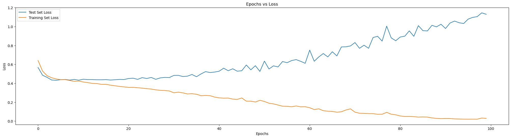
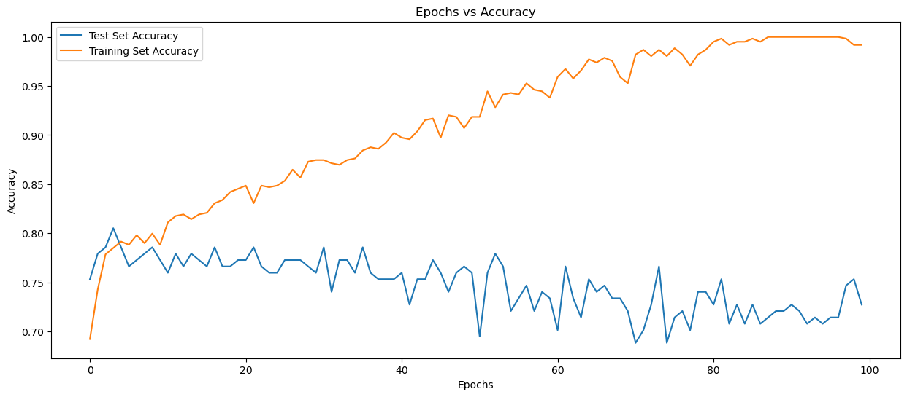
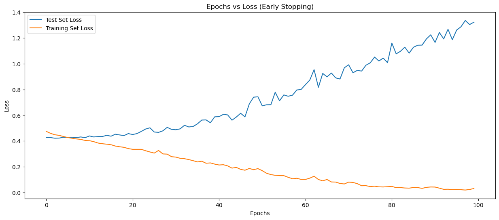
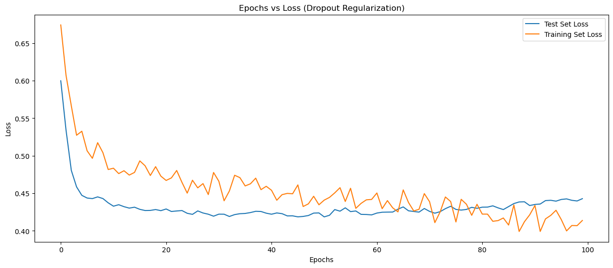

```python
import pandas as pd
import numpy as np
```


```python
df_diab = pd.read_csv('../datasets/diabetes.csv')
```


```python
df_diab.head()
```


<div>
<style scoped>
    .dataframe tbody tr th:only-of-type {
        vertical-align: middle;
    }

    .dataframe tbody tr th {
        vertical-align: top;
    }

    .dataframe thead th {
        text-align: right;
    }
</style>
<table border="1" class="dataframe">
  <thead>
    <tr style="text-align: right;">
      <th></th>
      <th>Pregnancies</th>
      <th>Glucose</th>
      <th>BloodPressure</th>
      <th>SkinThickness</th>
      <th>Insulin</th>
      <th>BMI</th>
      <th>DiabetesPedigreeFunction</th>
      <th>Age</th>
      <th>Outcome</th>
    </tr>
  </thead>
  <tbody>
    <tr>
      <th>0</th>
      <td>6</td>
      <td>148</td>
      <td>72</td>
      <td>35</td>
      <td>0</td>
      <td>33.6</td>
      <td>0.627</td>
      <td>50</td>
      <td>1</td>
    </tr>
    <tr>
      <th>1</th>
      <td>1</td>
      <td>85</td>
      <td>66</td>
      <td>29</td>
      <td>0</td>
      <td>26.6</td>
      <td>0.351</td>
      <td>31</td>
      <td>0</td>
    </tr>
    <tr>
      <th>2</th>
      <td>8</td>
      <td>183</td>
      <td>64</td>
      <td>0</td>
      <td>0</td>
      <td>23.3</td>
      <td>0.672</td>
      <td>32</td>
      <td>1</td>
    </tr>
    <tr>
      <th>3</th>
      <td>1</td>
      <td>89</td>
      <td>66</td>
      <td>23</td>
      <td>94</td>
      <td>28.1</td>
      <td>0.167</td>
      <td>21</td>
      <td>0</td>
    </tr>
    <tr>
      <th>4</th>
      <td>0</td>
      <td>137</td>
      <td>40</td>
      <td>35</td>
      <td>168</td>
      <td>43.1</td>
      <td>2.288</td>
      <td>33</td>
      <td>1</td>
    </tr>
  </tbody>
</table>
</div>


```python
df_diab.shape
```


    (768, 9)


```python
df_diab.Outcome.unique()
```


    array([1, 0], dtype=int64)


```python
# Check if any zero or missing values. 
df_diab.isna().sum()
```


    Pregnancies                 0
    Glucose                     0
    BloodPressure               0
    SkinThickness               0
    Insulin                     0
    BMI                         0
    DiabetesPedigreeFunction    0
    Age                         0
    Outcome                     0
    dtype: int64


```python
# Baking the data set to extract dependent and independent variables. 
X = df_diab.drop(['Outcome'],axis=1)
y = df_diab['Outcome']
```


```python
# A seed is a number that initializes the selection of numbers by a random number generator; 
# given the same seed number, a random number generator will generate the same series of 
# random numbers each time a simulation is run.
np.random.seed(12345)
```


```python
from sklearn.model_selection import train_test_split
```


```python
# Split into training and testing, to perform stratified sammpling
# Stratified sampling: dividing the whole data set into homogeneous groups called strata (stratum).

# train_size is 80% // 80% of the data is used to train the model. Large data is required for the training.
# random_state is 12345 // 
# stratify = y // to get a balanced data for the training. Can only be done on the dependent data (not on independent data).
# the stratify sampling will ensure that the percentage of the split data is also same as the original data. 
# Random sampling may create certain imbalances in the training and test data and may lead to inaccuracies. 
X_train, X_test, y_train,y_test = train_test_split(X,
                                                   y,
                                                   stratify = y,
                                                   test_size=0.2,
                                                   random_state=12345)
```


```python
X_train.shape
```


    (614, 8)


```python
X_test.shape
```


    (154, 8)


```python
# Scale of certain data columns are different than each other. To unify the scale, standard scaling is performed.
from sklearn.preprocessing import StandardScaler
```


```python
# X-scaled = (X - mean)/sd -> z value

# Neural network are sensitive to scale so scaling is mandtory. 
# Some ML algorithms also needs scaling 

# (x-mu)/sigma
# Calculate Z values for each column divided by standard deviation. 

# Training dataset is used for training the model. So 'mu' and 'sigma' is inferred from the training set only.
# Test dataset is used for validating the model. We keep the test set prstine. Don't learn or infer anything.

# Do fit_transform only on X_train and transform on X_test.
# We take the mean and standard deviation from X_train and apply it to X_test.

scaler = StandardScaler()
X_train_scaled = scaler.fit_transform(X_train)
X_test_scaled = scaler.transform(X_test)
```


```python
import tensorflow as tf
```


```python
print(tf.__version__)
```

    2.18.0
    


```python
from tensorflow.keras.models import Sequential
```


```python
from tensorflow.keras.layers import Dense, Input
```


```python
model = Sequential()
```


```python
X_train_scaled.shape[1]
```


    8


```python
model.add(Input(shape = (X_train_scaled.shape[1],))) # Input Layer
```


```python
# First Hidden Layer - 128 neurons, Relu activation
model.add(Dense(units=128,
                activation='relu'
         ))
```


```python
# Second Hidden Layer - 64 neurons, Relu activation
model.add(Dense(units=64, activation='relu'))

# Third Hidden Layer 32, relu activation
model.add(Dense(units=32, activation='relu'))
```


```python
# Output layer - Sigmoid
model.add(Dense(units=1, activation='sigmoid'))
```


```python
model.summary()
```


<pre style="white-space:pre;overflow-x:auto;line-height:normal;font-family:Menlo,'DejaVu Sans Mono',consolas,'Courier New',monospace"><span style="font-weight: bold">Model: "sequential_1"</span>
</pre>


<pre style="white-space:pre;overflow-x:auto;line-height:normal;font-family:Menlo,'DejaVu Sans Mono',consolas,'Courier New',monospace">┏━━━━━━━━━━━━━━━━━━━━━━━━━━━━━━━━━┳━━━━━━━━━━━━━━━━━━━━━━━━┳━━━━━━━━━━━━━━━┓
┃<span style="font-weight: bold"> Layer (type)                    </span>┃<span style="font-weight: bold"> Output Shape           </span>┃<span style="font-weight: bold">       Param # </span>┃
┡━━━━━━━━━━━━━━━━━━━━━━━━━━━━━━━━━╇━━━━━━━━━━━━━━━━━━━━━━━━╇━━━━━━━━━━━━━━━┩
│ dense_4 (<span style="color: #0087ff; text-decoration-color: #0087ff">Dense</span>)                 │ (<span style="color: #00d7ff; text-decoration-color: #00d7ff">None</span>, <span style="color: #00af00; text-decoration-color: #00af00">128</span>)            │         <span style="color: #00af00; text-decoration-color: #00af00">1,152</span> │
├─────────────────────────────────┼────────────────────────┼───────────────┤
│ dense_5 (<span style="color: #0087ff; text-decoration-color: #0087ff">Dense</span>)                 │ (<span style="color: #00d7ff; text-decoration-color: #00d7ff">None</span>, <span style="color: #00af00; text-decoration-color: #00af00">64</span>)             │         <span style="color: #00af00; text-decoration-color: #00af00">8,256</span> │
├─────────────────────────────────┼────────────────────────┼───────────────┤
│ dense_6 (<span style="color: #0087ff; text-decoration-color: #0087ff">Dense</span>)                 │ (<span style="color: #00d7ff; text-decoration-color: #00d7ff">None</span>, <span style="color: #00af00; text-decoration-color: #00af00">32</span>)             │         <span style="color: #00af00; text-decoration-color: #00af00">2,080</span> │
├─────────────────────────────────┼────────────────────────┼───────────────┤
│ dense_7 (<span style="color: #0087ff; text-decoration-color: #0087ff">Dense</span>)                 │ (<span style="color: #00d7ff; text-decoration-color: #00d7ff">None</span>, <span style="color: #00af00; text-decoration-color: #00af00">1</span>)              │            <span style="color: #00af00; text-decoration-color: #00af00">33</span> │
└─────────────────────────────────┴────────────────────────┴───────────────┘
</pre>


<pre style="white-space:pre;overflow-x:auto;line-height:normal;font-family:Menlo,'DejaVu Sans Mono',consolas,'Courier New',monospace"><span style="font-weight: bold"> Total params: </span><span style="color: #00af00; text-decoration-color: #00af00">11,521</span> (45.00 KB)
</pre>


<pre style="white-space:pre;overflow-x:auto;line-height:normal;font-family:Menlo,'DejaVu Sans Mono',consolas,'Courier New',monospace"><span style="font-weight: bold"> Trainable params: </span><span style="color: #00af00; text-decoration-color: #00af00">11,521</span> (45.00 KB)
</pre>


<pre style="white-space:pre;overflow-x:auto;line-height:normal;font-family:Menlo,'DejaVu Sans Mono',consolas,'Courier New',monospace"><span style="font-weight: bold"> Non-trainable params: </span><span style="color: #00af00; text-decoration-color: #00af00">0</span> (0.00 B)
</pre>


```python
#(8+1)*128 = 1152
#(128+1)*64 = 8256
(64+1)*32
```


    2080


```python
1152+8256+2080+33
```


    11521


```python
model.compile(optimizer='adam', # Variant of Gradient Descent
              loss= 'binary_crossentropy', # Log Loss or Binary Cross Entropy
              metrics=['accuracy']) # Monitor Accuracy
```


```python
result = model.fit(X_train_scaled, 
                   y_train,
                   validation_data = (X_test_scaled, y_test),
                   epochs=100)
```

    Epoch 1/100
    20/20 ━━━━━━━━━━━━━━━━━━━━ 4s 33ms/step - accuracy: 0.6527 - loss: 0.6685 - val_accuracy: 0.7532 - val_loss: 0.5675
    Epoch 2/100
    20/20 ━━━━━━━━━━━━━━━━━━━━ 0s 11ms/step - accuracy: 0.7408 - loss: 0.5409 - val_accuracy: 0.7792 - val_loss: 0.4853
    Epoch 3/100
    20/20 ━━━━━━━━━━━━━━━━━━━━ 0s 12ms/step - accuracy: 0.7840 - loss: 0.4739 - val_accuracy: 0.7857 - val_loss: 0.4630
    Epoch 4/100
    20/20 ━━━━━━━━━━━━━━━━━━━━ 0s 11ms/step - accuracy: 0.7879 - loss: 0.4576 - val_accuracy: 0.8052 - val_loss: 0.4350
    Epoch 5/100
    20/20 ━━━━━━━━━━━━━━━━━━━━ 0s 12ms/step - accuracy: 0.8163 - loss: 0.4233 - val_accuracy: 0.7857 - val_loss: 0.4318
    Epoch 6/100
    20/20 ━━━━━━━━━━━━━━━━━━━━ 0s 11ms/step - accuracy: 0.8077 - loss: 0.4303 - val_accuracy: 0.7662 - val_loss: 0.4383
    Epoch 7/100
    20/20 ━━━━━━━━━━━━━━━━━━━━ 0s 11ms/step - accuracy: 0.7942 - loss: 0.4375 - val_accuracy: 0.7727 - val_loss: 0.4408
    Epoch 8/100
    20/20 ━━━━━━━━━━━━━━━━━━━━ 0s 11ms/step - accuracy: 0.8026 - loss: 0.4064 - val_accuracy: 0.7792 - val_loss: 0.4342
    Epoch 9/100
    20/20 ━━━━━━━━━━━━━━━━━━━━ 0s 9ms/step - accuracy: 0.8036 - loss: 0.4229 - val_accuracy: 0.7857 - val_loss: 0.4414
    Epoch 10/100
    20/20 ━━━━━━━━━━━━━━━━━━━━ 0s 11ms/step - accuracy: 0.7938 - loss: 0.4308 - val_accuracy: 0.7727 - val_loss: 0.4329
    Epoch 11/100
    20/20 ━━━━━━━━━━━━━━━━━━━━ 0s 10ms/step - accuracy: 0.8167 - loss: 0.4283 - val_accuracy: 0.7597 - val_loss: 0.4433
    Epoch 12/100
    20/20 ━━━━━━━━━━━━━━━━━━━━ 0s 10ms/step - accuracy: 0.8043 - loss: 0.4045 - val_accuracy: 0.7792 - val_loss: 0.4394
    Epoch 13/100
    20/20 ━━━━━━━━━━━━━━━━━━━━ 0s 12ms/step - accuracy: 0.8091 - loss: 0.3805 - val_accuracy: 0.7662 - val_loss: 0.4395
    Epoch 14/100
    20/20 ━━━━━━━━━━━━━━━━━━━━ 0s 10ms/step - accuracy: 0.8178 - loss: 0.4231 - val_accuracy: 0.7792 - val_loss: 0.4375
    Epoch 15/100
    20/20 ━━━━━━━━━━━━━━━━━━━━ 0s 10ms/step - accuracy: 0.8299 - loss: 0.3733 - val_accuracy: 0.7727 - val_loss: 0.4372
    Epoch 16/100
    20/20 ━━━━━━━━━━━━━━━━━━━━ 0s 10ms/step - accuracy: 0.8274 - loss: 0.3902 - val_accuracy: 0.7662 - val_loss: 0.4393
    Epoch 17/100
    20/20 ━━━━━━━━━━━━━━━━━━━━ 0s 11ms/step - accuracy: 0.8239 - loss: 0.3934 - val_accuracy: 0.7857 - val_loss: 0.4346
    Epoch 18/100
    20/20 ━━━━━━━━━━━━━━━━━━━━ 0s 9ms/step - accuracy: 0.8498 - loss: 0.3760 - val_accuracy: 0.7662 - val_loss: 0.4378
    Epoch 19/100
    20/20 ━━━━━━━━━━━━━━━━━━━━ 0s 12ms/step - accuracy: 0.8597 - loss: 0.3442 - val_accuracy: 0.7662 - val_loss: 0.4413
    Epoch 20/100
    20/20 ━━━━━━━━━━━━━━━━━━━━ 0s 9ms/step - accuracy: 0.8598 - loss: 0.3432 - val_accuracy: 0.7727 - val_loss: 0.4401
    Epoch 21/100
    20/20 ━━━━━━━━━━━━━━━━━━━━ 0s 11ms/step - accuracy: 0.8454 - loss: 0.3529 - val_accuracy: 0.7727 - val_loss: 0.4508
    Epoch 22/100
    20/20 ━━━━━━━━━━━━━━━━━━━━ 0s 11ms/step - accuracy: 0.8440 - loss: 0.3431 - val_accuracy: 0.7857 - val_loss: 0.4540
    Epoch 23/100
    20/20 ━━━━━━━━━━━━━━━━━━━━ 0s 9ms/step - accuracy: 0.8469 - loss: 0.3389 - val_accuracy: 0.7662 - val_loss: 0.4418
    Epoch 24/100
    20/20 ━━━━━━━━━━━━━━━━━━━━ 0s 11ms/step - accuracy: 0.8487 - loss: 0.3375 - val_accuracy: 0.7597 - val_loss: 0.4600
    Epoch 25/100
    20/20 ━━━━━━━━━━━━━━━━━━━━ 0s 12ms/step - accuracy: 0.8477 - loss: 0.3398 - val_accuracy: 0.7597 - val_loss: 0.4509
    Epoch 26/100
    20/20 ━━━━━━━━━━━━━━━━━━━━ 0s 12ms/step - accuracy: 0.8453 - loss: 0.3403 - val_accuracy: 0.7727 - val_loss: 0.4619
    Epoch 27/100
    20/20 ━━━━━━━━━━━━━━━━━━━━ 0s 11ms/step - accuracy: 0.8714 - loss: 0.3214 - val_accuracy: 0.7727 - val_loss: 0.4421
    Epoch 28/100
    20/20 ━━━━━━━━━━━━━━━━━━━━ 0s 9ms/step - accuracy: 0.8634 - loss: 0.3195 - val_accuracy: 0.7727 - val_loss: 0.4575
    Epoch 29/100
    20/20 ━━━━━━━━━━━━━━━━━━━━ 0s 10ms/step - accuracy: 0.8837 - loss: 0.3076 - val_accuracy: 0.7662 - val_loss: 0.4626
    Epoch 30/100
    20/20 ━━━━━━━━━━━━━━━━━━━━ 0s 9ms/step - accuracy: 0.8934 - loss: 0.2991 - val_accuracy: 0.7597 - val_loss: 0.4609
    Epoch 31/100
    20/20 ━━━━━━━━━━━━━━━━━━━━ 0s 11ms/step - accuracy: 0.8882 - loss: 0.2911 - val_accuracy: 0.7857 - val_loss: 0.4836
    Epoch 32/100
    20/20 ━━━━━━━━━━━━━━━━━━━━ 0s 10ms/step - accuracy: 0.8669 - loss: 0.2993 - val_accuracy: 0.7403 - val_loss: 0.4842
    Epoch 33/100
    20/20 ━━━━━━━━━━━━━━━━━━━━ 0s 10ms/step - accuracy: 0.8819 - loss: 0.2765 - val_accuracy: 0.7727 - val_loss: 0.4713
    Epoch 34/100
    20/20 ━━━━━━━━━━━━━━━━━━━━ 0s 9ms/step - accuracy: 0.8668 - loss: 0.2997 - val_accuracy: 0.7727 - val_loss: 0.4759
    Epoch 35/100
    20/20 ━━━━━━━━━━━━━━━━━━━━ 0s 11ms/step - accuracy: 0.8780 - loss: 0.2772 - val_accuracy: 0.7597 - val_loss: 0.4934
    Epoch 36/100
    20/20 ━━━━━━━━━━━━━━━━━━━━ 0s 10ms/step - accuracy: 0.8819 - loss: 0.2897 - val_accuracy: 0.7857 - val_loss: 0.4698
    Epoch 37/100
    20/20 ━━━━━━━━━━━━━━━━━━━━ 0s 10ms/step - accuracy: 0.9086 - loss: 0.2524 - val_accuracy: 0.7597 - val_loss: 0.4993
    Epoch 38/100
    20/20 ━━━━━━━━━━━━━━━━━━━━ 0s 12ms/step - accuracy: 0.8706 - loss: 0.2760 - val_accuracy: 0.7532 - val_loss: 0.5236
    Epoch 39/100
    20/20 ━━━━━━━━━━━━━━━━━━━━ 0s 11ms/step - accuracy: 0.8917 - loss: 0.2729 - val_accuracy: 0.7532 - val_loss: 0.5138
    Epoch 40/100
    20/20 ━━━━━━━━━━━━━━━━━━━━ 0s 10ms/step - accuracy: 0.9001 - loss: 0.2451 - val_accuracy: 0.7532 - val_loss: 0.5190
    Epoch 41/100
    20/20 ━━━━━━━━━━━━━━━━━━━━ 0s 11ms/step - accuracy: 0.8995 - loss: 0.2494 - val_accuracy: 0.7597 - val_loss: 0.5280
    Epoch 42/100
    20/20 ━━━━━━━━━━━━━━━━━━━━ 0s 11ms/step - accuracy: 0.8896 - loss: 0.2464 - val_accuracy: 0.7273 - val_loss: 0.5601
    Epoch 43/100
    20/20 ━━━━━━━━━━━━━━━━━━━━ 0s 13ms/step - accuracy: 0.9063 - loss: 0.2303 - val_accuracy: 0.7532 - val_loss: 0.5331
    Epoch 44/100
    20/20 ━━━━━━━━━━━━━━━━━━━━ 0s 12ms/step - accuracy: 0.9263 - loss: 0.2168 - val_accuracy: 0.7532 - val_loss: 0.5539
    Epoch 45/100
    20/20 ━━━━━━━━━━━━━━━━━━━━ 0s 12ms/step - accuracy: 0.9261 - loss: 0.2137 - val_accuracy: 0.7727 - val_loss: 0.5282
    Epoch 46/100
    20/20 ━━━━━━━━━━━━━━━━━━━━ 0s 13ms/step - accuracy: 0.9155 - loss: 0.2193 - val_accuracy: 0.7597 - val_loss: 0.5331
    Epoch 47/100
    20/20 ━━━━━━━━━━━━━━━━━━━━ 0s 11ms/step - accuracy: 0.9335 - loss: 0.1935 - val_accuracy: 0.7403 - val_loss: 0.5938
    Epoch 48/100
    20/20 ━━━━━━━━━━━━━━━━━━━━ 0s 10ms/step - accuracy: 0.9180 - loss: 0.2136 - val_accuracy: 0.7597 - val_loss: 0.5429
    Epoch 49/100
    20/20 ━━━━━━━━━━━━━━━━━━━━ 0s 10ms/step - accuracy: 0.9089 - loss: 0.2033 - val_accuracy: 0.7662 - val_loss: 0.5863
    Epoch 50/100
    20/20 ━━━━━━━━━━━━━━━━━━━━ 0s 11ms/step - accuracy: 0.9225 - loss: 0.2133 - val_accuracy: 0.7597 - val_loss: 0.5258
    Epoch 51/100
    20/20 ━━━━━━━━━━━━━━━━━━━━ 0s 11ms/step - accuracy: 0.9248 - loss: 0.1865 - val_accuracy: 0.6948 - val_loss: 0.6349
    Epoch 52/100
    20/20 ━━━━━━━━━━━━━━━━━━━━ 0s 12ms/step - accuracy: 0.9425 - loss: 0.1973 - val_accuracy: 0.7597 - val_loss: 0.5514
    Epoch 53/100
    20/20 ━━━━━━━━━━━━━━━━━━━━ 0s 13ms/step - accuracy: 0.9185 - loss: 0.1854 - val_accuracy: 0.7792 - val_loss: 0.5846
    Epoch 54/100
    20/20 ━━━━━━━━━━━━━━━━━━━━ 0s 11ms/step - accuracy: 0.9346 - loss: 0.1666 - val_accuracy: 0.7662 - val_loss: 0.5732
    Epoch 55/100
    20/20 ━━━━━━━━━━━━━━━━━━━━ 0s 10ms/step - accuracy: 0.9499 - loss: 0.1474 - val_accuracy: 0.7208 - val_loss: 0.6304
    Epoch 56/100
    20/20 ━━━━━━━━━━━━━━━━━━━━ 0s 10ms/step - accuracy: 0.9568 - loss: 0.1431 - val_accuracy: 0.7338 - val_loss: 0.6179
    Epoch 57/100
    20/20 ━━━━━━━━━━━━━━━━━━━━ 0s 11ms/step - accuracy: 0.9564 - loss: 0.1561 - val_accuracy: 0.7468 - val_loss: 0.6405
    Epoch 58/100
    20/20 ━━━━━━━━━━━━━━━━━━━━ 0s 11ms/step - accuracy: 0.9543 - loss: 0.1495 - val_accuracy: 0.7208 - val_loss: 0.6508
    Epoch 59/100
    20/20 ━━━━━━━━━━━━━━━━━━━━ 0s 11ms/step - accuracy: 0.9547 - loss: 0.1383 - val_accuracy: 0.7403 - val_loss: 0.6328
    Epoch 60/100
    20/20 ━━━━━━━━━━━━━━━━━━━━ 0s 13ms/step - accuracy: 0.9505 - loss: 0.1401 - val_accuracy: 0.7338 - val_loss: 0.6115
    Epoch 61/100
    20/20 ━━━━━━━━━━━━━━━━━━━━ 0s 10ms/step - accuracy: 0.9643 - loss: 0.1342 - val_accuracy: 0.7013 - val_loss: 0.7512
    Epoch 62/100
    20/20 ━━━━━━━━━━━━━━━━━━━━ 0s 12ms/step - accuracy: 0.9586 - loss: 0.1354 - val_accuracy: 0.7662 - val_loss: 0.6333
    Epoch 63/100
    20/20 ━━━━━━━━━━━━━━━━━━━━ 0s 13ms/step - accuracy: 0.9649 - loss: 0.1227 - val_accuracy: 0.7338 - val_loss: 0.6786
    Epoch 64/100
    20/20 ━━━━━━━━━━━━━━━━━━━━ 0s 10ms/step - accuracy: 0.9700 - loss: 0.0999 - val_accuracy: 0.7143 - val_loss: 0.7148
    Epoch 65/100
    20/20 ━━━━━━━━━━━━━━━━━━━━ 0s 11ms/step - accuracy: 0.9779 - loss: 0.1079 - val_accuracy: 0.7532 - val_loss: 0.6794
    Epoch 66/100
    20/20 ━━━━━━━━━━━━━━━━━━━━ 0s 11ms/step - accuracy: 0.9766 - loss: 0.0992 - val_accuracy: 0.7403 - val_loss: 0.7338
    Epoch 67/100
    20/20 ━━━━━━━━━━━━━━━━━━━━ 0s 13ms/step - accuracy: 0.9842 - loss: 0.0862 - val_accuracy: 0.7468 - val_loss: 0.6899
    Epoch 68/100
    20/20 ━━━━━━━━━━━━━━━━━━━━ 0s 11ms/step - accuracy: 0.9760 - loss: 0.0871 - val_accuracy: 0.7338 - val_loss: 0.7849
    Epoch 69/100
    20/20 ━━━━━━━━━━━━━━━━━━━━ 0s 13ms/step - accuracy: 0.9615 - loss: 0.1136 - val_accuracy: 0.7338 - val_loss: 0.7863
    Epoch 70/100
    20/20 ━━━━━━━━━━━━━━━━━━━━ 0s 12ms/step - accuracy: 0.9642 - loss: 0.1082 - val_accuracy: 0.7208 - val_loss: 0.7952
    Epoch 71/100
    20/20 ━━━━━━━━━━━━━━━━━━━━ 0s 14ms/step - accuracy: 0.9913 - loss: 0.0881 - val_accuracy: 0.6883 - val_loss: 0.8311
    Epoch 72/100
    20/20 ━━━━━━━━━━━━━━━━━━━━ 0s 14ms/step - accuracy: 0.9852 - loss: 0.0814 - val_accuracy: 0.7013 - val_loss: 0.7703
    Epoch 73/100
    20/20 ━━━━━━━━━━━━━━━━━━━━ 0s 14ms/step - accuracy: 0.9836 - loss: 0.0830 - val_accuracy: 0.7273 - val_loss: 0.8034
    Epoch 74/100
    20/20 ━━━━━━━━━━━━━━━━━━━━ 0s 11ms/step - accuracy: 0.9878 - loss: 0.0755 - val_accuracy: 0.7662 - val_loss: 0.7702
    Epoch 75/100
    20/20 ━━━━━━━━━━━━━━━━━━━━ 0s 11ms/step - accuracy: 0.9801 - loss: 0.0855 - val_accuracy: 0.6883 - val_loss: 0.8847
    Epoch 76/100
    20/20 ━━━━━━━━━━━━━━━━━━━━ 0s 10ms/step - accuracy: 0.9923 - loss: 0.0724 - val_accuracy: 0.7143 - val_loss: 0.8971
    Epoch 77/100
    20/20 ━━━━━━━━━━━━━━━━━━━━ 0s 10ms/step - accuracy: 0.9812 - loss: 0.0667 - val_accuracy: 0.7208 - val_loss: 0.8466
    Epoch 78/100
    20/20 ━━━━━━━━━━━━━━━━━━━━ 0s 12ms/step - accuracy: 0.9797 - loss: 0.0792 - val_accuracy: 0.7013 - val_loss: 1.0047
    Epoch 79/100
    20/20 ━━━━━━━━━━━━━━━━━━━━ 0s 11ms/step - accuracy: 0.9734 - loss: 0.0778 - val_accuracy: 0.7403 - val_loss: 0.8809
    Epoch 80/100
    20/20 ━━━━━━━━━━━━━━━━━━━━ 0s 14ms/step - accuracy: 0.9874 - loss: 0.0665 - val_accuracy: 0.7403 - val_loss: 0.8505
    Epoch 81/100
    20/20 ━━━━━━━━━━━━━━━━━━━━ 0s 13ms/step - accuracy: 0.9966 - loss: 0.0511 - val_accuracy: 0.7273 - val_loss: 0.8899
    Epoch 82/100
    20/20 ━━━━━━━━━━━━━━━━━━━━ 0s 10ms/step - accuracy: 0.9996 - loss: 0.0440 - val_accuracy: 0.7532 - val_loss: 0.8982
    Epoch 83/100
    20/20 ━━━━━━━━━━━━━━━━━━━━ 0s 12ms/step - accuracy: 0.9903 - loss: 0.0495 - val_accuracy: 0.7078 - val_loss: 0.9551
    Epoch 84/100
    20/20 ━━━━━━━━━━━━━━━━━━━━ 0s 11ms/step - accuracy: 0.9960 - loss: 0.0461 - val_accuracy: 0.7273 - val_loss: 0.8970
    Epoch 85/100
    20/20 ━━━━━━━━━━━━━━━━━━━━ 0s 12ms/step - accuracy: 0.9965 - loss: 0.0412 - val_accuracy: 0.7078 - val_loss: 1.0100
    Epoch 86/100
    20/20 ━━━━━━━━━━━━━━━━━━━━ 0s 12ms/step - accuracy: 0.9994 - loss: 0.0467 - val_accuracy: 0.7273 - val_loss: 0.9572
    Epoch 87/100
    20/20 ━━━━━━━━━━━━━━━━━━━━ 0s 12ms/step - accuracy: 0.9982 - loss: 0.0410 - val_accuracy: 0.7078 - val_loss: 0.9543
    Epoch 88/100
    20/20 ━━━━━━━━━━━━━━━━━━━━ 0s 11ms/step - accuracy: 1.0000 - loss: 0.0309 - val_accuracy: 0.7143 - val_loss: 1.0130
    Epoch 89/100
    20/20 ━━━━━━━━━━━━━━━━━━━━ 0s 10ms/step - accuracy: 1.0000 - loss: 0.0277 - val_accuracy: 0.7208 - val_loss: 0.9974
    Epoch 90/100
    20/20 ━━━━━━━━━━━━━━━━━━━━ 0s 11ms/step - accuracy: 1.0000 - loss: 0.0234 - val_accuracy: 0.7208 - val_loss: 1.0249
    Epoch 91/100
    20/20 ━━━━━━━━━━━━━━━━━━━━ 0s 12ms/step - accuracy: 1.0000 - loss: 0.0274 - val_accuracy: 0.7273 - val_loss: 0.9798
    Epoch 92/100
    20/20 ━━━━━━━━━━━━━━━━━━━━ 0s 11ms/step - accuracy: 1.0000 - loss: 0.0281 - val_accuracy: 0.7208 - val_loss: 1.0380
    Epoch 93/100
    20/20 ━━━━━━━━━━━━━━━━━━━━ 0s 13ms/step - accuracy: 1.0000 - loss: 0.0249 - val_accuracy: 0.7078 - val_loss: 1.0585
    Epoch 94/100
    20/20 ━━━━━━━━━━━━━━━━━━━━ 0s 11ms/step - accuracy: 1.0000 - loss: 0.0226 - val_accuracy: 0.7143 - val_loss: 1.0409
    Epoch 95/100
    20/20 ━━━━━━━━━━━━━━━━━━━━ 0s 12ms/step - accuracy: 1.0000 - loss: 0.0197 - val_accuracy: 0.7078 - val_loss: 1.0326
    Epoch 96/100
    20/20 ━━━━━━━━━━━━━━━━━━━━ 0s 10ms/step - accuracy: 1.0000 - loss: 0.0200 - val_accuracy: 0.7143 - val_loss: 1.0793
    Epoch 97/100
    20/20 ━━━━━━━━━━━━━━━━━━━━ 0s 11ms/step - accuracy: 1.0000 - loss: 0.0226 - val_accuracy: 0.7143 - val_loss: 1.0972
    Epoch 98/100
    20/20 ━━━━━━━━━━━━━━━━━━━━ 0s 10ms/step - accuracy: 0.9977 - loss: 0.0216 - val_accuracy: 0.7468 - val_loss: 1.1057
    Epoch 99/100
    20/20 ━━━━━━━━━━━━━━━━━━━━ 0s 9ms/step - accuracy: 0.9938 - loss: 0.0286 - val_accuracy: 0.7532 - val_loss: 1.1455
    Epoch 100/100
    20/20 ━━━━━━━━━━━━━━━━━━━━ 0s 13ms/step - accuracy: 0.9935 - loss: 0.0226 - val_accuracy: 0.7273 - val_loss: 1.1301
    


```python
y_train_pred = model.predict(X_train_scaled)
y_test_pred = model.predict(X_test_scaled)
```

    20/20 ━━━━━━━━━━━━━━━━━━━━ 0s 10ms/step
    5/5 ━━━━━━━━━━━━━━━━━━━━ 0s 13ms/step
    


```python
y_train_pred[0] >=0.5
```


    array([ True])


```python
from sklearn.metrics import confusion_matrix, accuracy_score
```


```python
confusion_matrix(y_pred=y_train_pred >= 0.5, 
                 y_true = y_train)
```


    array([[400,   0],
           [  1, 213]], dtype=int64)


```python
accuracy_score(y_pred=y_train_pred >= 0.5, 
               y_true = y_train)
```


    0.998371335504886


```python
confusion_matrix(y_pred=y_test_pred >= 0.5, 
                 y_true = y_test)
```


    array([[81, 19],
           [23, 31]], dtype=int64)


```python
accuracy_score(y_pred=y_test_pred >= 0.5, 
               y_true = y_test)
```


    0.7272727272727273


```python
history = pd.DataFrame(result.history)
```


```python
history.head()
```


<div>
<style scoped>
    .dataframe tbody tr th:only-of-type {
        vertical-align: middle;
    }

    .dataframe tbody tr th {
        vertical-align: top;
    }

    .dataframe thead th {
        text-align: right;
    }
</style>
<table border="1" class="dataframe">
  <thead>
    <tr style="text-align: right;">
      <th></th>
      <th>accuracy</th>
      <th>loss</th>
      <th>val_accuracy</th>
      <th>val_loss</th>
    </tr>
  </thead>
  <tbody>
    <tr>
      <th>0</th>
      <td>0.692182</td>
      <td>0.640776</td>
      <td>0.753247</td>
      <td>0.567506</td>
    </tr>
    <tr>
      <th>1</th>
      <td>0.742671</td>
      <td>0.529257</td>
      <td>0.779221</td>
      <td>0.485339</td>
    </tr>
    <tr>
      <th>2</th>
      <td>0.778502</td>
      <td>0.480337</td>
      <td>0.785714</td>
      <td>0.463007</td>
    </tr>
    <tr>
      <th>3</th>
      <td>0.785016</td>
      <td>0.458811</td>
      <td>0.805195</td>
      <td>0.434954</td>
    </tr>
    <tr>
      <th>4</th>
      <td>0.791531</td>
      <td>0.446040</td>
      <td>0.785714</td>
      <td>0.431844</td>
    </tr>
  </tbody>
</table>
</div>


```python
import matplotlib.pyplot as plt
```


```python
plt.figure(figsize = (25,6))
plt.plot(history.val_loss, label='Test Set Loss')
plt.plot(history.loss, label='Training Set Loss')
plt.title('Epochs vs Loss')
plt.xlabel('Epochs')
plt.ylabel('Loss')
plt.legend()
plt.show()
```


    

    


```python
plt.figure(figsize = (15,6))
plt.plot(history.val_accuracy, label='Test Set Accuracy')
plt.plot(history.accuracy, label='Training Set Accuracy')
plt.title('Epochs vs Accuracy')
plt.xlabel('Epochs')
plt.ylabel('Accuracy')
plt.legend()
plt.show()
```


    

    


# Implement Early Stopping


```python
from tensorflow.keras.callbacks import EarlyStopping
```


```python
model_es = Sequential()
```


```python
model_es.add(Input(shape = (X_train_scaled.shape[1],)))
```


```python
model_es.add(Dense(units = 128, activation='relu'))
```


```python
model_es.add(Dense(units = 64, activation = 'relu'))
```


```python
model_es.add(Dense(units = 32, activation = 'relu'))
```


```python
model_es.add(Dense(units = 1, activation = 'sigmoid'))
```


```python
model_es.summary()
```


<pre style="white-space:pre;overflow-x:auto;line-height:normal;font-family:Menlo,'DejaVu Sans Mono',consolas,'Courier New',monospace"><span style="font-weight: bold">Model: "sequential_2"</span>
</pre>


<pre style="white-space:pre;overflow-x:auto;line-height:normal;font-family:Menlo,'DejaVu Sans Mono',consolas,'Courier New',monospace">┏━━━━━━━━━━━━━━━━━━━━━━━━━━━━━━━━━┳━━━━━━━━━━━━━━━━━━━━━━━━┳━━━━━━━━━━━━━━━┓
┃<span style="font-weight: bold"> Layer (type)                    </span>┃<span style="font-weight: bold"> Output Shape           </span>┃<span style="font-weight: bold">       Param # </span>┃
┡━━━━━━━━━━━━━━━━━━━━━━━━━━━━━━━━━╇━━━━━━━━━━━━━━━━━━━━━━━━╇━━━━━━━━━━━━━━━┩
│ dense_8 (<span style="color: #0087ff; text-decoration-color: #0087ff">Dense</span>)                 │ (<span style="color: #00d7ff; text-decoration-color: #00d7ff">None</span>, <span style="color: #00af00; text-decoration-color: #00af00">128</span>)            │         <span style="color: #00af00; text-decoration-color: #00af00">1,152</span> │
├─────────────────────────────────┼────────────────────────┼───────────────┤
│ dense_9 (<span style="color: #0087ff; text-decoration-color: #0087ff">Dense</span>)                 │ (<span style="color: #00d7ff; text-decoration-color: #00d7ff">None</span>, <span style="color: #00af00; text-decoration-color: #00af00">64</span>)             │         <span style="color: #00af00; text-decoration-color: #00af00">8,256</span> │
├─────────────────────────────────┼────────────────────────┼───────────────┤
│ dense_10 (<span style="color: #0087ff; text-decoration-color: #0087ff">Dense</span>)                │ (<span style="color: #00d7ff; text-decoration-color: #00d7ff">None</span>, <span style="color: #00af00; text-decoration-color: #00af00">32</span>)             │         <span style="color: #00af00; text-decoration-color: #00af00">2,080</span> │
├─────────────────────────────────┼────────────────────────┼───────────────┤
│ dense_11 (<span style="color: #0087ff; text-decoration-color: #0087ff">Dense</span>)                │ (<span style="color: #00d7ff; text-decoration-color: #00d7ff">None</span>, <span style="color: #00af00; text-decoration-color: #00af00">1</span>)              │            <span style="color: #00af00; text-decoration-color: #00af00">33</span> │
└─────────────────────────────────┴────────────────────────┴───────────────┘
</pre>


<pre style="white-space:pre;overflow-x:auto;line-height:normal;font-family:Menlo,'DejaVu Sans Mono',consolas,'Courier New',monospace"><span style="font-weight: bold"> Total params: </span><span style="color: #00af00; text-decoration-color: #00af00">11,521</span> (45.00 KB)
</pre>


<pre style="white-space:pre;overflow-x:auto;line-height:normal;font-family:Menlo,'DejaVu Sans Mono',consolas,'Courier New',monospace"><span style="font-weight: bold"> Trainable params: </span><span style="color: #00af00; text-decoration-color: #00af00">11,521</span> (45.00 KB)
</pre>


<pre style="white-space:pre;overflow-x:auto;line-height:normal;font-family:Menlo,'DejaVu Sans Mono',consolas,'Courier New',monospace"><span style="font-weight: bold"> Non-trainable params: </span><span style="color: #00af00; text-decoration-color: #00af00">0</span> (0.00 B)
</pre>


```python
model_es.compile(optimizer='adam',
                 loss='binary_crossentropy',
                 metrics=['Accuracy'])
```


```python
# Assuming 'es' is your EarlyStopping callback
es = EarlyStopping(monitor='val_accuracy', mode='max', patience=10, restore_best_weights=True) #adjust patience as needed.
```


```python
result_es = model_es.fit(X_train_scaled,
                         y_train,
                         validation_data = (X_test_scaled, y_test),
                         epochs = 100,
                         callbacks=[es]
                        )
```

    Epoch 1/100
    20/20 ━━━━━━━━━━━━━━━━━━━━ 0s 12ms/step - Accuracy: 0.7576 - loss: 0.4817 - val_Accuracy: 0.7727 - val_loss: 0.4264
    Epoch 2/100
    18/20 ━━━━━━━━━━━━━━━━━━━━ 0s 3ms/step - Accuracy: 0.7713 - loss: 0.4479 

    C:\Users\anilj\anaconda3\Lib\site-packages\keras\src\callbacks\early_stopping.py:153: UserWarning: Early stopping conditioned on metric `val_accuracy` which is not available. Available metrics are: Accuracy,loss,val_Accuracy,val_loss
      current = self.get_monitor_value(logs)
    

    20/20 ━━━━━━━━━━━━━━━━━━━━ 0s 10ms/step - Accuracy: 0.7720 - loss: 0.4496 - val_Accuracy: 0.7922 - val_loss: 0.4267
    Epoch 3/100
    20/20 ━━━━━━━━━━━━━━━━━━━━ 0s 10ms/step - Accuracy: 0.7904 - loss: 0.4427 - val_Accuracy: 0.7792 - val_loss: 0.4216
    Epoch 4/100
    20/20 ━━━━━━━━━━━━━━━━━━━━ 0s 11ms/step - Accuracy: 0.7817 - loss: 0.4456 - val_Accuracy: 0.7987 - val_loss: 0.4227
    Epoch 5/100
    20/20 ━━━━━━━━━━━━━━━━━━━━ 0s 10ms/step - Accuracy: 0.7825 - loss: 0.4576 - val_Accuracy: 0.7987 - val_loss: 0.4293
    Epoch 6/100
    20/20 ━━━━━━━━━━━━━━━━━━━━ 0s 11ms/step - Accuracy: 0.8126 - loss: 0.4049 - val_Accuracy: 0.7922 - val_loss: 0.4266
    Epoch 7/100
    20/20 ━━━━━━━━━━━━━━━━━━━━ 0s 10ms/step - Accuracy: 0.7840 - loss: 0.4423 - val_Accuracy: 0.7922 - val_loss: 0.4255
    Epoch 8/100
    20/20 ━━━━━━━━━━━━━━━━━━━━ 0s 9ms/step - Accuracy: 0.8172 - loss: 0.4119 - val_Accuracy: 0.7987 - val_loss: 0.4267
    Epoch 9/100
    20/20 ━━━━━━━━━━━━━━━━━━━━ 0s 10ms/step - Accuracy: 0.7951 - loss: 0.4331 - val_Accuracy: 0.7922 - val_loss: 0.4314
    Epoch 10/100
    20/20 ━━━━━━━━━━━━━━━━━━━━ 0s 9ms/step - Accuracy: 0.8211 - loss: 0.4037 - val_Accuracy: 0.7792 - val_loss: 0.4257
    Epoch 11/100
    20/20 ━━━━━━━━━━━━━━━━━━━━ 0s 9ms/step - Accuracy: 0.8213 - loss: 0.3963 - val_Accuracy: 0.7727 - val_loss: 0.4393
    Epoch 12/100
    20/20 ━━━━━━━━━━━━━━━━━━━━ 0s 10ms/step - Accuracy: 0.8501 - loss: 0.3727 - val_Accuracy: 0.7922 - val_loss: 0.4314
    Epoch 13/100
    20/20 ━━━━━━━━━━━━━━━━━━━━ 0s 8ms/step - Accuracy: 0.8492 - loss: 0.3647 - val_Accuracy: 0.7792 - val_loss: 0.4348
    Epoch 14/100
    20/20 ━━━━━━━━━━━━━━━━━━━━ 0s 8ms/step - Accuracy: 0.8292 - loss: 0.3762 - val_Accuracy: 0.7987 - val_loss: 0.4349
    Epoch 15/100
    20/20 ━━━━━━━━━━━━━━━━━━━━ 0s 8ms/step - Accuracy: 0.8241 - loss: 0.3882 - val_Accuracy: 0.7857 - val_loss: 0.4439
    Epoch 16/100
    20/20 ━━━━━━━━━━━━━━━━━━━━ 0s 8ms/step - Accuracy: 0.8425 - loss: 0.3400 - val_Accuracy: 0.7987 - val_loss: 0.4374
    Epoch 17/100
    20/20 ━━━━━━━━━━━━━━━━━━━━ 0s 6ms/step - Accuracy: 0.8536 - loss: 0.3653 - val_Accuracy: 0.7727 - val_loss: 0.4525
    Epoch 18/100
    20/20 ━━━━━━━━━━━━━━━━━━━━ 0s 7ms/step - Accuracy: 0.8531 - loss: 0.3680 - val_Accuracy: 0.7727 - val_loss: 0.4469
    Epoch 19/100
    20/20 ━━━━━━━━━━━━━━━━━━━━ 0s 7ms/step - Accuracy: 0.8625 - loss: 0.3273 - val_Accuracy: 0.7792 - val_loss: 0.4421
    Epoch 20/100
    20/20 ━━━━━━━━━━━━━━━━━━━━ 0s 8ms/step - Accuracy: 0.8606 - loss: 0.3484 - val_Accuracy: 0.7597 - val_loss: 0.4576
    Epoch 21/100
    20/20 ━━━━━━━━━━━━━━━━━━━━ 0s 7ms/step - Accuracy: 0.8598 - loss: 0.3435 - val_Accuracy: 0.7662 - val_loss: 0.4503
    Epoch 22/100
    20/20 ━━━━━━━━━━━━━━━━━━━━ 0s 7ms/step - Accuracy: 0.8787 - loss: 0.2950 - val_Accuracy: 0.7468 - val_loss: 0.4575
    Epoch 23/100
    20/20 ━━━━━━━━━━━━━━━━━━━━ 0s 8ms/step - Accuracy: 0.8688 - loss: 0.3296 - val_Accuracy: 0.7662 - val_loss: 0.4744
    Epoch 24/100
    20/20 ━━━━━━━━━━━━━━━━━━━━ 0s 8ms/step - Accuracy: 0.8697 - loss: 0.3155 - val_Accuracy: 0.7338 - val_loss: 0.4927
    Epoch 25/100
    20/20 ━━━━━━━━━━━━━━━━━━━━ 0s 8ms/step - Accuracy: 0.8687 - loss: 0.3208 - val_Accuracy: 0.7338 - val_loss: 0.5024
    Epoch 26/100
    20/20 ━━━━━━━━━━━━━━━━━━━━ 0s 7ms/step - Accuracy: 0.8928 - loss: 0.2874 - val_Accuracy: 0.7662 - val_loss: 0.4699
    Epoch 27/100
    20/20 ━━━━━━━━━━━━━━━━━━━━ 0s 8ms/step - Accuracy: 0.8557 - loss: 0.3158 - val_Accuracy: 0.7662 - val_loss: 0.4669
    Epoch 28/100
    20/20 ━━━━━━━━━━━━━━━━━━━━ 0s 8ms/step - Accuracy: 0.8727 - loss: 0.2993 - val_Accuracy: 0.7403 - val_loss: 0.4790
    Epoch 29/100
    20/20 ━━━━━━━━━━━━━━━━━━━━ 0s 8ms/step - Accuracy: 0.8884 - loss: 0.2907 - val_Accuracy: 0.7468 - val_loss: 0.5060
    Epoch 30/100
    20/20 ━━━━━━━━━━━━━━━━━━━━ 0s 8ms/step - Accuracy: 0.8919 - loss: 0.2915 - val_Accuracy: 0.7532 - val_loss: 0.4902
    Epoch 31/100
    20/20 ━━━━━━━━━━━━━━━━━━━━ 0s 8ms/step - Accuracy: 0.9059 - loss: 0.2696 - val_Accuracy: 0.7468 - val_loss: 0.4875
    Epoch 32/100
    20/20 ━━━━━━━━━━━━━━━━━━━━ 0s 8ms/step - Accuracy: 0.8986 - loss: 0.2862 - val_Accuracy: 0.7532 - val_loss: 0.4943
    Epoch 33/100
    20/20 ━━━━━━━━━━━━━━━━━━━━ 0s 8ms/step - Accuracy: 0.9002 - loss: 0.2624 - val_Accuracy: 0.7468 - val_loss: 0.5220
    Epoch 34/100
    20/20 ━━━━━━━━━━━━━━━━━━━━ 0s 8ms/step - Accuracy: 0.9001 - loss: 0.2483 - val_Accuracy: 0.7597 - val_loss: 0.5090
    Epoch 35/100
    20/20 ━━━━━━━━━━━━━━━━━━━━ 0s 7ms/step - Accuracy: 0.8952 - loss: 0.2441 - val_Accuracy: 0.7468 - val_loss: 0.5126
    Epoch 36/100
    20/20 ━━━━━━━━━━━━━━━━━━━━ 0s 8ms/step - Accuracy: 0.8891 - loss: 0.2550 - val_Accuracy: 0.7532 - val_loss: 0.5332
    Epoch 37/100
    20/20 ━━━━━━━━━━━━━━━━━━━━ 0s 8ms/step - Accuracy: 0.9047 - loss: 0.2344 - val_Accuracy: 0.7468 - val_loss: 0.5625
    Epoch 38/100
    20/20 ━━━━━━━━━━━━━━━━━━━━ 0s 7ms/step - Accuracy: 0.9103 - loss: 0.2259 - val_Accuracy: 0.7338 - val_loss: 0.5637
    Epoch 39/100
    20/20 ━━━━━━━━━━━━━━━━━━━━ 0s 8ms/step - Accuracy: 0.9026 - loss: 0.2314 - val_Accuracy: 0.7597 - val_loss: 0.5416
    Epoch 40/100
    20/20 ━━━━━━━━━━━━━━━━━━━━ 0s 8ms/step - Accuracy: 0.9221 - loss: 0.2077 - val_Accuracy: 0.7208 - val_loss: 0.5878
    Epoch 41/100
    20/20 ━━━━━━━━━━━━━━━━━━━━ 0s 7ms/step - Accuracy: 0.9264 - loss: 0.2086 - val_Accuracy: 0.7727 - val_loss: 0.5890
    Epoch 42/100
    20/20 ━━━━━━━━━━━━━━━━━━━━ 0s 8ms/step - Accuracy: 0.9278 - loss: 0.1996 - val_Accuracy: 0.7078 - val_loss: 0.6070
    Epoch 43/100
    20/20 ━━━━━━━━━━━━━━━━━━━━ 0s 8ms/step - Accuracy: 0.9285 - loss: 0.2076 - val_Accuracy: 0.7338 - val_loss: 0.6025
    Epoch 44/100
    20/20 ━━━━━━━━━━━━━━━━━━━━ 0s 8ms/step - Accuracy: 0.9284 - loss: 0.1698 - val_Accuracy: 0.7532 - val_loss: 0.5616
    Epoch 45/100
    20/20 ━━━━━━━━━━━━━━━━━━━━ 0s 8ms/step - Accuracy: 0.9285 - loss: 0.1848 - val_Accuracy: 0.7468 - val_loss: 0.5862
    Epoch 46/100
    20/20 ━━━━━━━━━━━━━━━━━━━━ 0s 12ms/step - Accuracy: 0.9463 - loss: 0.1791 - val_Accuracy: 0.7403 - val_loss: 0.6152
    Epoch 47/100
    20/20 ━━━━━━━━━━━━━━━━━━━━ 0s 8ms/step - Accuracy: 0.9345 - loss: 0.1680 - val_Accuracy: 0.7273 - val_loss: 0.5872
    Epoch 48/100
    20/20 ━━━━━━━━━━━━━━━━━━━━ 0s 10ms/step - Accuracy: 0.9215 - loss: 0.1878 - val_Accuracy: 0.7078 - val_loss: 0.6876
    Epoch 49/100
    20/20 ━━━━━━━━━━━━━━━━━━━━ 0s 8ms/step - Accuracy: 0.9359 - loss: 0.1841 - val_Accuracy: 0.7273 - val_loss: 0.7402
    Epoch 50/100
    20/20 ━━━━━━━━━━━━━━━━━━━━ 0s 9ms/step - Accuracy: 0.9202 - loss: 0.1928 - val_Accuracy: 0.7078 - val_loss: 0.7431
    Epoch 51/100
    20/20 ━━━━━━━━━━━━━━━━━━━━ 0s 8ms/step - Accuracy: 0.9365 - loss: 0.1784 - val_Accuracy: 0.7338 - val_loss: 0.6730
    Epoch 52/100
    20/20 ━━━━━━━━━━━━━━━━━━━━ 0s 11ms/step - Accuracy: 0.9358 - loss: 0.1443 - val_Accuracy: 0.7143 - val_loss: 0.6813
    Epoch 53/100
    20/20 ━━━━━━━━━━━━━━━━━━━━ 0s 9ms/step - Accuracy: 0.9626 - loss: 0.1364 - val_Accuracy: 0.7273 - val_loss: 0.6820
    Epoch 54/100
    20/20 ━━━━━━━━━━━━━━━━━━━━ 0s 10ms/step - Accuracy: 0.9639 - loss: 0.1186 - val_Accuracy: 0.7078 - val_loss: 0.7786
    Epoch 55/100
    20/20 ━━━━━━━━━━━━━━━━━━━━ 0s 11ms/step - Accuracy: 0.9562 - loss: 0.1242 - val_Accuracy: 0.7078 - val_loss: 0.7122
    Epoch 56/100
    20/20 ━━━━━━━━━━━━━━━━━━━━ 0s 10ms/step - Accuracy: 0.9661 - loss: 0.1076 - val_Accuracy: 0.7013 - val_loss: 0.7577
    Epoch 57/100
    20/20 ━━━━━━━━━━━━━━━━━━━━ 0s 11ms/step - Accuracy: 0.9737 - loss: 0.1118 - val_Accuracy: 0.7143 - val_loss: 0.7474
    Epoch 58/100
    20/20 ━━━━━━━━━━━━━━━━━━━━ 0s 9ms/step - Accuracy: 0.9646 - loss: 0.1184 - val_Accuracy: 0.7143 - val_loss: 0.7557
    Epoch 59/100
    20/20 ━━━━━━━━━━━━━━━━━━━━ 0s 8ms/step - Accuracy: 0.9786 - loss: 0.0931 - val_Accuracy: 0.6883 - val_loss: 0.7961
    Epoch 60/100
    20/20 ━━━━━━━━━━━━━━━━━━━━ 0s 9ms/step - Accuracy: 0.9813 - loss: 0.0885 - val_Accuracy: 0.7143 - val_loss: 0.8002
    Epoch 61/100
    20/20 ━━━━━━━━━━━━━━━━━━━━ 0s 10ms/step - Accuracy: 0.9696 - loss: 0.0968 - val_Accuracy: 0.7078 - val_loss: 0.8376
    Epoch 62/100
    20/20 ━━━━━━━━━━━━━━━━━━━━ 0s 12ms/step - Accuracy: 0.9624 - loss: 0.1086 - val_Accuracy: 0.7143 - val_loss: 0.8729
    Epoch 63/100
    20/20 ━━━━━━━━━━━━━━━━━━━━ 0s 10ms/step - Accuracy: 0.9595 - loss: 0.1324 - val_Accuracy: 0.7013 - val_loss: 0.9538
    Epoch 64/100
    20/20 ━━━━━━━━━━━━━━━━━━━━ 0s 10ms/step - Accuracy: 0.9523 - loss: 0.1127 - val_Accuracy: 0.6948 - val_loss: 0.8167
    Epoch 65/100
    20/20 ━━━━━━━━━━━━━━━━━━━━ 0s 8ms/step - Accuracy: 0.9684 - loss: 0.0894 - val_Accuracy: 0.6948 - val_loss: 0.9245
    Epoch 66/100
    20/20 ━━━━━━━━━━━━━━━━━━━━ 0s 8ms/step - Accuracy: 0.9797 - loss: 0.0925 - val_Accuracy: 0.7468 - val_loss: 0.8979
    Epoch 67/100
    20/20 ━━━━━━━━━━━━━━━━━━━━ 0s 11ms/step - Accuracy: 0.9747 - loss: 0.0805 - val_Accuracy: 0.7208 - val_loss: 0.9277
    Epoch 68/100
    20/20 ━━━━━━━━━━━━━━━━━━━━ 0s 9ms/step - Accuracy: 0.9881 - loss: 0.0727 - val_Accuracy: 0.7078 - val_loss: 0.8899
    Epoch 69/100
    20/20 ━━━━━━━━━━━━━━━━━━━━ 0s 9ms/step - Accuracy: 0.9836 - loss: 0.0670 - val_Accuracy: 0.7143 - val_loss: 0.8815
    Epoch 70/100
    20/20 ━━━━━━━━━━━━━━━━━━━━ 0s 10ms/step - Accuracy: 0.9935 - loss: 0.0622 - val_Accuracy: 0.7208 - val_loss: 0.9684
    Epoch 71/100
    20/20 ━━━━━━━━━━━━━━━━━━━━ 0s 11ms/step - Accuracy: 0.9911 - loss: 0.0678 - val_Accuracy: 0.7273 - val_loss: 0.9918
    Epoch 72/100
    20/20 ━━━━━━━━━━━━━━━━━━━━ 0s 10ms/step - Accuracy: 0.9796 - loss: 0.0697 - val_Accuracy: 0.6948 - val_loss: 0.9297
    Epoch 73/100
    20/20 ━━━━━━━━━━━━━━━━━━━━ 0s 11ms/step - Accuracy: 0.9795 - loss: 0.0706 - val_Accuracy: 0.6948 - val_loss: 0.9484
    Epoch 74/100
    20/20 ━━━━━━━━━━━━━━━━━━━━ 0s 9ms/step - Accuracy: 0.9961 - loss: 0.0445 - val_Accuracy: 0.6948 - val_loss: 0.9428
    Epoch 75/100
    20/20 ━━━━━━━━━━━━━━━━━━━━ 0s 8ms/step - Accuracy: 0.9905 - loss: 0.0563 - val_Accuracy: 0.7013 - val_loss: 0.9881
    Epoch 76/100
    20/20 ━━━━━━━━━━━━━━━━━━━━ 0s 16ms/step - Accuracy: 0.9920 - loss: 0.0433 - val_Accuracy: 0.6883 - val_loss: 1.0070
    Epoch 77/100
    20/20 ━━━━━━━━━━━━━━━━━━━━ 0s 9ms/step - Accuracy: 0.9969 - loss: 0.0470 - val_Accuracy: 0.7013 - val_loss: 1.0514
    Epoch 78/100
    20/20 ━━━━━━━━━━━━━━━━━━━━ 0s 8ms/step - Accuracy: 0.9942 - loss: 0.0439 - val_Accuracy: 0.6883 - val_loss: 1.0211
    Epoch 79/100
    20/20 ━━━━━━━━━━━━━━━━━━━━ 0s 7ms/step - Accuracy: 0.9986 - loss: 0.0450 - val_Accuracy: 0.6883 - val_loss: 1.0434
    Epoch 80/100
    20/20 ━━━━━━━━━━━━━━━━━━━━ 0s 6ms/step - Accuracy: 0.9984 - loss: 0.0408 - val_Accuracy: 0.7013 - val_loss: 1.0082
    Epoch 81/100
    20/20 ━━━━━━━━━━━━━━━━━━━━ 0s 7ms/step - Accuracy: 0.9917 - loss: 0.0501 - val_Accuracy: 0.6883 - val_loss: 1.1603
    Epoch 82/100
    20/20 ━━━━━━━━━━━━━━━━━━━━ 0s 7ms/step - Accuracy: 0.9977 - loss: 0.0348 - val_Accuracy: 0.7078 - val_loss: 1.0767
    Epoch 83/100
    20/20 ━━━━━━━━━━━━━━━━━━━━ 0s 6ms/step - Accuracy: 0.9956 - loss: 0.0401 - val_Accuracy: 0.6948 - val_loss: 1.0966
    Epoch 84/100
    20/20 ━━━━━━━━━━━━━━━━━━━━ 0s 7ms/step - Accuracy: 0.9986 - loss: 0.0277 - val_Accuracy: 0.6883 - val_loss: 1.1286
    Epoch 85/100
    20/20 ━━━━━━━━━━━━━━━━━━━━ 0s 6ms/step - Accuracy: 0.9967 - loss: 0.0341 - val_Accuracy: 0.7078 - val_loss: 1.0821
    Epoch 86/100
    20/20 ━━━━━━━━━━━━━━━━━━━━ 0s 8ms/step - Accuracy: 0.9966 - loss: 0.0417 - val_Accuracy: 0.6818 - val_loss: 1.1277
    Epoch 87/100
    20/20 ━━━━━━━━━━━━━━━━━━━━ 0s 6ms/step - Accuracy: 0.9908 - loss: 0.0421 - val_Accuracy: 0.6883 - val_loss: 1.1438
    Epoch 88/100
    20/20 ━━━━━━━━━━━━━━━━━━━━ 0s 6ms/step - Accuracy: 0.9914 - loss: 0.0368 - val_Accuracy: 0.6948 - val_loss: 1.1446
    Epoch 89/100
    20/20 ━━━━━━━━━━━━━━━━━━━━ 0s 7ms/step - Accuracy: 0.9972 - loss: 0.0380 - val_Accuracy: 0.6883 - val_loss: 1.1923
    Epoch 90/100
    20/20 ━━━━━━━━━━━━━━━━━━━━ 0s 7ms/step - Accuracy: 0.9806 - loss: 0.0498 - val_Accuracy: 0.6883 - val_loss: 1.2244
    Epoch 91/100
    20/20 ━━━━━━━━━━━━━━━━━━━━ 0s 6ms/step - Accuracy: 0.9950 - loss: 0.0422 - val_Accuracy: 0.6948 - val_loss: 1.1653
    Epoch 92/100
    20/20 ━━━━━━━━━━━━━━━━━━━━ 0s 8ms/step - Accuracy: 0.9956 - loss: 0.0327 - val_Accuracy: 0.6883 - val_loss: 1.2421
    Epoch 93/100
    20/20 ━━━━━━━━━━━━━━━━━━━━ 0s 7ms/step - Accuracy: 1.0000 - loss: 0.0250 - val_Accuracy: 0.6883 - val_loss: 1.1925
    Epoch 94/100
    20/20 ━━━━━━━━━━━━━━━━━━━━ 0s 7ms/step - Accuracy: 0.9993 - loss: 0.0192 - val_Accuracy: 0.6883 - val_loss: 1.2671
    Epoch 95/100
    20/20 ━━━━━━━━━━━━━━━━━━━━ 0s 7ms/step - Accuracy: 0.9977 - loss: 0.0220 - val_Accuracy: 0.6948 - val_loss: 1.1865
    Epoch 96/100
    20/20 ━━━━━━━━━━━━━━━━━━━━ 0s 6ms/step - Accuracy: 0.9998 - loss: 0.0245 - val_Accuracy: 0.6883 - val_loss: 1.2611
    Epoch 97/100
    20/20 ━━━━━━━━━━━━━━━━━━━━ 0s 7ms/step - Accuracy: 0.9992 - loss: 0.0212 - val_Accuracy: 0.6818 - val_loss: 1.2869
    Epoch 98/100
    20/20 ━━━━━━━━━━━━━━━━━━━━ 0s 6ms/step - Accuracy: 1.0000 - loss: 0.0173 - val_Accuracy: 0.7143 - val_loss: 1.3356
    Epoch 99/100
    20/20 ━━━━━━━━━━━━━━━━━━━━ 0s 7ms/step - Accuracy: 0.9994 - loss: 0.0193 - val_Accuracy: 0.6948 - val_loss: 1.3039
    Epoch 100/100
    20/20 ━━━━━━━━━━━━━━━━━━━━ 0s 6ms/step - Accuracy: 0.9984 - loss: 0.0228 - val_Accuracy: 0.6883 - val_loss: 1.3224
    


```python
history_es = pd.DataFrame(result_es.history)
```


```python
plt.figure(figsize = (15,6))
plt.plot(history_es.val_loss, label='Test Set Loss')
plt.plot(history_es.loss, label='Training Set Loss')
plt.title('Epochs vs Loss (Early Stopping)')
plt.xlabel('Epochs')
plt.ylabel('Loss')
plt.legend()
plt.show()
```


    

    


# Implementing L1 Regularization


```python
model_reg = Sequential()
```


```python
model_reg.add(Input(shape = (X_train_scaled.shape[1],)))
```


```python
# First Hidden Layer - 128 neurons, Relu activation, L1 Regularizer for the Kernel
model_reg.add(Dense(units=128,
                    activation='relu',
                    #kernel_regularizer = tf.keras.regularizers.L1()
                    kernel_regularizer = tf.keras.regularizers.L1()
                   )
             )
```


```python
# Second Hidden Layer - 64 neurons, Relu activation
model_reg.add(Dense(units=64, activation='relu'))
```


```python
# Third Hidden Layer 32, relu
model_reg.add(Dense(units=32, activation='relu'))
```


```python
# Output layer - Sigmoid
model_reg.add(Dense(units=1, activation='sigmoid'))
```


```python
model_reg.compile(optimizer = 'adam',
                  loss = 'binary_crossentropy',
                  metrics = ['accuracy'])
```


```python
model_reg.summary()
```


<pre style="white-space:pre;overflow-x:auto;line-height:normal;font-family:Menlo,'DejaVu Sans Mono',consolas,'Courier New',monospace"><span style="font-weight: bold">Model: "sequential_3"</span>
</pre>


<pre style="white-space:pre;overflow-x:auto;line-height:normal;font-family:Menlo,'DejaVu Sans Mono',consolas,'Courier New',monospace">┏━━━━━━━━━━━━━━━━━━━━━━━━━━━━━━━━━┳━━━━━━━━━━━━━━━━━━━━━━━━┳━━━━━━━━━━━━━━━┓
┃<span style="font-weight: bold"> Layer (type)                    </span>┃<span style="font-weight: bold"> Output Shape           </span>┃<span style="font-weight: bold">       Param # </span>┃
┡━━━━━━━━━━━━━━━━━━━━━━━━━━━━━━━━━╇━━━━━━━━━━━━━━━━━━━━━━━━╇━━━━━━━━━━━━━━━┩
│ dense_12 (<span style="color: #0087ff; text-decoration-color: #0087ff">Dense</span>)                │ (<span style="color: #00d7ff; text-decoration-color: #00d7ff">None</span>, <span style="color: #00af00; text-decoration-color: #00af00">128</span>)            │         <span style="color: #00af00; text-decoration-color: #00af00">1,152</span> │
├─────────────────────────────────┼────────────────────────┼───────────────┤
│ dense_13 (<span style="color: #0087ff; text-decoration-color: #0087ff">Dense</span>)                │ (<span style="color: #00d7ff; text-decoration-color: #00d7ff">None</span>, <span style="color: #00af00; text-decoration-color: #00af00">64</span>)             │         <span style="color: #00af00; text-decoration-color: #00af00">8,256</span> │
├─────────────────────────────────┼────────────────────────┼───────────────┤
│ dense_14 (<span style="color: #0087ff; text-decoration-color: #0087ff">Dense</span>)                │ (<span style="color: #00d7ff; text-decoration-color: #00d7ff">None</span>, <span style="color: #00af00; text-decoration-color: #00af00">32</span>)             │         <span style="color: #00af00; text-decoration-color: #00af00">2,080</span> │
├─────────────────────────────────┼────────────────────────┼───────────────┤
│ dense_15 (<span style="color: #0087ff; text-decoration-color: #0087ff">Dense</span>)                │ (<span style="color: #00d7ff; text-decoration-color: #00d7ff">None</span>, <span style="color: #00af00; text-decoration-color: #00af00">1</span>)              │            <span style="color: #00af00; text-decoration-color: #00af00">33</span> │
└─────────────────────────────────┴────────────────────────┴───────────────┘
</pre>


<pre style="white-space:pre;overflow-x:auto;line-height:normal;font-family:Menlo,'DejaVu Sans Mono',consolas,'Courier New',monospace"><span style="font-weight: bold"> Total params: </span><span style="color: #00af00; text-decoration-color: #00af00">11,521</span> (45.00 KB)
</pre>


<pre style="white-space:pre;overflow-x:auto;line-height:normal;font-family:Menlo,'DejaVu Sans Mono',consolas,'Courier New',monospace"><span style="font-weight: bold"> Trainable params: </span><span style="color: #00af00; text-decoration-color: #00af00">11,521</span> (45.00 KB)
</pre>


<pre style="white-space:pre;overflow-x:auto;line-height:normal;font-family:Menlo,'DejaVu Sans Mono',consolas,'Courier New',monospace"><span style="font-weight: bold"> Non-trainable params: </span><span style="color: #00af00; text-decoration-color: #00af00">0</span> (0.00 B)
</pre>


```python
result_reg = model_reg.fit(X_train_scaled, 
                           y_train,
                           validation_data = (X_test_scaled, y_test),
                           epochs=100)
```

    Epoch 1/100
    20/20 ━━━━━━━━━━━━━━━━━━━━ 3s 32ms/step - accuracy: 0.6821 - loss: 1.6654 - val_accuracy: 0.7403 - val_loss: 1.4723
    Epoch 2/100
    20/20 ━━━━━━━━━━━━━━━━━━━━ 1s 10ms/step - accuracy: 0.7209 - loss: 1.4460 - val_accuracy: 0.7468 - val_loss: 1.2787
    Epoch 3/100
    20/20 ━━━━━━━━━━━━━━━━━━━━ 0s 8ms/step - accuracy: 0.7791 - loss: 1.2477 - val_accuracy: 0.7662 - val_loss: 1.1251
    Epoch 4/100
    20/20 ━━━━━━━━━━━━━━━━━━━━ 0s 9ms/step - accuracy: 0.7908 - loss: 1.1022 - val_accuracy: 0.7792 - val_loss: 1.0055
    Epoch 5/100
    20/20 ━━━━━━━━━━━━━━━━━━━━ 0s 11ms/step - accuracy: 0.7920 - loss: 0.9815 - val_accuracy: 0.7857 - val_loss: 0.9009
    Epoch 6/100
    20/20 ━━━━━━━━━━━━━━━━━━━━ 0s 8ms/step - accuracy: 0.7708 - loss: 0.9229 - val_accuracy: 0.7857 - val_loss: 0.8217
    Epoch 7/100
    20/20 ━━━━━━━━━━━━━━━━━━━━ 0s 7ms/step - accuracy: 0.8297 - loss: 0.7822 - val_accuracy: 0.7857 - val_loss: 0.7497
    Epoch 8/100
    20/20 ━━━━━━━━━━━━━━━━━━━━ 0s 8ms/step - accuracy: 0.7902 - loss: 0.7331 - val_accuracy: 0.7727 - val_loss: 0.6977
    Epoch 9/100
    20/20 ━━━━━━━━━━━━━━━━━━━━ 0s 7ms/step - accuracy: 0.7989 - loss: 0.6942 - val_accuracy: 0.7857 - val_loss: 0.6420
    Epoch 10/100
    20/20 ━━━━━━━━━━━━━━━━━━━━ 0s 9ms/step - accuracy: 0.7976 - loss: 0.6381 - val_accuracy: 0.7857 - val_loss: 0.6088
    Epoch 11/100
    20/20 ━━━━━━━━━━━━━━━━━━━━ 0s 7ms/step - accuracy: 0.7516 - loss: 0.6292 - val_accuracy: 0.7727 - val_loss: 0.5791
    Epoch 12/100
    20/20 ━━━━━━━━━━━━━━━━━━━━ 0s 7ms/step - accuracy: 0.7395 - loss: 0.6378 - val_accuracy: 0.7857 - val_loss: 0.5563
    Epoch 13/100
    20/20 ━━━━━━━━━━━━━━━━━━━━ 0s 7ms/step - accuracy: 0.7956 - loss: 0.5332 - val_accuracy: 0.7727 - val_loss: 0.5396
    Epoch 14/100
    20/20 ━━━━━━━━━━━━━━━━━━━━ 0s 7ms/step - accuracy: 0.7868 - loss: 0.5229 - val_accuracy: 0.7922 - val_loss: 0.5205
    Epoch 15/100
    20/20 ━━━━━━━━━━━━━━━━━━━━ 0s 7ms/step - accuracy: 0.7783 - loss: 0.5457 - val_accuracy: 0.7727 - val_loss: 0.5172
    Epoch 16/100
    20/20 ━━━━━━━━━━━━━━━━━━━━ 0s 10ms/step - accuracy: 0.8028 - loss: 0.5200 - val_accuracy: 0.7792 - val_loss: 0.5079
    Epoch 17/100
    20/20 ━━━━━━━━━━━━━━━━━━━━ 0s 7ms/step - accuracy: 0.7819 - loss: 0.5144 - val_accuracy: 0.7792 - val_loss: 0.5078
    Epoch 18/100
    20/20 ━━━━━━━━━━━━━━━━━━━━ 0s 7ms/step - accuracy: 0.7917 - loss: 0.5000 - val_accuracy: 0.7597 - val_loss: 0.5009
    Epoch 19/100
    20/20 ━━━━━━━━━━━━━━━━━━━━ 0s 8ms/step - accuracy: 0.7643 - loss: 0.5164 - val_accuracy: 0.7727 - val_loss: 0.4924
    Epoch 20/100
    20/20 ━━━━━━━━━━━━━━━━━━━━ 0s 9ms/step - accuracy: 0.7845 - loss: 0.5080 - val_accuracy: 0.7662 - val_loss: 0.4938
    Epoch 21/100
    20/20 ━━━━━━━━━━━━━━━━━━━━ 0s 8ms/step - accuracy: 0.7808 - loss: 0.5032 - val_accuracy: 0.7792 - val_loss: 0.4872
    Epoch 22/100
    20/20 ━━━━━━━━━━━━━━━━━━━━ 0s 8ms/step - accuracy: 0.7632 - loss: 0.5382 - val_accuracy: 0.7727 - val_loss: 0.4815
    Epoch 23/100
    20/20 ━━━━━━━━━━━━━━━━━━━━ 0s 8ms/step - accuracy: 0.8002 - loss: 0.4773 - val_accuracy: 0.7727 - val_loss: 0.4849
    Epoch 24/100
    20/20 ━━━━━━━━━━━━━━━━━━━━ 0s 8ms/step - accuracy: 0.7654 - loss: 0.5225 - val_accuracy: 0.7662 - val_loss: 0.4773
    Epoch 25/100
    20/20 ━━━━━━━━━━━━━━━━━━━━ 0s 8ms/step - accuracy: 0.7916 - loss: 0.4562 - val_accuracy: 0.7662 - val_loss: 0.4746
    Epoch 26/100
    20/20 ━━━━━━━━━━━━━━━━━━━━ 0s 8ms/step - accuracy: 0.7823 - loss: 0.4959 - val_accuracy: 0.7727 - val_loss: 0.4794
    Epoch 27/100
    20/20 ━━━━━━━━━━━━━━━━━━━━ 0s 7ms/step - accuracy: 0.7849 - loss: 0.4868 - val_accuracy: 0.7662 - val_loss: 0.4752
    Epoch 28/100
    20/20 ━━━━━━━━━━━━━━━━━━━━ 0s 9ms/step - accuracy: 0.8038 - loss: 0.4506 - val_accuracy: 0.7727 - val_loss: 0.4796
    Epoch 29/100
    20/20 ━━━━━━━━━━━━━━━━━━━━ 0s 9ms/step - accuracy: 0.7832 - loss: 0.4843 - val_accuracy: 0.7727 - val_loss: 0.4728
    Epoch 30/100
    20/20 ━━━━━━━━━━━━━━━━━━━━ 0s 7ms/step - accuracy: 0.7760 - loss: 0.4856 - val_accuracy: 0.7727 - val_loss: 0.4756
    Epoch 31/100
    20/20 ━━━━━━━━━━━━━━━━━━━━ 0s 7ms/step - accuracy: 0.7995 - loss: 0.4882 - val_accuracy: 0.7727 - val_loss: 0.4733
    Epoch 32/100
    20/20 ━━━━━━━━━━━━━━━━━━━━ 0s 7ms/step - accuracy: 0.7776 - loss: 0.4951 - val_accuracy: 0.7792 - val_loss: 0.4744
    Epoch 33/100
    20/20 ━━━━━━━━━━━━━━━━━━━━ 0s 7ms/step - accuracy: 0.7980 - loss: 0.4751 - val_accuracy: 0.7727 - val_loss: 0.4711
    Epoch 34/100
    20/20 ━━━━━━━━━━━━━━━━━━━━ 0s 9ms/step - accuracy: 0.8279 - loss: 0.4367 - val_accuracy: 0.7468 - val_loss: 0.4939
    Epoch 35/100
    20/20 ━━━━━━━━━━━━━━━━━━━━ 0s 7ms/step - accuracy: 0.8078 - loss: 0.4836 - val_accuracy: 0.7727 - val_loss: 0.4756
    Epoch 36/100
    20/20 ━━━━━━━━━━━━━━━━━━━━ 0s 7ms/step - accuracy: 0.7818 - loss: 0.4871 - val_accuracy: 0.7727 - val_loss: 0.4737
    Epoch 37/100
    20/20 ━━━━━━━━━━━━━━━━━━━━ 0s 10ms/step - accuracy: 0.7915 - loss: 0.4880 - val_accuracy: 0.7662 - val_loss: 0.4682
    Epoch 38/100
    20/20 ━━━━━━━━━━━━━━━━━━━━ 0s 9ms/step - accuracy: 0.8121 - loss: 0.4707 - val_accuracy: 0.7597 - val_loss: 0.4862
    Epoch 39/100
    20/20 ━━━━━━━━━━━━━━━━━━━━ 0s 10ms/step - accuracy: 0.7853 - loss: 0.4804 - val_accuracy: 0.7662 - val_loss: 0.4695
    Epoch 40/100
    20/20 ━━━━━━━━━━━━━━━━━━━━ 0s 9ms/step - accuracy: 0.7992 - loss: 0.4752 - val_accuracy: 0.7792 - val_loss: 0.4736
    Epoch 41/100
    20/20 ━━━━━━━━━━━━━━━━━━━━ 0s 9ms/step - accuracy: 0.8109 - loss: 0.4464 - val_accuracy: 0.7662 - val_loss: 0.4691
    Epoch 42/100
    20/20 ━━━━━━━━━━━━━━━━━━━━ 0s 9ms/step - accuracy: 0.8111 - loss: 0.4445 - val_accuracy: 0.7727 - val_loss: 0.4725
    Epoch 43/100
    20/20 ━━━━━━━━━━━━━━━━━━━━ 0s 9ms/step - accuracy: 0.8149 - loss: 0.4520 - val_accuracy: 0.7662 - val_loss: 0.4740
    Epoch 44/100
    20/20 ━━━━━━━━━━━━━━━━━━━━ 0s 9ms/step - accuracy: 0.8034 - loss: 0.4682 - val_accuracy: 0.7727 - val_loss: 0.4736
    Epoch 45/100
    20/20 ━━━━━━━━━━━━━━━━━━━━ 0s 10ms/step - accuracy: 0.7839 - loss: 0.4672 - val_accuracy: 0.7792 - val_loss: 0.4708
    Epoch 46/100
    20/20 ━━━━━━━━━━━━━━━━━━━━ 0s 9ms/step - accuracy: 0.7863 - loss: 0.4662 - val_accuracy: 0.7727 - val_loss: 0.4766
    Epoch 47/100
    20/20 ━━━━━━━━━━━━━━━━━━━━ 0s 9ms/step - accuracy: 0.7718 - loss: 0.4664 - val_accuracy: 0.7727 - val_loss: 0.4694
    Epoch 48/100
    20/20 ━━━━━━━━━━━━━━━━━━━━ 0s 15ms/step - accuracy: 0.8053 - loss: 0.4797 - val_accuracy: 0.7532 - val_loss: 0.4761
    Epoch 49/100
    20/20 ━━━━━━━━━━━━━━━━━━━━ 0s 10ms/step - accuracy: 0.7892 - loss: 0.4739 - val_accuracy: 0.7727 - val_loss: 0.4814
    Epoch 50/100
    20/20 ━━━━━━━━━━━━━━━━━━━━ 0s 12ms/step - accuracy: 0.8007 - loss: 0.4816 - val_accuracy: 0.7727 - val_loss: 0.4778
    Epoch 51/100
    20/20 ━━━━━━━━━━━━━━━━━━━━ 0s 12ms/step - accuracy: 0.8010 - loss: 0.4573 - val_accuracy: 0.7792 - val_loss: 0.4693
    Epoch 52/100
    20/20 ━━━━━━━━━━━━━━━━━━━━ 0s 12ms/step - accuracy: 0.7810 - loss: 0.4617 - val_accuracy: 0.7792 - val_loss: 0.4728
    Epoch 53/100
    20/20 ━━━━━━━━━━━━━━━━━━━━ 0s 11ms/step - accuracy: 0.7880 - loss: 0.4710 - val_accuracy: 0.7792 - val_loss: 0.4719
    Epoch 54/100
    20/20 ━━━━━━━━━━━━━━━━━━━━ 0s 12ms/step - accuracy: 0.8111 - loss: 0.4536 - val_accuracy: 0.7662 - val_loss: 0.4788
    Epoch 55/100
    20/20 ━━━━━━━━━━━━━━━━━━━━ 0s 11ms/step - accuracy: 0.7945 - loss: 0.4644 - val_accuracy: 0.7662 - val_loss: 0.4722
    Epoch 56/100
    20/20 ━━━━━━━━━━━━━━━━━━━━ 0s 7ms/step - accuracy: 0.7886 - loss: 0.4834 - val_accuracy: 0.7727 - val_loss: 0.4803
    Epoch 57/100
    20/20 ━━━━━━━━━━━━━━━━━━━━ 0s 8ms/step - accuracy: 0.7991 - loss: 0.4375 - val_accuracy: 0.7727 - val_loss: 0.4839
    Epoch 58/100
    20/20 ━━━━━━━━━━━━━━━━━━━━ 0s 7ms/step - accuracy: 0.7821 - loss: 0.4709 - val_accuracy: 0.7597 - val_loss: 0.4755
    Epoch 59/100
    20/20 ━━━━━━━━━━━━━━━━━━━━ 0s 9ms/step - accuracy: 0.8051 - loss: 0.4464 - val_accuracy: 0.7922 - val_loss: 0.4698
    Epoch 60/100
    20/20 ━━━━━━━━━━━━━━━━━━━━ 0s 8ms/step - accuracy: 0.7965 - loss: 0.4630 - val_accuracy: 0.7727 - val_loss: 0.4709
    Epoch 61/100
    20/20 ━━━━━━━━━━━━━━━━━━━━ 0s 9ms/step - accuracy: 0.7898 - loss: 0.4722 - val_accuracy: 0.7792 - val_loss: 0.4818
    Epoch 62/100
    20/20 ━━━━━━━━━━━━━━━━━━━━ 0s 8ms/step - accuracy: 0.7985 - loss: 0.4474 - val_accuracy: 0.7532 - val_loss: 0.4869
    Epoch 63/100
    20/20 ━━━━━━━━━━━━━━━━━━━━ 0s 8ms/step - accuracy: 0.7944 - loss: 0.4621 - val_accuracy: 0.7597 - val_loss: 0.4779
    Epoch 64/100
    20/20 ━━━━━━━━━━━━━━━━━━━━ 0s 10ms/step - accuracy: 0.8089 - loss: 0.4565 - val_accuracy: 0.7532 - val_loss: 0.4697
    Epoch 65/100
    20/20 ━━━━━━━━━━━━━━━━━━━━ 0s 8ms/step - accuracy: 0.7658 - loss: 0.4925 - val_accuracy: 0.7727 - val_loss: 0.4715
    Epoch 66/100
    20/20 ━━━━━━━━━━━━━━━━━━━━ 0s 8ms/step - accuracy: 0.8213 - loss: 0.4469 - val_accuracy: 0.7662 - val_loss: 0.4721
    Epoch 67/100
    20/20 ━━━━━━━━━━━━━━━━━━━━ 0s 10ms/step - accuracy: 0.7990 - loss: 0.4761 - val_accuracy: 0.7857 - val_loss: 0.4675
    Epoch 68/100
    20/20 ━━━━━━━━━━━━━━━━━━━━ 0s 7ms/step - accuracy: 0.8256 - loss: 0.4362 - val_accuracy: 0.7792 - val_loss: 0.4815
    Epoch 69/100
    20/20 ━━━━━━━━━━━━━━━━━━━━ 0s 7ms/step - accuracy: 0.7911 - loss: 0.4733 - val_accuracy: 0.7727 - val_loss: 0.4719
    Epoch 70/100
    20/20 ━━━━━━━━━━━━━━━━━━━━ 0s 11ms/step - accuracy: 0.8152 - loss: 0.4394 - val_accuracy: 0.7662 - val_loss: 0.4709
    Epoch 71/100
    20/20 ━━━━━━━━━━━━━━━━━━━━ 0s 8ms/step - accuracy: 0.7883 - loss: 0.4769 - val_accuracy: 0.7662 - val_loss: 0.4934
    Epoch 72/100
    20/20 ━━━━━━━━━━━━━━━━━━━━ 0s 8ms/step - accuracy: 0.7934 - loss: 0.4609 - val_accuracy: 0.7792 - val_loss: 0.4761
    Epoch 73/100
    20/20 ━━━━━━━━━━━━━━━━━━━━ 0s 11ms/step - accuracy: 0.8148 - loss: 0.4305 - val_accuracy: 0.7532 - val_loss: 0.4815
    Epoch 74/100
    20/20 ━━━━━━━━━━━━━━━━━━━━ 0s 12ms/step - accuracy: 0.7900 - loss: 0.4619 - val_accuracy: 0.7597 - val_loss: 0.4801
    Epoch 75/100
    20/20 ━━━━━━━━━━━━━━━━━━━━ 0s 10ms/step - accuracy: 0.8291 - loss: 0.4312 - val_accuracy: 0.7792 - val_loss: 0.4711
    Epoch 76/100
    20/20 ━━━━━━━━━━━━━━━━━━━━ 0s 6ms/step - accuracy: 0.8213 - loss: 0.4541 - val_accuracy: 0.7727 - val_loss: 0.4685
    Epoch 77/100
    20/20 ━━━━━━━━━━━━━━━━━━━━ 0s 7ms/step - accuracy: 0.8120 - loss: 0.4342 - val_accuracy: 0.7727 - val_loss: 0.4726
    Epoch 78/100
    20/20 ━━━━━━━━━━━━━━━━━━━━ 0s 7ms/step - accuracy: 0.8200 - loss: 0.4360 - val_accuracy: 0.7727 - val_loss: 0.4646
    Epoch 79/100
    20/20 ━━━━━━━━━━━━━━━━━━━━ 0s 6ms/step - accuracy: 0.7922 - loss: 0.4690 - val_accuracy: 0.7597 - val_loss: 0.4819
    Epoch 80/100
    20/20 ━━━━━━━━━━━━━━━━━━━━ 0s 6ms/step - accuracy: 0.8143 - loss: 0.4425 - val_accuracy: 0.7597 - val_loss: 0.4753
    Epoch 81/100
    20/20 ━━━━━━━━━━━━━━━━━━━━ 0s 6ms/step - accuracy: 0.8209 - loss: 0.4297 - val_accuracy: 0.7792 - val_loss: 0.4855
    Epoch 82/100
    20/20 ━━━━━━━━━━━━━━━━━━━━ 0s 10ms/step - accuracy: 0.7831 - loss: 0.4691 - val_accuracy: 0.7857 - val_loss: 0.4891
    Epoch 83/100
    20/20 ━━━━━━━━━━━━━━━━━━━━ 0s 8ms/step - accuracy: 0.7984 - loss: 0.4639 - val_accuracy: 0.7532 - val_loss: 0.4874
    Epoch 84/100
    20/20 ━━━━━━━━━━━━━━━━━━━━ 0s 10ms/step - accuracy: 0.8139 - loss: 0.4580 - val_accuracy: 0.7597 - val_loss: 0.4791
    Epoch 85/100
    20/20 ━━━━━━━━━━━━━━━━━━━━ 0s 9ms/step - accuracy: 0.8369 - loss: 0.4303 - val_accuracy: 0.7597 - val_loss: 0.4733
    Epoch 86/100
    20/20 ━━━━━━━━━━━━━━━━━━━━ 0s 8ms/step - accuracy: 0.8239 - loss: 0.4378 - val_accuracy: 0.7922 - val_loss: 0.4747
    Epoch 87/100
    20/20 ━━━━━━━━━━━━━━━━━━━━ 0s 6ms/step - accuracy: 0.8235 - loss: 0.4409 - val_accuracy: 0.7662 - val_loss: 0.4810
    Epoch 88/100
    20/20 ━━━━━━━━━━━━━━━━━━━━ 0s 7ms/step - accuracy: 0.8340 - loss: 0.4297 - val_accuracy: 0.7662 - val_loss: 0.4779
    Epoch 89/100
    20/20 ━━━━━━━━━━━━━━━━━━━━ 0s 6ms/step - accuracy: 0.8397 - loss: 0.4140 - val_accuracy: 0.7597 - val_loss: 0.4777
    Epoch 90/100
    20/20 ━━━━━━━━━━━━━━━━━━━━ 0s 9ms/step - accuracy: 0.7989 - loss: 0.4501 - val_accuracy: 0.7597 - val_loss: 0.4814
    Epoch 91/100
    20/20 ━━━━━━━━━━━━━━━━━━━━ 0s 7ms/step - accuracy: 0.8151 - loss: 0.4376 - val_accuracy: 0.7662 - val_loss: 0.4791
    Epoch 92/100
    20/20 ━━━━━━━━━━━━━━━━━━━━ 0s 7ms/step - accuracy: 0.8129 - loss: 0.4479 - val_accuracy: 0.7662 - val_loss: 0.4802
    Epoch 93/100
    20/20 ━━━━━━━━━━━━━━━━━━━━ 0s 8ms/step - accuracy: 0.8085 - loss: 0.4526 - val_accuracy: 0.7662 - val_loss: 0.4839
    Epoch 94/100
    20/20 ━━━━━━━━━━━━━━━━━━━━ 0s 10ms/step - accuracy: 0.8150 - loss: 0.4410 - val_accuracy: 0.7662 - val_loss: 0.5035
    Epoch 95/100
    20/20 ━━━━━━━━━━━━━━━━━━━━ 0s 8ms/step - accuracy: 0.7924 - loss: 0.4633 - val_accuracy: 0.7662 - val_loss: 0.4795
    Epoch 96/100
    20/20 ━━━━━━━━━━━━━━━━━━━━ 0s 7ms/step - accuracy: 0.8113 - loss: 0.4307 - val_accuracy: 0.7662 - val_loss: 0.4819
    Epoch 97/100
    20/20 ━━━━━━━━━━━━━━━━━━━━ 0s 7ms/step - accuracy: 0.8339 - loss: 0.3938 - val_accuracy: 0.7727 - val_loss: 0.4763
    Epoch 98/100
    20/20 ━━━━━━━━━━━━━━━━━━━━ 0s 6ms/step - accuracy: 0.8293 - loss: 0.4137 - val_accuracy: 0.7727 - val_loss: 0.4900
    Epoch 99/100
    20/20 ━━━━━━━━━━━━━━━━━━━━ 0s 6ms/step - accuracy: 0.8094 - loss: 0.4586 - val_accuracy: 0.7662 - val_loss: 0.4847
    Epoch 100/100
    20/20 ━━━━━━━━━━━━━━━━━━━━ 0s 6ms/step - accuracy: 0.8093 - loss: 0.4542 - val_accuracy: 0.7662 - val_loss: 0.4771
    


```python
history_reg = pd.DataFrame(result_reg.history)
```


```python
plt.figure(figsize = (25,6))
plt.plot(history_reg.val_loss, label='Test Set Loss')
plt.plot(history_reg.loss, label='Training Set Loss')
plt.title('Epochs vs Loss (L1 Regularization)')
plt.xlabel('Epochs')
plt.ylabel('Loss')
plt.legend()
plt.show()
```


    

    


# Implement Dropout Regularization


```python
from tensorflow.keras.layers import Dropout
```


```python
model_drp = Sequential()
```


```python
model_drp.add(Input(shape = (X_train_scaled.shape[1],)))
```


```python
model_drp.add(Dense(units=128,
                    activation='relu'
                   )
             )
```


```python
model_drp.add(Dropout(0.5))
```


```python
model_drp.add(Dense(units=64, activation='relu'))
```


```python
model_drp.add(Dropout(0.3))
```


```python
model_drp.add(Dense(units=32, activation='relu'))
```


```python
model_drp.add(Dropout(0.25))
```


```python
model_drp.add(Dense(units=1, activation='sigmoid'))
```


```python
model_drp.summary()
```


<pre style="white-space:pre;overflow-x:auto;line-height:normal;font-family:Menlo,'DejaVu Sans Mono',consolas,'Courier New',monospace"><span style="font-weight: bold">Model: "sequential_4"</span>
</pre>


<pre style="white-space:pre;overflow-x:auto;line-height:normal;font-family:Menlo,'DejaVu Sans Mono',consolas,'Courier New',monospace">┏━━━━━━━━━━━━━━━━━━━━━━━━━━━━━━━━━┳━━━━━━━━━━━━━━━━━━━━━━━━┳━━━━━━━━━━━━━━━┓
┃<span style="font-weight: bold"> Layer (type)                    </span>┃<span style="font-weight: bold"> Output Shape           </span>┃<span style="font-weight: bold">       Param # </span>┃
┡━━━━━━━━━━━━━━━━━━━━━━━━━━━━━━━━━╇━━━━━━━━━━━━━━━━━━━━━━━━╇━━━━━━━━━━━━━━━┩
│ dense_16 (<span style="color: #0087ff; text-decoration-color: #0087ff">Dense</span>)                │ (<span style="color: #00d7ff; text-decoration-color: #00d7ff">None</span>, <span style="color: #00af00; text-decoration-color: #00af00">128</span>)            │         <span style="color: #00af00; text-decoration-color: #00af00">1,152</span> │
├─────────────────────────────────┼────────────────────────┼───────────────┤
│ dropout (<span style="color: #0087ff; text-decoration-color: #0087ff">Dropout</span>)               │ (<span style="color: #00d7ff; text-decoration-color: #00d7ff">None</span>, <span style="color: #00af00; text-decoration-color: #00af00">128</span>)            │             <span style="color: #00af00; text-decoration-color: #00af00">0</span> │
├─────────────────────────────────┼────────────────────────┼───────────────┤
│ dense_17 (<span style="color: #0087ff; text-decoration-color: #0087ff">Dense</span>)                │ (<span style="color: #00d7ff; text-decoration-color: #00d7ff">None</span>, <span style="color: #00af00; text-decoration-color: #00af00">64</span>)             │         <span style="color: #00af00; text-decoration-color: #00af00">8,256</span> │
├─────────────────────────────────┼────────────────────────┼───────────────┤
│ dropout_1 (<span style="color: #0087ff; text-decoration-color: #0087ff">Dropout</span>)             │ (<span style="color: #00d7ff; text-decoration-color: #00d7ff">None</span>, <span style="color: #00af00; text-decoration-color: #00af00">64</span>)             │             <span style="color: #00af00; text-decoration-color: #00af00">0</span> │
├─────────────────────────────────┼────────────────────────┼───────────────┤
│ dense_18 (<span style="color: #0087ff; text-decoration-color: #0087ff">Dense</span>)                │ (<span style="color: #00d7ff; text-decoration-color: #00d7ff">None</span>, <span style="color: #00af00; text-decoration-color: #00af00">32</span>)             │         <span style="color: #00af00; text-decoration-color: #00af00">2,080</span> │
├─────────────────────────────────┼────────────────────────┼───────────────┤
│ dropout_2 (<span style="color: #0087ff; text-decoration-color: #0087ff">Dropout</span>)             │ (<span style="color: #00d7ff; text-decoration-color: #00d7ff">None</span>, <span style="color: #00af00; text-decoration-color: #00af00">32</span>)             │             <span style="color: #00af00; text-decoration-color: #00af00">0</span> │
├─────────────────────────────────┼────────────────────────┼───────────────┤
│ dense_19 (<span style="color: #0087ff; text-decoration-color: #0087ff">Dense</span>)                │ (<span style="color: #00d7ff; text-decoration-color: #00d7ff">None</span>, <span style="color: #00af00; text-decoration-color: #00af00">1</span>)              │            <span style="color: #00af00; text-decoration-color: #00af00">33</span> │
└─────────────────────────────────┴────────────────────────┴───────────────┘
</pre>


<pre style="white-space:pre;overflow-x:auto;line-height:normal;font-family:Menlo,'DejaVu Sans Mono',consolas,'Courier New',monospace"><span style="font-weight: bold"> Total params: </span><span style="color: #00af00; text-decoration-color: #00af00">11,521</span> (45.00 KB)
</pre>


<pre style="white-space:pre;overflow-x:auto;line-height:normal;font-family:Menlo,'DejaVu Sans Mono',consolas,'Courier New',monospace"><span style="font-weight: bold"> Trainable params: </span><span style="color: #00af00; text-decoration-color: #00af00">11,521</span> (45.00 KB)
</pre>


<pre style="white-space:pre;overflow-x:auto;line-height:normal;font-family:Menlo,'DejaVu Sans Mono',consolas,'Courier New',monospace"><span style="font-weight: bold"> Non-trainable params: </span><span style="color: #00af00; text-decoration-color: #00af00">0</span> (0.00 B)
</pre>


```python
model_drp.compile(optimizer = 'adam',
                  loss = 'binary_crossentropy',
                  metrics = ['accuracy'])
```


```python
result_drp = model_drp.fit(X_train_scaled, 
                           y_train,
                           validation_data = (X_test_scaled, y_test),
                           epochs=100)
```

    Epoch 1/100
    20/20 ━━━━━━━━━━━━━━━━━━━━ 3s 19ms/step - accuracy: 0.5215 - loss: 0.6960 - val_accuracy: 0.7143 - val_loss: 0.5999
    Epoch 2/100
    20/20 ━━━━━━━━━━━━━━━━━━━━ 0s 7ms/step - accuracy: 0.6411 - loss: 0.6315 - val_accuracy: 0.7273 - val_loss: 0.5341
    Epoch 3/100
    20/20 ━━━━━━━━━━━━━━━━━━━━ 0s 7ms/step - accuracy: 0.6883 - loss: 0.5739 - val_accuracy: 0.7727 - val_loss: 0.4806
    Epoch 4/100
    20/20 ━━━━━━━━━━━━━━━━━━━━ 0s 7ms/step - accuracy: 0.7324 - loss: 0.5390 - val_accuracy: 0.7857 - val_loss: 0.4586
    Epoch 5/100
    20/20 ━━━━━━━━━━━━━━━━━━━━ 0s 8ms/step - accuracy: 0.7842 - loss: 0.5095 - val_accuracy: 0.7922 - val_loss: 0.4473
    Epoch 6/100
    20/20 ━━━━━━━━━━━━━━━━━━━━ 0s 7ms/step - accuracy: 0.7533 - loss: 0.5088 - val_accuracy: 0.7857 - val_loss: 0.4437
    Epoch 7/100
    20/20 ━━━━━━━━━━━━━━━━━━━━ 0s 7ms/step - accuracy: 0.7745 - loss: 0.5006 - val_accuracy: 0.7922 - val_loss: 0.4429
    Epoch 8/100
    20/20 ━━━━━━━━━━━━━━━━━━━━ 0s 7ms/step - accuracy: 0.7550 - loss: 0.5077 - val_accuracy: 0.7792 - val_loss: 0.4452
    Epoch 9/100
    20/20 ━━━━━━━━━━━━━━━━━━━━ 0s 7ms/step - accuracy: 0.7864 - loss: 0.4967 - val_accuracy: 0.7857 - val_loss: 0.4430
    Epoch 10/100
    20/20 ━━━━━━━━━━━━━━━━━━━━ 0s 7ms/step - accuracy: 0.7496 - loss: 0.4990 - val_accuracy: 0.7922 - val_loss: 0.4373
    Epoch 11/100
    20/20 ━━━━━━━━━━━━━━━━━━━━ 0s 7ms/step - accuracy: 0.7698 - loss: 0.4616 - val_accuracy: 0.7857 - val_loss: 0.4328
    Epoch 12/100
    20/20 ━━━━━━━━━━━━━━━━━━━━ 0s 8ms/step - accuracy: 0.7624 - loss: 0.5057 - val_accuracy: 0.7922 - val_loss: 0.4348
    Epoch 13/100
    20/20 ━━━━━━━━━━━━━━━━━━━━ 0s 7ms/step - accuracy: 0.7803 - loss: 0.4779 - val_accuracy: 0.7922 - val_loss: 0.4322
    Epoch 14/100
    20/20 ━━━━━━━━━━━━━━━━━━━━ 0s 8ms/step - accuracy: 0.7798 - loss: 0.4711 - val_accuracy: 0.7857 - val_loss: 0.4303
    Epoch 15/100
    20/20 ━━━━━━━━━━━━━━━━━━━━ 0s 8ms/step - accuracy: 0.7603 - loss: 0.4846 - val_accuracy: 0.7792 - val_loss: 0.4315
    Epoch 16/100
    20/20 ━━━━━━━━━━━━━━━━━━━━ 0s 7ms/step - accuracy: 0.7681 - loss: 0.4992 - val_accuracy: 0.7922 - val_loss: 0.4287
    Epoch 17/100
    20/20 ━━━━━━━━━━━━━━━━━━━━ 0s 7ms/step - accuracy: 0.7619 - loss: 0.4922 - val_accuracy: 0.7922 - val_loss: 0.4271
    Epoch 18/100
    20/20 ━━━━━━━━━━━━━━━━━━━━ 0s 8ms/step - accuracy: 0.7541 - loss: 0.4838 - val_accuracy: 0.7792 - val_loss: 0.4272
    Epoch 19/100
    20/20 ━━━━━━━━━━━━━━━━━━━━ 0s 7ms/step - accuracy: 0.7428 - loss: 0.5082 - val_accuracy: 0.7857 - val_loss: 0.4284
    Epoch 20/100
    20/20 ━━━━━━━━━━━━━━━━━━━━ 0s 7ms/step - accuracy: 0.7819 - loss: 0.4626 - val_accuracy: 0.7857 - val_loss: 0.4269
    Epoch 21/100
    20/20 ━━━━━━━━━━━━━━━━━━━━ 0s 8ms/step - accuracy: 0.7590 - loss: 0.4808 - val_accuracy: 0.7857 - val_loss: 0.4291
    Epoch 22/100
    20/20 ━━━━━━━━━━━━━━━━━━━━ 0s 8ms/step - accuracy: 0.7666 - loss: 0.4869 - val_accuracy: 0.7857 - val_loss: 0.4258
    Epoch 23/100
    20/20 ━━━━━━━━━━━━━━━━━━━━ 0s 7ms/step - accuracy: 0.8049 - loss: 0.4480 - val_accuracy: 0.7857 - val_loss: 0.4264
    Epoch 24/100
    20/20 ━━━━━━━━━━━━━━━━━━━━ 0s 7ms/step - accuracy: 0.7918 - loss: 0.4407 - val_accuracy: 0.7857 - val_loss: 0.4270
    Epoch 25/100
    20/20 ━━━━━━━━━━━━━━━━━━━━ 0s 8ms/step - accuracy: 0.7865 - loss: 0.4423 - val_accuracy: 0.7857 - val_loss: 0.4234
    Epoch 26/100
    20/20 ━━━━━━━━━━━━━━━━━━━━ 0s 8ms/step - accuracy: 0.7857 - loss: 0.4636 - val_accuracy: 0.7922 - val_loss: 0.4219
    Epoch 27/100
    20/20 ━━━━━━━━━━━━━━━━━━━━ 0s 8ms/step - accuracy: 0.7826 - loss: 0.4556 - val_accuracy: 0.8052 - val_loss: 0.4265
    Epoch 28/100
    20/20 ━━━━━━━━━━━━━━━━━━━━ 0s 8ms/step - accuracy: 0.7834 - loss: 0.4721 - val_accuracy: 0.7922 - val_loss: 0.4238
    Epoch 29/100
    20/20 ━━━━━━━━━━━━━━━━━━━━ 0s 9ms/step - accuracy: 0.7326 - loss: 0.4834 - val_accuracy: 0.7857 - val_loss: 0.4221
    Epoch 30/100
    20/20 ━━━━━━━━━━━━━━━━━━━━ 0s 7ms/step - accuracy: 0.8113 - loss: 0.4392 - val_accuracy: 0.7857 - val_loss: 0.4195
    Epoch 31/100
    20/20 ━━━━━━━━━━━━━━━━━━━━ 0s 8ms/step - accuracy: 0.7768 - loss: 0.4780 - val_accuracy: 0.7922 - val_loss: 0.4222
    Epoch 32/100
    20/20 ━━━━━━━━━━━━━━━━━━━━ 0s 9ms/step - accuracy: 0.7945 - loss: 0.4297 - val_accuracy: 0.7857 - val_loss: 0.4221
    Epoch 33/100
    20/20 ━━━━━━━━━━━━━━━━━━━━ 0s 9ms/step - accuracy: 0.8025 - loss: 0.4370 - val_accuracy: 0.7857 - val_loss: 0.4191
    Epoch 34/100
    20/20 ━━━━━━━━━━━━━━━━━━━━ 0s 9ms/step - accuracy: 0.7505 - loss: 0.5211 - val_accuracy: 0.7922 - val_loss: 0.4216
    Epoch 35/100
    20/20 ━━━━━━━━━━━━━━━━━━━━ 0s 9ms/step - accuracy: 0.7809 - loss: 0.4710 - val_accuracy: 0.7792 - val_loss: 0.4228
    Epoch 36/100
    20/20 ━━━━━━━━━━━━━━━━━━━━ 0s 9ms/step - accuracy: 0.8113 - loss: 0.4342 - val_accuracy: 0.7792 - val_loss: 0.4231
    Epoch 37/100
    20/20 ━━━━━━━━━━━━━━━━━━━━ 0s 8ms/step - accuracy: 0.7794 - loss: 0.4388 - val_accuracy: 0.7727 - val_loss: 0.4243
    Epoch 38/100
    20/20 ━━━━━━━━━━━━━━━━━━━━ 0s 11ms/step - accuracy: 0.7738 - loss: 0.4812 - val_accuracy: 0.7727 - val_loss: 0.4260
    Epoch 39/100
    20/20 ━━━━━━━━━━━━━━━━━━━━ 0s 9ms/step - accuracy: 0.7956 - loss: 0.4385 - val_accuracy: 0.7857 - val_loss: 0.4258
    Epoch 40/100
    20/20 ━━━━━━━━━━━━━━━━━━━━ 0s 8ms/step - accuracy: 0.7726 - loss: 0.4716 - val_accuracy: 0.7727 - val_loss: 0.4235
    Epoch 41/100
    20/20 ━━━━━━━━━━━━━━━━━━━━ 0s 9ms/step - accuracy: 0.7661 - loss: 0.4512 - val_accuracy: 0.7597 - val_loss: 0.4221
    Epoch 42/100
    20/20 ━━━━━━━━━━━━━━━━━━━━ 0s 10ms/step - accuracy: 0.7764 - loss: 0.4433 - val_accuracy: 0.7727 - val_loss: 0.4238
    Epoch 43/100
    20/20 ━━━━━━━━━━━━━━━━━━━━ 0s 13ms/step - accuracy: 0.7995 - loss: 0.4341 - val_accuracy: 0.7792 - val_loss: 0.4229
    Epoch 44/100
    20/20 ━━━━━━━━━━━━━━━━━━━━ 0s 9ms/step - accuracy: 0.7938 - loss: 0.4662 - val_accuracy: 0.7597 - val_loss: 0.4199
    Epoch 45/100
    20/20 ━━━━━━━━━━━━━━━━━━━━ 0s 9ms/step - accuracy: 0.7656 - loss: 0.4714 - val_accuracy: 0.7597 - val_loss: 0.4200
    Epoch 46/100
    20/20 ━━━━━━━━━━━━━━━━━━━━ 0s 10ms/step - accuracy: 0.7587 - loss: 0.4555 - val_accuracy: 0.7727 - val_loss: 0.4186
    Epoch 47/100
    20/20 ━━━━━━━━━━━━━━━━━━━━ 0s 9ms/step - accuracy: 0.8094 - loss: 0.4118 - val_accuracy: 0.7857 - val_loss: 0.4192
    Epoch 48/100
    20/20 ━━━━━━━━━━━━━━━━━━━━ 0s 9ms/step - accuracy: 0.8010 - loss: 0.4395 - val_accuracy: 0.7727 - val_loss: 0.4204
    Epoch 49/100
    20/20 ━━━━━━━━━━━━━━━━━━━━ 0s 9ms/step - accuracy: 0.8179 - loss: 0.4219 - val_accuracy: 0.7792 - val_loss: 0.4236
    Epoch 50/100
    20/20 ━━━━━━━━━━━━━━━━━━━━ 0s 11ms/step - accuracy: 0.7666 - loss: 0.4483 - val_accuracy: 0.7857 - val_loss: 0.4238
    Epoch 51/100
    20/20 ━━━━━━━━━━━━━━━━━━━━ 0s 8ms/step - accuracy: 0.7857 - loss: 0.4498 - val_accuracy: 0.7662 - val_loss: 0.4186
    Epoch 52/100
    20/20 ━━━━━━━━━━━━━━━━━━━━ 0s 8ms/step - accuracy: 0.8008 - loss: 0.4289 - val_accuracy: 0.7662 - val_loss: 0.4207
    Epoch 53/100
    20/20 ━━━━━━━━━━━━━━━━━━━━ 0s 7ms/step - accuracy: 0.7789 - loss: 0.4827 - val_accuracy: 0.7727 - val_loss: 0.4283
    Epoch 54/100
    20/20 ━━━━━━━━━━━━━━━━━━━━ 0s 9ms/step - accuracy: 0.7751 - loss: 0.4504 - val_accuracy: 0.7597 - val_loss: 0.4262
    Epoch 55/100
    20/20 ━━━━━━━━━━━━━━━━━━━━ 0s 7ms/step - accuracy: 0.8077 - loss: 0.4350 - val_accuracy: 0.7857 - val_loss: 0.4307
    Epoch 56/100
    20/20 ━━━━━━━━━━━━━━━━━━━━ 0s 8ms/step - accuracy: 0.7913 - loss: 0.4362 - val_accuracy: 0.7662 - val_loss: 0.4256
    Epoch 57/100
    20/20 ━━━━━━━━━━━━━━━━━━━━ 0s 6ms/step - accuracy: 0.8144 - loss: 0.4127 - val_accuracy: 0.7727 - val_loss: 0.4265
    Epoch 58/100
    20/20 ━━━━━━━━━━━━━━━━━━━━ 0s 7ms/step - accuracy: 0.8036 - loss: 0.4196 - val_accuracy: 0.7792 - val_loss: 0.4219
    Epoch 59/100
    20/20 ━━━━━━━━━━━━━━━━━━━━ 0s 7ms/step - accuracy: 0.8015 - loss: 0.4406 - val_accuracy: 0.7727 - val_loss: 0.4218
    Epoch 60/100
    20/20 ━━━━━━━━━━━━━━━━━━━━ 0s 6ms/step - accuracy: 0.8055 - loss: 0.4245 - val_accuracy: 0.7922 - val_loss: 0.4212
    Epoch 61/100
    20/20 ━━━━━━━━━━━━━━━━━━━━ 0s 7ms/step - accuracy: 0.7835 - loss: 0.4422 - val_accuracy: 0.7792 - val_loss: 0.4237
    Epoch 62/100
    20/20 ━━━━━━━━━━━━━━━━━━━━ 0s 6ms/step - accuracy: 0.7939 - loss: 0.4358 - val_accuracy: 0.7857 - val_loss: 0.4248
    Epoch 63/100
    20/20 ━━━━━━━━━━━━━━━━━━━━ 0s 6ms/step - accuracy: 0.8117 - loss: 0.4377 - val_accuracy: 0.7922 - val_loss: 0.4249
    Epoch 64/100
    20/20 ━━━━━━━━━━━━━━━━━━━━ 0s 11ms/step - accuracy: 0.8073 - loss: 0.4342 - val_accuracy: 0.7857 - val_loss: 0.4250
    Epoch 65/100
    20/20 ━━━━━━━━━━━━━━━━━━━━ 0s 6ms/step - accuracy: 0.8077 - loss: 0.4137 - val_accuracy: 0.7792 - val_loss: 0.4289
    Epoch 66/100
    20/20 ━━━━━━━━━━━━━━━━━━━━ 0s 6ms/step - accuracy: 0.7971 - loss: 0.4520 - val_accuracy: 0.7662 - val_loss: 0.4319
    Epoch 67/100
    20/20 ━━━━━━━━━━━━━━━━━━━━ 0s 7ms/step - accuracy: 0.8114 - loss: 0.4364 - val_accuracy: 0.7792 - val_loss: 0.4267
    Epoch 68/100
    20/20 ━━━━━━━━━━━━━━━━━━━━ 0s 8ms/step - accuracy: 0.8112 - loss: 0.4084 - val_accuracy: 0.7792 - val_loss: 0.4258
    Epoch 69/100
    20/20 ━━━━━━━━━━━━━━━━━━━━ 0s 7ms/step - accuracy: 0.8092 - loss: 0.4227 - val_accuracy: 0.7922 - val_loss: 0.4249
    Epoch 70/100
    20/20 ━━━━━━━━━━━━━━━━━━━━ 0s 7ms/step - accuracy: 0.8080 - loss: 0.4609 - val_accuracy: 0.7987 - val_loss: 0.4297
    Epoch 71/100
    20/20 ━━━━━━━━━━━━━━━━━━━━ 0s 6ms/step - accuracy: 0.8137 - loss: 0.4452 - val_accuracy: 0.7792 - val_loss: 0.4259
    Epoch 72/100
    20/20 ━━━━━━━━━━━━━━━━━━━━ 0s 7ms/step - accuracy: 0.8046 - loss: 0.4081 - val_accuracy: 0.7727 - val_loss: 0.4235
    Epoch 73/100
    20/20 ━━━━━━━━━━━━━━━━━━━━ 0s 7ms/step - accuracy: 0.7869 - loss: 0.4474 - val_accuracy: 0.7792 - val_loss: 0.4255
    Epoch 74/100
    20/20 ━━━━━━━━━━━━━━━━━━━━ 0s 6ms/step - accuracy: 0.7910 - loss: 0.4417 - val_accuracy: 0.7727 - val_loss: 0.4295
    Epoch 75/100
    20/20 ━━━━━━━━━━━━━━━━━━━━ 0s 6ms/step - accuracy: 0.7796 - loss: 0.4294 - val_accuracy: 0.7662 - val_loss: 0.4327
    Epoch 76/100
    20/20 ━━━━━━━━━━━━━━━━━━━━ 0s 6ms/step - accuracy: 0.7986 - loss: 0.4431 - val_accuracy: 0.7662 - val_loss: 0.4285
    Epoch 77/100
    20/20 ━━━━━━━━━━━━━━━━━━━━ 0s 7ms/step - accuracy: 0.8125 - loss: 0.4307 - val_accuracy: 0.7792 - val_loss: 0.4276
    Epoch 78/100
    20/20 ━━━━━━━━━━━━━━━━━━━━ 0s 7ms/step - accuracy: 0.8021 - loss: 0.4528 - val_accuracy: 0.7792 - val_loss: 0.4285
    Epoch 79/100
    20/20 ━━━━━━━━━━━━━━━━━━━━ 0s 6ms/step - accuracy: 0.7895 - loss: 0.4223 - val_accuracy: 0.7792 - val_loss: 0.4313
    Epoch 80/100
    20/20 ━━━━━━━━━━━━━━━━━━━━ 0s 7ms/step - accuracy: 0.8240 - loss: 0.4161 - val_accuracy: 0.7727 - val_loss: 0.4300
    Epoch 81/100
    20/20 ━━━━━━━━━━━━━━━━━━━━ 0s 6ms/step - accuracy: 0.8172 - loss: 0.4148 - val_accuracy: 0.7727 - val_loss: 0.4315
    Epoch 82/100
    20/20 ━━━━━━━━━━━━━━━━━━━━ 0s 7ms/step - accuracy: 0.7949 - loss: 0.4245 - val_accuracy: 0.7727 - val_loss: 0.4316
    Epoch 83/100
    20/20 ━━━━━━━━━━━━━━━━━━━━ 0s 13ms/step - accuracy: 0.8014 - loss: 0.4124 - val_accuracy: 0.7662 - val_loss: 0.4333
    Epoch 84/100
    20/20 ━━━━━━━━━━━━━━━━━━━━ 0s 8ms/step - accuracy: 0.8035 - loss: 0.3973 - val_accuracy: 0.7727 - val_loss: 0.4306
    Epoch 85/100
    20/20 ━━━━━━━━━━━━━━━━━━━━ 0s 7ms/step - accuracy: 0.8069 - loss: 0.4191 - val_accuracy: 0.7727 - val_loss: 0.4283
    Epoch 86/100
    20/20 ━━━━━━━━━━━━━━━━━━━━ 0s 6ms/step - accuracy: 0.8332 - loss: 0.3933 - val_accuracy: 0.7662 - val_loss: 0.4323
    Epoch 87/100
    20/20 ━━━━━━━━━━━━━━━━━━━━ 0s 7ms/step - accuracy: 0.7798 - loss: 0.4239 - val_accuracy: 0.7727 - val_loss: 0.4363
    Epoch 88/100
    20/20 ━━━━━━━━━━━━━━━━━━━━ 0s 9ms/step - accuracy: 0.8345 - loss: 0.4186 - val_accuracy: 0.7727 - val_loss: 0.4385
    Epoch 89/100
    20/20 ━━━━━━━━━━━━━━━━━━━━ 0s 8ms/step - accuracy: 0.8363 - loss: 0.3909 - val_accuracy: 0.7597 - val_loss: 0.4387
    Epoch 90/100
    20/20 ━━━━━━━━━━━━━━━━━━━━ 0s 6ms/step - accuracy: 0.7885 - loss: 0.4331 - val_accuracy: 0.7727 - val_loss: 0.4337
    Epoch 91/100
    20/20 ━━━━━━━━━━━━━━━━━━━━ 0s 7ms/step - accuracy: 0.7951 - loss: 0.4207 - val_accuracy: 0.7727 - val_loss: 0.4351
    Epoch 92/100
    20/20 ━━━━━━━━━━━━━━━━━━━━ 0s 8ms/step - accuracy: 0.8425 - loss: 0.3618 - val_accuracy: 0.7792 - val_loss: 0.4357
    Epoch 93/100
    20/20 ━━━━━━━━━━━━━━━━━━━━ 0s 8ms/step - accuracy: 0.7963 - loss: 0.4217 - val_accuracy: 0.7857 - val_loss: 0.4403
    Epoch 94/100
    20/20 ━━━━━━━━━━━━━━━━━━━━ 0s 8ms/step - accuracy: 0.8006 - loss: 0.4216 - val_accuracy: 0.7857 - val_loss: 0.4407
    Epoch 95/100
    20/20 ━━━━━━━━━━━━━━━━━━━━ 0s 6ms/step - accuracy: 0.8156 - loss: 0.4039 - val_accuracy: 0.7857 - val_loss: 0.4395
    Epoch 96/100
    20/20 ━━━━━━━━━━━━━━━━━━━━ 0s 8ms/step - accuracy: 0.8066 - loss: 0.4105 - val_accuracy: 0.7792 - val_loss: 0.4418
    Epoch 97/100
    20/20 ━━━━━━━━━━━━━━━━━━━━ 0s 7ms/step - accuracy: 0.8136 - loss: 0.3981 - val_accuracy: 0.7727 - val_loss: 0.4426
    Epoch 98/100
    20/20 ━━━━━━━━━━━━━━━━━━━━ 0s 9ms/step - accuracy: 0.7950 - loss: 0.4148 - val_accuracy: 0.7987 - val_loss: 0.4407
    Epoch 99/100
    20/20 ━━━━━━━━━━━━━━━━━━━━ 0s 9ms/step - accuracy: 0.8076 - loss: 0.4172 - val_accuracy: 0.7987 - val_loss: 0.4398
    Epoch 100/100
    20/20 ━━━━━━━━━━━━━━━━━━━━ 0s 9ms/step - accuracy: 0.8164 - loss: 0.3923 - val_accuracy: 0.7857 - val_loss: 0.4429
    


```python
history_drp = pd.DataFrame(result_drp.history)
```


```python
plt.figure(figsize = (15,6))
plt.plot(history_drp.val_loss, label='Test Set Loss')
plt.plot(history_drp.loss, label='Training Set Loss')
plt.title('Epochs vs Loss (Dropout Regularization)')
plt.xlabel('Epochs')
plt.ylabel('Loss')
plt.legend()
plt.show()
```


    

    


```python

```


```python

```
